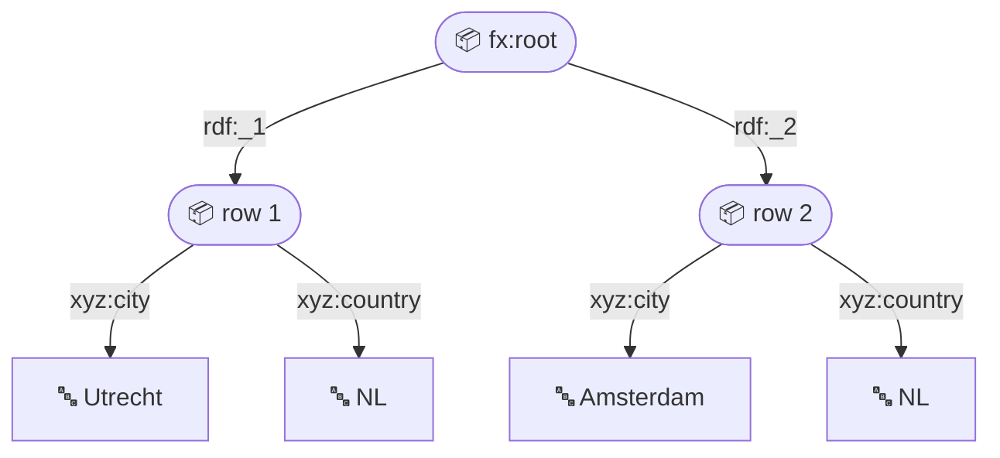
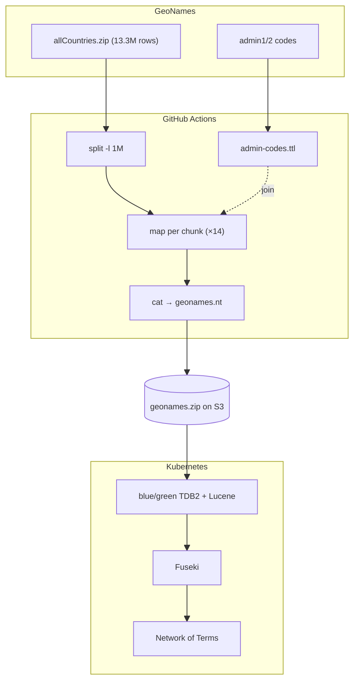

A while ago we [added worldwide GeoNames to the Network of Terms](/blog/2025/05/29/geonames). That post announced the *what*; this one is the *how*, because getting [GeoNames](https://www.geonames.org/) in there was less obvious than it sounds.

GeoNames has no usable RDF. There is official ‘RDF’, but it dates from 2020, it is broken RDF/XML and incomplete anyway.
There’s also per-resource RDF, but that’s hard to work with for 13M+ resources.
So we fell back to the TSV dump: messy, but recent and complete.
This is the story of converting that TSV to RDF using nothing but the SPARQL we already know:
no bespoke scripts, no separate mapping language.
And of why the pipeline around the conversion is what turns a one-off experiment into an actual service.

<!-- truncate -->

## Querying non-RDF with the SPARQL you already know

Faced with a CSV or TSV, you reach for the usual tools:

- **bespoke scripts**, but then you start from zero, you have to maintain them, and they are opaque to non-programming data specialists;
- or **RML**, which is what we did at first, but then you have to learn a whole new language: `logicalSource`, `referenceFormulation`, `parentTriplesMap`, `joinCondition` etc.

Neither fit NDE well, where **SPARQL CONSTRUCT** has taken an increasingly central role in our RDF→RDF transformations,
often in several small steps chained together. What if you could use that same language for non-RDF data too?

That is exactly what [SPARQL Anything](https://sparql-anything.cc) does. 
First, a warning: do not let the spartan website with its broken links scare you off.
Yes, it is an academic project (the [Facade-X paper](https://arxiv.org/abs/2106.02361) is from SEMANTiCS 2021), but it is maintained, and it works in practice. As a bonus, it came out of the EU Horizon 2020 projects [SPICE](https://cordis.europa.eu/project/id/870811) and [Polifonia](https://polifonia-project.eu), and it is open source under Apache-2.0.

The headline claim is that you write **‘pure’ SPARQL.** 
Take that with a grain of salt: there are some sixty non-standard pieces (a service prefix, config parameters, `fx:` functions)
so the query is **not portable**, which means it requires SPARQL Anything.
But – and this is the point – it **does not extend the SPARQL grammar** (unlike, say, [SPARQL Generate](https://ci.mines-stetienne.fr/sparql-generate/) with its `GENERATE` and `ITERATOR` clauses). Your existing `CONSTRUCT` skills transfer directly to transforming non-RDF into RDF.

## Applying it to GeoNames

SPARQL only works on RDF, and we have a TSV. So how? With an ordinary `CONSTRUCT`:

```sparql
PREFIX gn: <http://www.geonames.org/ontology#>
PREFIX fx: <http://sparql.xyz/facade-x/ns/>
PREFIX xyz: <http://sparql.xyz/facade-x/data/>
PREFIX apf: <http://jena.apache.org/ARQ/property#>

CONSTRUCT {
  ?uri a gn:Feature ;
    gn:name ?name ;
    gn:alternateName ?alt .
}
WHERE {
  SERVICE <x-sparql-anything:> {
    fx:properties fx:location "geonames.tsv" ;
      fx:csv.delimiter "\t" ;
      fx:csv.headers true ;
      fx:csv.quote-char "false" . # GeoNames TSV is unquoted; see below
    ?s xyz:geonameid ?id ;
      xyz:name ?name ;
      xyz:alternatenames ?alts .
    ?alt apf:strSplit (?alts ",") . # no split in pure SPARQL, so use Jena
    BIND(URI(CONCAT("https://sws.geonames.org/", ?id, "/")) AS ?uri)
  }
}
```

The trick is the `SERVICE` block with the custom `x-sparql-anything:` prefix.
SPARQL Anything is a Jena ARQ extension that **intercepts** the `SERVICE` keyword:
you put the source and some parameters there, and SPARQL Anything does the actual conversion for you.
Those parameters are the `fx:properties` line: `fx:properties` is a reserved ‘magic’ subject, and every predicate-object pair you hang off it is read as a configuration option for the triplifier rather than as a pattern to match against the data. So here it says: read `geonames.tsv`, treat it as tab-delimited (`fx:csv.delimiter "\t"`), and take the first row as column headers (`fx:csv.headers true`) – which is what lets you refer to columns by name as `xyz:geonameid`, `xyz:name` and so on.
Note that we reuse the existing GeoNames IRIs (`https://sws.geonames.org/{id}/`) rather than minting our own.

You run it from the command line:

```bash
$ java -jar sparql-anything.jar -q places.rq -f NT -o geonames.nt
```

## What sits in between: Facade-X

The conversion really happens in **two steps**.

**Step one, SPARQL Anything does for you**: it turns the source into raw RDF according to a model called **Facade-X**.
A *facade* is a software design pattern: one simple, uniform front for all sorts of different (and sometimes messy) sources behind it, like a new front on a building.
Here it is one RDF interface for [CSV/TSV, JSON, XML, Excel and the rest](https://sparql-anything.readthedocs.io/v0.8.0/#supported-formats); the *X* is anything. This two-row `cities.csv`:

 ```csv
 city,country
 Utrecht,NL
 Amsterdam,NL
 ```

becomes:

 ```turtle
 @prefix rdf: <http://www.w3.org/1999/02/22-rdf-syntax-ns#> .
 @prefix fx: <http://sparql.xyz/facade-x/ns/> .
 @prefix xyz: <http://sparql.xyz/facade-x/data/> .
 
 [] a fx:root ;
   rdf:_1 [ xyz:city "Utrecht" ; xyz:country "NL" ] ;
   rdf:_2 [ xyz:city "Amsterdam" ; xyz:country "NL" ] .
 ```

It is a raw but elegant model with only two building blocks, **containers and literals**:
 
- every member of a container is a key/value pair, 
- and the value is always either a literal or another container.

A key is either an ordinary property `xyz:<name>` (when the name is known, e.g. from CSV headers) or a positional member `rdf:_1`, `rdf:_2`, and so on. 
This is RDF’s built-in [container membership properties](https://www.w3.org/TR/rdf-schema/#ch_containermembershipproperty). 
Facade-X uses them to keep rows ordered and numbered, rather than RDF lists (the `rdf:first`/`rdf:rest` chain), because numbered members are far easier to query in SPARQL than a linked list.

So, as a tree with a root container holding one container per row, each holding literal values:



📦 is a container, 🔤 a literal.

 **Step two, you do yourself**: the mapping to your domain. 
 That is the `CONSTRUCT` template above: genuinely ordinary SPARQL, helped by some custom functions where needed.
 The structure of the half-finished Facade-X product is what determines how you write it.

## From experiment to service

A transformation you run by hand a few times is an experiment.
Turning that into a **repeatable pipeline that runs reliably and delivers a public result** is what makes it a service.
The infrastructure around it matters at least as much as the tool.

The pipeline falls into two stages that meet at a single handoff:

1. **build** (harvest and convert) writes a finished artifact;
2. **serve** (index and publish) consumes it. 

We keep them apart on purpose.
The build is a heavy, bursty batch job (GBs of data, a fresh JVM per chunk) that has no business competing with the live query service for memory and CPU, so it runs outside the cluster on free GitHub-hosted runners. 
And because the two stages communicate only through `geonames.zip` on S3, the conversion can be slow, retried or even fail without ever disturbing the endpoint people are querying. 
Each phase fails, retries and scales on its own.

<details>
<summary>The whole pipeline at a glance, from source dump to searchable endpoint</summary>



</details>

### Build 

**Harvest and conversion run outside our hosting cluster**, on GitHub Actions with a scheduled workflow. Weekly and automatically, it harvests the GeoNames dump, converts it to RDF and publishes [`geonames.zip`](https://geonames.ams3.digitaloceanspaces.com/geonames.zip) to S3. That file is public, and it is the point: anyone can download the converted GeoNames RDF and load it into their own store. Our serve stage is just one consumer of it. You do not have to run the conversion yourself.

Because SPARQL Anything is SPARQL, you can **federate:** pull in other data mid-query. We use this for the administrative codes: in the main file, parent relationships are only given as codes, which we want to resolve to GeoNames URIs. So we first convert the admin-code lookup tables to RDF (themselves a SPARQL Anything conversion), then the places query joins against that `admin-codes.ttl` to produce `gn:parentADM1` and `gn:parentADM2`. A caveat: federating per row to a *remote* endpoint over 13M rows is impractical (latency, rate limits), so load bounded lookup tables locally instead.

> An aside worth knowing: GitHub disables scheduled workflows after 60 days of repository inactivity. Our weekly harvest sat idle for a while without anyone noticing.

### Serve

**Indexing runs in-cluster, [blue/green](/stack/patterns#bluegreen-rebuild).** A [Kubernetes](https://github.com/netwerk-digitaal-erfgoed/infrastructure) job downloads `geonames.zip` and builds a fresh TDB2 store plus Lucene index on a staging volume (green), while Fuseki keeps serving the current production index (blue). That build takes ~28 min. Then a swap: stop Fuseki, move staging to prod, restart – near-zero downtime. The result (137M triples / 13M features) is served from Fuseki, which we need for its Lucene full-text search.

And then the goal is reached: GeoNames is searchable in the Network of Terms.

## Hitting the limits

The build stage runs on a free GitHub-hosted runner (public repos): 4 vCPUs, **16 GB of RAM** and **14 GB of SSD**, and both the memory and the disk became ceilings.

- **Memory.** The dataset was too large to load in one go, and at the time SPARQL Anything could not stream a CSV in usable batches: `fx:slice true` sliced one row per query, unusably slow.
- **Disk.** Spilling to disk did not help: `fx:ondisk` first materialises *all* triples, and the on-disk store grew without bound, straight past the runner’s 14 GB. On roomier hardware we watched it reach **51 GB** with still no output after 2h before we killed it.

We reported the missing per-query batch size as [#624](https://github.com/SPARQL-Anything/sparql.anything/issues/624), and **SPARQL Anything 1.2 added it**: `fx:slice.size 1000` streams a source in batches of 1000 rows, mapping a 1M-row chunk about **7× faster** at lower memory. We still split the TSV first (`split -l 1M`) and run one chunk per process, though – the `CONSTRUCT` output is assembled in memory before it is written (so peak memory tracks the *total* output, which we reported separately as [#635](https://github.com/SPARQL-Anything/sparql.anything/issues/635)), and a fresh JVM per chunk is what caps that. Split and slice do different jobs: **slice for speed, split for memory.**

## Verify

But when chunking, make sure that **every chunk actually succeeded.**

The GeoNames TSV does not use quoting, so a literal `"` is just an ordinary character inside a name; think `"Kostas Tsianos" Theatre`. But SPARQL Anything runs the TSV through Apache Commons CSV, which treats `"` as a quote by default, so it reads that name as a broken quoted field and crashes with `invalid char between encapsulated token and delimiter`. The fix is to turn quoting off with `fx:csv.quote-char "false"`, so `"` is read as ordinary data.

:::note[How we got here]
`"false"` only arrived in **SPARQL Anything 1.2**, after we reported the missing off switch as [#625](https://github.com/SPARQL-Anything/sparql.anything/issues/625). Until then there was no way to disable quoting, so we worked around it by pointing `fx:csv.quote-char` at U+0001 (Start of Heading): a control character that never occurs in the data, which effectively turned quoting off.
:::

What did this cost?
On 30 Nov 2025 the output had 12.27M features; with the quote fix it was 13.33M: about 1.06M extra places recovered. 
**One quote character cost a million places.**

## One language, one skillset

SPARQL Anything is not the whole puzzle – just a lightweight conversion step that you build a pipeline around yourself. Roughly positioned against the alternatives, it sits at the single-tool end: more standardised mapping languages like RML ask you to learn a language of their own; orchestrators like [rdf-connect](https://github.com/rdf-connect) wrap such steps into full pipelines; complete suites like [TriplyETL](https://docs.triply.cc/triply-etl/) add validation and a store, but are commercial and closed. SPARQL Anything reuses the SPARQL you already know, and nothing more. We are giving it a place in **[LD Elements](https://github.com/ldelements/lde)**, the successor to LD Workbench.

So: apply the knowledge you already have about querying RDF to non-RDF sources. One language, one skillset. 
But make it a real *service*: a repeatable, automated pipeline that refreshes and indexes the data on its own, not a one-off experiment on your laptop.

---

Further reading: 
* pipeline source code at [netwerk-digitaal-erfgoed/geonames-rdf](https://github.com/netwerk-digitaal-erfgoed/geonames-rdf)
* [SPARQL Anything docs](https://sparql-anything.readthedocs.io/stable/) with their [gentle introduction](https://sparql-anything.readthedocs.io/stable/A_GENTLE_INTRODUCTION_TO_SPARQL_ANYTHING/)
