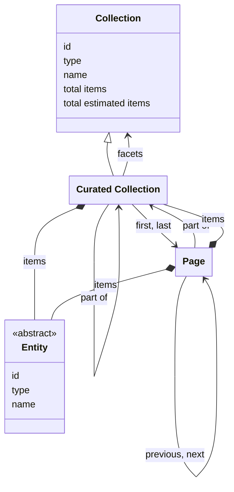

# Curated collections

## Introduction

A curated collection is a grouping of [entities](entities.md). It is the main way for a presentation layer to browse and filter the entities of a data layer. A data layer can include any entity of any type in a curated collection, and can create any number of curated collections, nested in any way, depending on the requirements of presentation layers.

For example: a data layer may have a collection for all entities of type 'Heritage object'. The data layer may also have a 'Masterpieces' collection with its finest art-related entities. The data layer may also have a 'Great for kids' collection with entities that are interesting for children. The data layer decides how the entities are selected and put into a collection: entities may be hand-picked, derived by a query, or assembled by aggregating other collections.

A data layer may add extra functionality to a curated collection. For example: users of a presentation layer may want to find entities in the 'Masterpieces' collection using faceted search or users may want to get suggestions to find entities in the 'Great for kids' collection using autocompletion. This specification defines two optional functionalities: [facets](facets.md) and [suggestions](suggestions.md).

## Data model

| Name               | Description                                                                                                                              |
| ------------------ | ---------------------------------------------------------------------------------------------------------------------------------------- |
| Collection         | An ordered list of resources. The generic type. See [Resources](resources.md).                                                           |
| Curated Collection | An ordered list of entities or further curated collections. It may consist of pages, containing sublists of the items in the collection. |
| Page               | An ordered sublist of the items in a curated collection.                                                                                 |
| Entity             | An identifiable 'thing' relevant to heritage. See [Entities](entities.md).                                                               |

The following class diagram visualizes the data model:



## Filters

Entities in a collection can be filtered to narrow down results. Supported filter types are:

1. **Keyword filter**: filtering based on text matching (e.g. `Rem`, `Rem*`, `'Rembrandt van Rijn'`).
1. **Date or numeric filter**: filtering by comparing date or numeric values (e.g. 'Date of creation is between 1900 and 1950').
1. **Geolocation filter**: filtering based on coordinates and radius (e.g. 'Location of creation is within 25 km of a geopoint').
1. **Facet filter**: filtering by specific attributes or categories (e.g. 'Creator is "Rembrandt" or "Vincent van Gogh" and Type is "Painting"').

Filter types are not specific to any collection: a data layer may support them for some of its collections and not for others, or for none. The data layer decides which filters it supports for which collection. The data layer can also add its own, custom filters, for specific use cases.

:::note

**To be discussed**: is there a standard or common notation to express filter and facet parameters via a query string?

Options could be [Feed Item Query Language](https://datatracker.ietf.org/doc/html/draft-nottingham-atompub-fiql-00) (FIQL), [RSQL](https://github.com/jirutka/rsql-parser) or [OData](https://docs.oasis-open.org/odata/odata/v4.01/odata-v4.01-part1-protocol.html#_Toc31358947). These can be heavy-weight, though, or be unable to express all parameters (e.g. facets that should be retrieved). Alternatively, use a custom notation using a convention, e.g. the [LHS bracket syntax](https://docs.strapi.io/cms/api/rest/filters), that can be mapped to JSON for processing by the API? For example:

1. Filter by range: date of creation is between 1900 and 1950

`GET /v1/collections/masterpieces?page=1&filter[dateCreated][gte]=1900&filter[dateCreated][lte]=1950`

2. Filter by geolocation: location of creation is within 25 km of geopoint 52.0752021, 5.1135515

`GET /v1/collections/masterpieces?page=1&filter[locationCreated][lat]=52.0752021&filter[locationCreated][distance][lon]=5.1135515&filter[locationCreated][distance][radius]=25km`

3. Filter by facet: creator ID is 'https://example.org/v1/entities/7890' or 'https://example.org/v1/entities/9012'

`GET /v1/collections/masterpieces?page=1&filter[creators][in]=https://example.org/v1/entities/7890&filter[creators][in]=https://example.org/v1/entities/9012`

4. Instruct the API to return a maximum of 5 facet values of facet 'Creator', and that these values must be ordered by count and then by name

`GET /v1/collections/masterpieces?page=1&facet[creators][orderBy][count]=desc&facet[creators][orderBy][name]=asc&facet[creators][size]=5`

:::

:::note

**To do**: think of a way to express the ID of a `facet` in the query string. A facet ID like `creators` is a shorthand for its full URI but currently does not have a designated property in a [facet collection](facets.md#endpoint-retrieve-a-facet-collection). Full URIs — such as `https://example.org/v1/collections/masterpieces/facets/creators` — are rather verbose.

:::

## Endpoint: Retrieve the root collection

The endpoint retrieves the root collection: the curated collection that is not a part of another collection. Its items are curated collections, entities, or a mixture of both. The API _MUST_ implement this endpoint, even if the root collection is the only collection it offers: a data layer that does not nest its collections offers its entities as the items of the root collection.

The root collection is the entry point into the API: it allows a presentation layer to identify the collections and entities the data layer offers, and their endpoint URIs. A data layer exposes its root at URI `/{version}/collections`, so that a presentation layer can assume where the tree begins. It's up to the data layer to define what the tree holds and how the collections are nested.

### HTTP request

`GET /{version}/collections`

### Path parameters

| Name      | Data type | Cardinality | Description                            |
| --------- | --------- | ----------- | -------------------------------------- |
| `version` | string    | 1           | The version of the API. Example: `v1`. |

### Query parameters

None.

### Request body

None.

### Response body

The response body _MUST_ contain at least the following properties:

| Name                  | Data type                 | Cardinality | Description                                                                                                                                                                                                                                                                              |
| --------------------- | ------------------------- | ----------- | ---------------------------------------------------------------------------------------------------------------------------------------------------------------------------------------------------------------------------------------------------------------------------------------- |
| `id`                  | string                    | 1           | The identifier of the collection.                                                                                                                                                                                                                                                        |
| `type`                | string                    | 1           | The type of the collection. It _MUST_ be `CuratedCollection` or a specialization.                                                                                                                                                                                                        |
| `name`                | string                    | 1           | The name of the collection.                                                                                                                                                                                                                                                              |
| `totalItems`          | number                    | 0 or 1      | The exact total number of items in the collection, being its further collections, its entities, or both. Not set if the exact total is too costly to calculate. Mutually exclusive with `estimatedTotalItems`.                                                                           |
| `estimatedTotalItems` | number                    | 0 or 1      | An estimate of the total number of items in the collection. It can be higher or lower than the real total. Not set if there is no estimate. Mutually exclusive with `totalItems`.                                                                                                        |
| `items`               | array                     | 0 or 1      | A list of the items in the collection. Not set if the items are parts of [pages](#endpoint-retrieve-a-page-in-a-collection).                                                                                                                                                             |
| `items[*]`            | CuratedCollection, Entity | 1           | A `CuratedCollection` or a specialization, or a specialization of `Entity`. Not set if the items are parts of [pages](#endpoint-retrieve-a-page-in-a-collection).                                                                                                                        |
| `first`               | Page                      | 0 or 1      | The first page in the collection. Not set if the collection is empty or if it is not divided into [pages](#endpoint-retrieve-a-page-in-a-collection).                                                                                                                                    |
| `first.id`            | string                    | 1           | The identifier of the first page in the collection.                                                                                                                                                                                                                                      |
| `first.type`          | string                    | 1           | The type of the first page in the collection. It _MUST_ be `Page` or a specialization.                                                                                                                                                                                                   |
| `last`                | Page                      | 0 or 1      | The last page in the collection. Not set if the collection is empty, if the collection is not divided into [pages](#endpoint-retrieve-a-page-in-a-collection), or if the last page is unknown (e.g. in case of [cursor navigation](resources.md#page-navigation-and-cursor-navigation)). |
| `last.id`             | string                    | 1           | The identifier of the last page in the collection.                                                                                                                                                                                                                                       |
| `last.type`           | string                    | 1           | The type of the last page in the collection. It _MUST_ be `Page` or a specialization.                                                                                                                                                                                                    |
| `capabilities`        | array                     | 0 or 1      | The URIs of the capabilities the API implements for this collection. _MUST_ be omitted if the collection supports no capabilities. See [Capability discovery](resources.md#capability-discovery).                                                                                        |
| `facets`              | Collection                | 0 or 1      | The list of this collection's facet collections. _MUST_ be omitted if the collection has no facet collections. See [Facets](facets.md).                                                                                                                                                  |
| `facets.id`           | string                    | 1           | The identifier of the list.                                                                                                                                                                                                                                                              |
| `facets.type`         | string                    | 1           | The type of the list. It _MUST_ be `Collection` or a specialization.                                                                                                                                                                                                                     |
| `facets.name`         | string                    | 1           | The name of the list.                                                                                                                                                                                                                                                                    |
| `suggestions`         | Collection                | 0 or 1      | The list of this collection's suggestion collections. _MUST_ be omitted if the collection has no suggestion collections. See [Suggestions](suggestions.md).                                                                                                                              |
| `suggestions.id`      | string                    | 1           | The identifier of the list.                                                                                                                                                                                                                                                              |
| `suggestions.type`    | string                    | 1           | The type of the list. It _MUST_ be `Collection` or a specialization.                                                                                                                                                                                                                     |
| `suggestions.name`    | string                    | 1           | The name of the list.                                                                                                                                                                                                                                                                    |

Note: the response body carries no `partOf` property — the root collection is not a part of another collection.

### Example

An example of the response body of the API:

```json
{
  "id": "https://example.org/v1/collections",
  "type": "CuratedCollection",
  "name": "Collections",
  "totalItems": 3,
  "items": [
    {
      "id": "https://example.org/v1/collections/objects",
      "type": "CuratedCollection",
      "name": "Heritage objects"
    },
    {
      "id": "https://example.org/v1/collections/masterpieces",
      "type": "CuratedCollection",
      "name": "Masterpieces"
    },
    {
      "id": "https://example.org/v1/collections/persons",
      "type": "CuratedCollection",
      "name": "Persons"
    }
  ]
}
```

The response indicates that the API has three collections that are a part of the root collection. The root collection groups collections, not entities — it supports no capabilities and omits the `capabilities` property.

A collection can hold further collections. Example response for the 'Persons' collection:

```json
{
  "id": "https://example.org/v1/collections/persons",
  "type": "CuratedCollection",
  "name": "Persons",
  "totalItems": 2,
  "items": [
    {
      "id": "https://example.org/v1/collections/persons/painters",
      "type": "CuratedCollection",
      "name": "Painters"
    },
    {
      "id": "https://example.org/v1/collections/persons/writers",
      "type": "CuratedCollection",
      "name": "Writers"
    }
  ],
  "partOf": {
    "id": "https://example.org/v1/collections",
    "type": "CuratedCollection",
    "name": "Collections"
  }
}
```

The response indicates that the 'Persons' collection groups two collections: one for 'Painters' and one for 'Writers'. The collection itself is a part of a parent collection, 'Collections'. The collection groups collections rather than entities — it supports no capabilities and omits the `capabilities` property.

## Endpoint: Retrieve a collection

The endpoint retrieves a curated collection. The API _MAY_ implement this endpoint, for the collections it chooses to expose.

### HTTP request

`GET /{version}/collections(/{...collections})/{collection}`

### Path parameters

| Name             | Data type | Cardinality | Description                                                                                |
| ---------------- | --------- | ----------- | ------------------------------------------------------------------------------------------ |
| `version`        | string    | 1           | The version of the API. Example: `v1`.                                                     |
| `...collections` | string    | 0 or more   | The path identifier(s) of the collection(s) the collection is part of. Example: `persons`. |
| `collection`     | string    | 1           | The path identifier of the collection. Example: `masterpieces`, `objects`.                 |

### Query parameters

| Name      | Data type | Cardinality | Description                                                                                                                                                                                                                                                          |
| --------- | --------- | ----------- | -------------------------------------------------------------------------------------------------------------------------------------------------------------------------------------------------------------------------------------------------------------------- |
| `q`       | string    | 0 or 1      | A keyword query for filtering the entities. Minimum length: defined by the API (e.g. 1 character). Maximum length: defined by the API (e.g. 100 characters).                                                                                                         |
| `size`    | number    | 0 or 1      | The maximum number of entities to retrieve. Minimum: 1. Default: 10. Maximum: defined by the API (e.g. 100).                                                                                                                                                         |
| `orderBy` | string    | 0 or 1      | The sorting order of the entities. One of `relevance`, `value`. Default: `relevance:desc` (most relevant entity first) if `q` is set; otherwise the order defined by the API. The API defines which value is used to sort by `value` (e.g. the `name` of an entity). |
| `filter`  | string    | 0 or more   | The rules for filtering the entities. See [Filters](#filters).                                                                                                                                                                                                       |

### Request body

None.

### Response body

The response body _MUST_ contain at least the following properties:

| Name                  | Data type                 | Cardinality | Description                                                                                                                                                                                                                                                                              |
| --------------------- | ------------------------- | ----------- | ---------------------------------------------------------------------------------------------------------------------------------------------------------------------------------------------------------------------------------------------------------------------------------------- |
| `id`                  | string                    | 1           | The identifier of the collection.                                                                                                                                                                                                                                                        |
| `type`                | string                    | 1           | The type of the collection. It _MUST_ be `CuratedCollection` or a specialization.                                                                                                                                                                                                        |
| `name`                | string                    | 1           | The name of the collection.                                                                                                                                                                                                                                                              |
| `totalItems`          | number                    | 0 or 1      | The exact total number of items in the collection, being its further collections, its entities, or both. Not set if the exact total is too costly to calculate. Mutually exclusive with `estimatedTotalItems`.                                                                           |
| `estimatedTotalItems` | number                    | 0 or 1      | An estimate of the total number of items in the collection. It can be higher or lower than the real total. Not set if there is no estimate. Mutually exclusive with `totalItems`.                                                                                                        |
| `items`               | array                     | 0 or 1      | A list of the items in the collection. Not set if the items are parts of [pages](#endpoint-retrieve-a-page-in-a-collection).                                                                                                                                                             |
| `items[*]`            | CuratedCollection, Entity | 1           | A `CuratedCollection` or a specialization, or a specialization of `Entity`. Not set if the items are parts of [pages](#endpoint-retrieve-a-page-in-a-collection).                                                                                                                        |
| `first`               | Page                      | 0 or 1      | The first page in the collection. Not set if the collection is empty or if it is not divided into [pages](#endpoint-retrieve-a-page-in-a-collection).                                                                                                                                    |
| `first.id`            | string                    | 1           | The identifier of the first page in the collection.                                                                                                                                                                                                                                      |
| `first.type`          | string                    | 1           | The type of the first page in the collection. It _MUST_ be `Page` or a specialization.                                                                                                                                                                                                   |
| `last`                | Page                      | 0 or 1      | The last page in the collection. Not set if the collection is empty, if the collection is not divided into [pages](#endpoint-retrieve-a-page-in-a-collection), or if the last page is unknown (e.g. in case of [cursor navigation](resources.md#page-navigation-and-cursor-navigation)). |
| `last.id`             | string                    | 1           | The identifier of the last page in the collection.                                                                                                                                                                                                                                       |
| `last.type`           | string                    | 1           | The type of the last page in the collection. It _MUST_ be `Page` or a specialization.                                                                                                                                                                                                    |
| `partOf`              | CuratedCollection         | 0 or 1      | The collection of which this collection is a part. Not set if this collection is the [root collection](#endpoint-retrieve-the-root-collection).                                                                                                                                          |
| `partOf.id`           | string                    | 1           | The identifier of the collection.                                                                                                                                                                                                                                                        |
| `partOf.type`         | string                    | 1           | The type of the collection. It _MUST_ be `CuratedCollection` or a specialization.                                                                                                                                                                                                        |
| `partOf.name`         | string                    | 1           | The name of the collection.                                                                                                                                                                                                                                                              |
| `capabilities`        | array                     | 0 or 1      | The URIs of the capabilities the API implements for this collection. _MUST_ be omitted if the collection supports no capabilities. See [Capability discovery](resources.md#capability-discovery).                                                                                        |
| `facets`              | Collection                | 0 or 1      | The list of this collection's facet collections. _MUST_ be omitted if the collection has no facet collections. See [Facets](facets.md).                                                                                                                                                  |
| `facets.id`           | string                    | 1           | The identifier of the list.                                                                                                                                                                                                                                                              |
| `facets.type`         | string                    | 1           | The type of the list. It _MUST_ be `Collection` or a specialization.                                                                                                                                                                                                                     |
| `facets.name`         | string                    | 1           | The name of the list.                                                                                                                                                                                                                                                                    |
| `suggestions`         | Collection                | 0 or 1      | The list of this collection's suggestion collections. _MUST_ be omitted if the collection has no suggestion collections. See [Suggestions](suggestions.md).                                                                                                                              |
| `suggestions.id`      | string                    | 1           | The identifier of the list.                                                                                                                                                                                                                                                              |
| `suggestions.type`    | string                    | 1           | The type of the list. It _MUST_ be `Collection` or a specialization.                                                                                                                                                                                                                     |
| `suggestions.name`    | string                    | 1           | The name of the list.                                                                                                                                                                                                                                                                    |

### Example

An example of the response body of a collection:

```json
{
  "id": "https://example.org/v1/collections/objects",
  "type": "CuratedCollection",
  "name": "Heritage objects",
  "totalItems": 195,
  "first": {
    "id": "https://example.org/v1/collections/objects?page=1",
    "type": "Page"
  },
  "last": {
    "id": "https://example.org/v1/collections/objects?page=20",
    "type": "Page"
  },
  "partOf": {
    "id": "https://example.org/v1/collections",
    "type": "CuratedCollection",
    "name": "Collections"
  },
  "capabilities": [
    "https://specs.nde.nl/rest/v1/page-pagination",
    "https://specs.nde.nl/rest/v1/keyword-search"
  ]
}
```

The response indicates that this collection contains 195 entities, spread over 20 pages, and that it supports keyword search for it.

Another collection has the same structure. Which capabilities a collection has is a choice of the data layer. In the example underneath the data layer also supports facets and suggestions for its 'Masterpieces' collection. The `facets` property points to the list of the collection's facet collections, and the `suggestions` property points to the list of its suggestion collections.

```json
{
  "id": "https://example.org/v1/collections/masterpieces",
  "type": "CuratedCollection",
  "name": "Masterpieces",
  "totalItems": 195,
  "first": {
    "id": "https://example.org/v1/collections/masterpieces?page=1",
    "type": "Page"
  },
  "last": {
    "id": "https://example.org/v1/collections/masterpieces?page=20",
    "type": "Page"
  },
  "partOf": {
    "id": "https://example.org/v1/collections",
    "type": "CuratedCollection",
    "name": "Collections"
  },
  "capabilities": [
    "https://specs.nde.nl/rest/v1/page-pagination",
    "https://specs.nde.nl/rest/v1/keyword-search",
    "https://specs.nde.nl/rest/v1/facets",
    "https://specs.nde.nl/rest/v1/suggestions"
  ],
  "facets": {
    "id": "https://example.org/v1/collections/masterpieces/facets",
    "type": "Collection",
    "name": "Facets"
  },
  "suggestions": {
    "id": "https://example.org/v1/collections/masterpieces/suggestions",
    "type": "Collection",
    "name": "Suggestions"
  }
}
```

## Endpoint: Retrieve a page in a collection

The endpoint retrieves a page in a curated collection. The API _MUST_ implement this endpoint for every collection it divides into [pages](#endpoint-retrieve-a-page-in-a-collection).

### HTTP request

`GET /{version}/collections(/{...collections})/{collection}?page={page}`

### Path parameters

| Name             | Data type | Cardinality | Description                                                                                |
| ---------------- | --------- | ----------- | ------------------------------------------------------------------------------------------ |
| `version`        | string    | 1           | The version of the API. Example: `v1`.                                                     |
| `...collections` | string    | 0 or more   | The path identifier(s) of the collection(s) the collection is part of. Example: `persons`. |
| `collection`     | string    | 1           | The path identifier of the collection. Example: `masterpieces`, `objects`.                 |

### Query parameters

| Name      | Data type | Cardinality | Description                                                                                                                                                                                                                                                          |
| --------- | --------- | ----------- | -------------------------------------------------------------------------------------------------------------------------------------------------------------------------------------------------------------------------------------------------------------------- |
| `page`    | string    | 1           | The identifier of the page: a page number or cursor, depending on the [pagination strategy](resources.md#page-navigation-and-cursor-navigation) of the API.                                                                                                          |
| `q`       | string    | 0 or 1      | A keyword query for filtering the entities. Minimum length: defined by the API (e.g. 1 character). Maximum length: defined by the API (e.g. 100 characters).                                                                                                         |
| `size`    | number    | 0 or 1      | The maximum number of entities to retrieve. Minimum: 1. Default: 10. Maximum: defined by the API (e.g. 100).                                                                                                                                                         |
| `orderBy` | string    | 0 or 1      | The sorting order of the entities. One of `relevance`, `value`. Default: `relevance:desc` (most relevant entity first) if `q` is set; otherwise the order defined by the API. The API defines which value is used to sort by `value` (e.g. the `name` of an entity). |
| `filter`  | string    | 0 or more   | The rules for filtering the entities. See [Filters](#filters).                                                                                                                                                                                                       |
| `facet`   | string    | 0 or more   | The facets that must be retrieved. _MUST_ be ignored by the API if it does not support facets. See [facets](facets.md).                                                                                                                                              |

### Request body

None.

### Response body

The response body _MUST_ contain at least the following properties:

| Name                         | Data type                  | Cardinality | Description                                                                                                                                                                                                                                                                                                                                                                                      |
| ---------------------------- | -------------------------- | ----------- | ------------------------------------------------------------------------------------------------------------------------------------------------------------------------------------------------------------------------------------------------------------------------------------------------------------------------------------------------------------------------------------------------ |
| `id`                         | string                     | 1           | The identifier of the current page.                                                                                                                                                                                                                                                                                                                                                              |
| `type`                       | string                     | 1           | The type of the page. It _MUST_ be `Page` or a specialization.                                                                                                                                                                                                                                                                                                                                   |
| `name`                       | string                     | 1           | The name of the page.                                                                                                                                                                                                                                                                                                                                                                            |
| `items`                      | array                      | 1           | A list of the items in the collection that fall on this page.                                                                                                                                                                                                                                                                                                                                    |
| `items[*]`                   | CuratedCollection, Entity  | 1           | A `CuratedCollection` or a specialization, or a specialization of `Entity`. If an `Entity`: all properties _MUST_ be embedded — see the response body of endpoint [Retrieve an entity](entities.md#endpoint-retrieve-an-entity).                                                                                                                                                                 |
| `facets`                     | array                      | 0 or 1      | The facet results requested via the `facet` query parameters. _MUST_ be omitted if no facets were requested. See [Facets on a page](#facets-on-a-page).                                                                                                                                                                                                                                          |
| `facets[*]`                  | FacetCollection, FacetPage | 1           | The result of one requested facet. It is a `FacetPage` if the facet collection is divided into [pages](resources.md#page), and a `FacetCollection` if it is not. The result is the response body of endpoint [Retrieve a facet collection](facets.md#endpoint-retrieve-a-facet-collection) or [Retrieve a page in a facet collection](facets.md#endpoint-retrieve-a-page-in-a-facet-collection). |
| `prev`                       | Page                       | 0 or 1      | The previous page in the collection. Not set if there is no previous page.                                                                                                                                                                                                                                                                                                                       |
| `prev.id`                    | string                     | 1           | The identifier of the previous page in the collection.                                                                                                                                                                                                                                                                                                                                           |
| `prev.type`                  | string                     | 1           | The type of the previous page in the collection. It _MUST_ be `Page` or a specialization.                                                                                                                                                                                                                                                                                                        |
| `next`                       | Page                       | 0 or 1      | The next page in the collection. Not set if there is no next page.                                                                                                                                                                                                                                                                                                                               |
| `next.id`                    | string                     | 1           | The identifier of the next page in the collection.                                                                                                                                                                                                                                                                                                                                               |
| `next.type`                  | string                     | 1           | The type of the next page in the collection. It _MUST_ be `Page` or a specialization.                                                                                                                                                                                                                                                                                                            |
| `partOf`                     | CuratedCollection          | 1           | The collection to which the items contained by the page belong.                                                                                                                                                                                                                                                                                                                                  |
| `partOf.id`                  | string                     | 1           | The identifier of the collection.                                                                                                                                                                                                                                                                                                                                                                |
| `partOf.type`                | string                     | 1           | The type of the collection. It _MUST_ be `CuratedCollection` or a specialization.                                                                                                                                                                                                                                                                                                                |
| `partOf.name`                | string                     | 1           | The name of the collection.                                                                                                                                                                                                                                                                                                                                                                      |
| `partOf.totalItems`          | number                     | 0 or 1      | The exact total number of items in the collection, being its further collections, its resources, or both. Not set if the exact total is too costly to calculate. Mutually exclusive with `partOf.estimatedTotalItems`.                                                                                                                                                                           |
| `partOf.estimatedTotalItems` | number                     | 0 or 1      | An estimate of the total number of items in the collection. It can be higher or lower than the real total. Not set if there is no estimate. Mutually exclusive with `partOf.totalItems`.                                                                                                                                                                                                         |
| `partOf.first`               | Page                       | 1           | The first page in the collection.                                                                                                                                                                                                                                                                                                                                                                |
| `partOf.first.id`            | string                     | 1           | The identifier of the first page in the collection.                                                                                                                                                                                                                                                                                                                                              |
| `partOf.first.type`          | string                     | 1           | The type of the first page in the collection. It _MUST_ be `Page` or a specialization.                                                                                                                                                                                                                                                                                                           |
| `partOf.last`                | Page                       | 0 or 1      | The last page in the collection. Not set if the last page is unknown (e.g. in case of [cursor navigation](resources.md#page-navigation-and-cursor-navigation)).                                                                                                                                                                                                                                  |
| `partOf.last.id`             | string                     | 1           | The identifier of the last page in the collection.                                                                                                                                                                                                                                                                                                                                               |
| `partOf.last.type`           | string                     | 1           | The type of the last page in the collection. It _MUST_ be `Page` or a specialization.                                                                                                                                                                                                                                                                                                            |

### Example

An example of the response body:

```json
{
  "id": "https://example.org/v1/collections/masterpieces?page=3",
  "type": "Page",
  "name": "Masterpieces: page 3",
  "items": [
    {
      "id": "https://example.org/v1/entities/1234",
      "type": "HeritageObject",
      "name": "The Night Watch"
      // Other properties...
    },
    {
      "id": "https://example.org/v1/entities/5678",
      "type": "HeritageObject",
      "name": "Ford V8 Cabriolet"
      // Other properties...
    }
    // Other items...
  ],
  "prev": {
    "id": "https://example.org/v1/collections/masterpieces?page=2",
    "type": "Page"
  },
  "next": {
    "id": "https://example.org/v1/collections/masterpieces?page=4",
    "type": "Page"
  },
  "partOf": {
    "id": "https://example.org/v1/collections/masterpieces",
    "type": "CuratedCollection",
    "name": "Masterpieces",
    "totalItems": 195,
    "first": {
      "id": "https://example.org/v1/collections/masterpieces?page=1",
      "type": "Page"
    },
    "last": {
      "id": "https://example.org/v1/collections/masterpieces?page=20",
      "type": "Page"
    }
  }
}
```

### Facets on a page

A page can carry the results of the facets that the presentation layer requested in a dedicated `facets` property.

An entry in the `facets` property mirrors the facet collection it belongs to. If that facet collection is divided into pages, the entry is a `FacetPage`. If it is not, the entry is the `FacetCollection` itself, which lists its facet items inline. A presentation layer therefore has to accept both shapes. It distinguishes them by the `type` of the entry, as set out in the response body above.

Both shapes are allowed in one `facets` property. A data layer is easier to use, however, when all of its facet collections have the same shape. A data layer _SHOULD_ therefore either divide all of its facet collections into pages, or divide none of them. Then every entry in `facets` has the same type, and a presentation layer can read all of them in one way.

The results in `facets` belong to the whole collection, not to one page. They depend on the query in the request, such as `q` and `filter`, and not on `page`. Every page of the same collection for the same query therefore carries the same facet results; only the `items` change when a presentation layer moves to the next page. A presentation layer can request the facets on the first page and reuse the results on the following pages.

A page response has two kinds of `next` and `prev` links. The links of the page itself move within the collection. The links inside an entry of `facets` move within the results of that facet. They are not the same, and a presentation layer must not confuse them.

The next two examples show the two shapes separately. Both are allowed, and a data layer _MAY_ return either one.

#### Facets that are not divided into pages

An example of a response body in which the presentation layer requested two facet collections that are not divided into pages. Both entries in `facets` are a `FacetCollection`, which lists its items inline. A presentation layer reads every entry in the same way. An entry is the complete response body that the endpoint [Retrieve a facet collection](facets.md#endpoint-retrieve-a-facet-collection) returns. It has no `first` and no `last`, because a collection that is not divided into pages has no pages.

```json
{
  "id": "https://example.org/v1/collections/masterpieces?page=3",
  "type": "Page",
  "name": "Masterpieces: page 3",
  "items": [
    // Omitted for brevity; see the example response above
  ],
  "facets": [
    {
      "id": "https://example.org/v1/collections/masterpieces/facets/centuries?orderBy=count:desc&context=...",
      "type": "FacetCollection",
      "name": "Made in century",
      "totalItems": 4,
      "items": [
        {
          "type": "FacetItem",
          "count": 8,
          "value": {
            "id": "https://example.org/v1/entities/3456",
            "type": "Concept",
            "name": "18th century"
          }
        },
        {
          "type": "FacetItem",
          "count": 5,
          "value": {
            "id": "https://example.org/v1/entities/3457",
            "type": "Concept",
            "name": "17th century"
          }
        },
        {
          "type": "FacetItem",
          "count": 3,
          "value": {
            "id": "https://example.org/v1/entities/3458",
            "type": "Concept",
            "name": "19th century"
          }
        },
        {
          "type": "FacetItem",
          "count": 1,
          "value": {
            "id": "https://example.org/v1/entities/3459",
            "type": "Concept",
            "name": "16th century"
          }
        }
      ],
      "partOf": {
        "id": "https://example.org/v1/collections/masterpieces/facets",
        "type": "Collection",
        "name": "Facets"
      }
    },
    {
      "id": "https://example.org/v1/collections/masterpieces/facets/subjects?orderBy=count:desc&context=...",
      "type": "FacetCollection",
      "name": "Subject",
      "totalItems": 3,
      "items": [
        {
          "type": "FacetItem",
          "count": 8,
          "value": {
            "id": "https://example.org/v1/entities/4567",
            "type": "Concept",
            "name": "Religious art"
          }
        },
        {
          "type": "FacetItem",
          "count": 3,
          "value": {
            "id": "https://example.org/v1/entities/4568",
            "type": "Concept",
            "name": "Portraits"
          }
        },
        {
          "type": "FacetItem",
          "count": 1,
          "value": {
            "id": "https://example.org/v1/entities/4569",
            "type": "Concept",
            "name": "Prints"
          }
        }
      ],
      "partOf": {
        "id": "https://example.org/v1/collections/masterpieces/facets",
        "type": "Collection",
        "name": "Facets"
      }
    }
  ],
  "prev": {
    "id": "https://example.org/v1/collections/masterpieces?page=2",
    "type": "Page"
  },
  "next": {
    "id": "https://example.org/v1/collections/masterpieces?page=4",
    "type": "Page"
  },
  "partOf": {
    "id": "https://example.org/v1/collections/masterpieces",
    "type": "CuratedCollection",
    "name": "Masterpieces",
    "totalItems": 195,
    "first": {
      "id": "https://example.org/v1/collections/masterpieces?page=1",
      "type": "Page"
    },
    "last": {
      "id": "https://example.org/v1/collections/masterpieces?page=20",
      "type": "Page"
    }
  }
}
```

#### Facets that are divided into pages

An example of a response body in which the presentation layer requested two facets collections that are divided into pages. Both entries in `facets` are a `FacetPage`. A presentation layer reads every entry in the same way, and follows the `next` property of an entry to see more values of that facet.

An entry is the complete response body of a `FacetPage`, the same body that the endpoint [Retrieve a page in a facet collection](facets.md#endpoint-retrieve-a-page-in-a-facet-collection) returns, including `prev` and `next`. The entries below have no `prev`, because they are the first page of their facet collection. Their `partOf` carries `totalItems`, `first` and `last`, so a presentation layer that wants a different page of that facet follows one of those, or calls the endpoint. It does not page backwards from the entry itself.

```json
{
  "id": "https://example.org/v1/collections/objects?page=2",
  "type": "Page",
  "name": "Objects: page 2",
  "items": [
    // Omitted for brevity; see the example response above
  ],
  "facets": [
    {
      "id": "https://example.org/v1/collections/objects/facets/creators?page=1&size=3&orderBy=count:desc&context=...",
      "type": "FacetPage",
      "name": "Creator: page 1",
      "items": [
        {
          "type": "FacetItem",
          "count": 12,
          "value": {
            "id": "https://example.org/v1/entities/7890",
            "type": "Person",
            "name": "Arno Haag"
          }
        },
        {
          "type": "FacetItem",
          "count": 8,
          "value": {
            "id": "https://example.org/v1/entities/7891",
            "type": "Person",
            "name": "Hans de Haan"
          }
        },
        {
          "type": "FacetItem",
          "count": 2,
          "value": {
            "id": "https://example.org/v1/entities/7892",
            "type": "Person",
            "name": "John Jansen"
          }
        }
      ],
      "next": {
        "id": "https://example.org/v1/collections/objects/facets/creators?page=2&size=3&orderBy=count:desc&context=...",
        "type": "FacetPage"
      },
      "partOf": {
        "id": "https://example.org/v1/collections/objects/facets/creators",
        "type": "FacetCollection",
        "name": "Creator",
        "totalItems": 195,
        "first": {
          "id": "https://example.org/v1/collections/objects/facets/creators?page=1&size=3&orderBy=count:desc&context=...",
          "type": "FacetPage"
        },
        "last": {
          "id": "https://example.org/v1/collections/objects/facets/creators?page=65&size=3&orderBy=count:desc&context=...",
          "type": "FacetPage"
        }
      }
    },
    {
      "id": "https://example.org/v1/collections/objects/facets/places?page=1&size=3&orderBy=count:desc&context=...",
      "type": "FacetPage",
      "name": "Made in place: page 1",
      "items": [
        {
          "type": "FacetItem",
          "count": 9,
          "value": {
            "id": "https://example.org/v1/entities/3450",
            "type": "Place",
            "name": "Amsterdam"
          }
        },
        {
          "type": "FacetItem",
          "count": 6,
          "value": {
            "id": "https://example.org/v1/entities/3451",
            "type": "Place",
            "name": "The Hague"
          }
        },
        {
          "type": "FacetItem",
          "count": 1,
          "value": {
            "id": "https://example.org/v1/entities/3452",
            "type": "Place",
            "name": "Delft"
          }
        }
      ],
      "next": {
        "id": "https://example.org/v1/collections/objects/facets/places?page=2&size=3&orderBy=count:desc&context=...",
        "type": "FacetPage"
      },
      "partOf": {
        "id": "https://example.org/v1/collections/objects/facets/places",
        "type": "FacetCollection",
        "name": "Made in place",
        "totalItems": 42,
        "first": {
          "id": "https://example.org/v1/collections/objects/facets/places?page=1&size=3&orderBy=count:desc&context=...",
          "type": "FacetPage"
        },
        "last": {
          "id": "https://example.org/v1/collections/objects/facets/places?page=14&size=3&orderBy=count:desc&context=...",
          "type": "FacetPage"
        }
      }
    }
  ],
  "prev": {
    "id": "https://example.org/v1/collections/objects?page=1",
    "type": "Page"
  },
  "next": {
    "id": "https://example.org/v1/collections/objects?page=3",
    "type": "Page"
  },
  "partOf": {
    "id": "https://example.org/v1/collections/objects",
    "type": "CuratedCollection",
    "name": "Objects",
    "totalItems": 120,
    "first": {
      "id": "https://example.org/v1/collections/objects?page=1",
      "type": "Page"
    },
    "last": {
      "id": "https://example.org/v1/collections/objects?page=12",
      "type": "Page"
    }
  }
}
```
