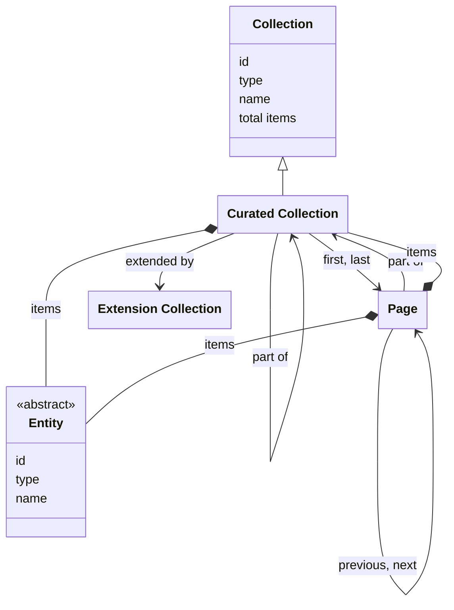

# Curated collections

## Introduction

A **curated collection** is a grouping of [entities](entities.md). It is the main way for a presentation layer to browse and search the entities of a data layer. A data layer can include any entity of any type in a curated collection, and can create any number of curated collections, nested in any way, depending on the requirements of presentation layers.

For example: a data layer may have a collection for all entities of type 'heritage object'. The data layer may also have a 'Masterpieces' collection with the finest entities. The data layer may also have a 'Great for kids' collection with entities that are interesting for children. The data layer decides how the entities are selected and put into a collection: entities may be hand-picked, derived by a query, or assembled by aggregating other collections.

A curated collection is a specialization of the generic [Collection](resources.md#collection-structure) that [Resources](resources.md) defines. A curated collection holds further curated collections and entities, and nothing else. This specification uses the word _collection_ for a curated collection throughout the rest of this page, and `CuratedCollection` for the type.

A data layer may add extra functionality to a curated collection. For example: users of a presentation layer may want to find entities in the 'Masterpieces' collection using faceted search. Such add-on functionality can be defined as an [extension](extensions.md).

## Data model

| Name                 | Description                                                                                                                              |
| -------------------- | ---------------------------------------------------------------------------------------------------------------------------------------- |
| Collection           | An ordered list of resources. The generic type, of which a Curated Collection is a specialization. See [Resources](resources.md).        |
| Curated Collection   | An ordered list of entities or further curated collections. It may consist of pages, containing sublists of the items in the collection. |
| Page                 | An ordered sublist of the items in a Collection.                                                                                         |
| Extension Collection | A collection of extensions, adding extra functionality to a Collection. See [Extensions](extensions.md).                                 |
| Entity               | An identifiable 'thing' relevant to heritage. See [Entities](entities.md).                                                               |

The following class diagram visualizes the data model:



## Capability discovery

Collections may have different _capabilities_: functionalities that they support. Every collection advertises its capabilities. This allows presentation layers to discover the functionalities and adapt their user interfaces to it.

This specification defines the following capabilities:

| Capability URI                                | Description                                                                          |
| --------------------------------------------- | ------------------------------------------------------------------------------------ |
| `https://specs.nde.nl/rest/v1/keyword-search` | The collection supports keyword search.                                              |
| `https://specs.nde.nl/rest/v1/filtering`      | The collection supports filtering.                                                   |
| `https://specs.nde.nl/rest/v1/facets`         | The collection supports [facets](facets.md).                                         |
| `https://specs.nde.nl/rest/v1/suggestions`    | The collection supports [suggestions](suggestions.md).                               |
| `https://specs.nde.nl/rest/v1/highlighting`   | The collection supports text highlighting in string fields matching a keyword query. |

:::note

**To do**: explain in more detail. For example: how can a presentation layer discover the supported capabilities?

:::

## Filters

Entities in a collection can be filtered to narrow down results. Supported filter types are:

1. **Keyword filter**: filtering based on text matching (e.g. `Rem`, `Rem*`, `'Rembrandt van Rijn'`).
1. **Date or numeric filter**: filtering by comparing date or numeric values (e.g. 'Date of creation is between 1900 and 1950').
1. **Geolocation filter**: filtering based on coordinates and radius (e.g. 'Location of creation is within 25 km of a geopoint').
1. **Facet filter**: filtering by specific attributes or categories (e.g. 'Creator is "Rembrandt" or "Vincent van Gogh" and Type is "Painting"').

Filter types are not specific to any collection: a data layer may support them for some of its collections and not for others, or for none. The data layer decides which filters it supports for which collection. The data layer can also add its own, custom filters, for specific use cases.

:::note

**To be discussed**: is there a standard or common notation to express filter and facet parameters via a query string?

Options could be [Feed Item Query Language](https://datatracker.ietf.org/doc/html/draft-nottingham-atompub-fiql-00) (FIQL), [RSQL](https://github.com/jirutka/rsql-parser) or [OData](https://docs.oasis-open.org/odata/odata/v4.01/odata-v4.01-part1-protocol.html#_Toc31358947). These can be heavy-weight, though, or be unable to express all parameters (e.g. facets that should be retrieved). Alternatively, use a custom notation using a convention, e.g. the [LHS bracket syntax](https://docs.strapi.io/cms/api/rest/filters), that can be mapped to JSON for processing by the API? For example:

1. Filter by range: date of creation is between 1900 and 1950

`GET /v1/collections/masterpieces?page=1&filter[dateCreated][gte]=1900&filter[dateCreated][lte]=1950`

2. Filter by geolocation: location of creation is within 25 km of geopoint 52.0752021, 5.1135515

`GET /v1/collections/masterpieces?page=1&filter[locationCreated][lat]=52.0752021&filter[locationCreated][distance][lon]=5.1135515&filter[locationCreated][distance][radius]=25km`

3. Filter by facet: creator ID is 'https://example.org/v1/entities/7890' or 'https://example.org/v1/entities/9012'

`GET /v1/collections/masterpieces?page=1&filter[creators][in]=https://example.org/v1/entities/7890&filter[creators][in]=https://example.org/v1/entities/9012`

4. Instruct the API to return a maximum of 5 facet values of facet 'Creators', and that these values must be ordered by count and then by name

`GET /v1/collections/masterpieces?page=1&facet[creators][orderBy][count]=desc&facet[creators][orderBy][name]=asc&facet[creators][size]=5`

:::

:::note

**To do**: think of a way to express the ID of a `facet` in the query string. A facet ID like `creators` is a shorthand for its full URI but currently does not exist in the [facet collection](facets.md#endpoint-retrieve-a-facet-catalog). Full URIs - such as `https://example.org/v1/collections/masterpieces/extensions/facets/creators` - are rather verbose.

:::

## Endpoint: Retrieve the root collection

The endpoint retrieves the root collection: the curated collection that is not a part of another collection. Its items are curated collections, entities, or a mixture of both. The API _MUST_ implement this endpoint, even if the root collection is the only collection it offers: a data layer that does not nest its collections offers its entities as the items of the root collection.

The root collection is the entry point into the API: it allows a presentation layer to identify the collections and entities the data layer offers, and their endpoint URIs. A data layer exposes its root at `GET /{version}/collections`, so that a presentation layer can assume where the tree begins. It's up to the data layer to define what the tree holds and how the collections are nested.

### HTTP request

`GET /{version}/collections`

### Path parameters

| Name      | Data type | Cardinality | Description                            |
| --------- | --------- | ----------- | -------------------------------------- |
| `version` | string    | 1           | The version of the API. Example: `v1`. |

### Query parameters

None.

### Request body

None.

### Response body

The response body _MUST_ contain at least the following fields:

| Name              | Data type                 | Cardinality | Description                                                                                                                                                                                                                                                   |
| ----------------- | ------------------------- | ----------- | ------------------------------------------------------------------------------------------------------------------------------------------------------------------------------------------------------------------------------------------------------------- |
| `id`              | string                    | 1           | The identifier of the collection.                                                                                                                                                                                                                             |
| `type`            | string                    | 1           | The type of the collection. It _MUST_ be `CuratedCollection` or a specialization.                                                                                                                                                                             |
| `name`            | string                    | 1           | The name of the collection.                                                                                                                                                                                                                                   |
| `totalItems`      | number                    | 0 or 1      | The total number of items in the collection, being its further collections, its entities, or both. May be an estimate. Not set if it is too costly to calculate.                                                                                              |
| `items`           | array                     | 0 or 1      | A list of the items in the collection. Not set if the items are parts of [pages](#endpoint-retrieve-a-page-in-a-collection).                                                                                                                                  |
| `items[*]`        | CuratedCollection, Entity | 1           | A `CuratedCollection` or a specialization, or an `Entity`. Not set if the items are parts of [pages](#endpoint-retrieve-a-page-in-a-collection).                                                                                                              |
| `first`           | Page                      | 0 or 1      | The first page in the collection. Not set if the collection is empty or if it is not divided into [pages](#endpoint-retrieve-a-page-in-a-collection).                                                                                                         |
| `first.id`        | string                    | 1           | The identifier of the first page in the collection.                                                                                                                                                                                                           |
| `first.type`      | string                    | 1           | The type of the first page in the collection. It _MUST_ be `Page` or a specialization.                                                                                                                                                                        |
| `last`            | Page                      | 0 or 1      | The last page in the collection. Not set if the collection is empty, if the collection is not divided into [pages](#endpoint-retrieve-a-page-in-a-collection), or if the last page is unknown (e.g. in case of [cursor pagination](resources.md#pagination)). |
| `last.id`         | string                    | 1           | The identifier of the last page in the collection.                                                                                                                                                                                                            |
| `last.type`       | string                    | 1           | The type of the last page in the collection. It _MUST_ be `Page` or a specialization.                                                                                                                                                                         |
| `extendedBy`      | ExtensionCollection       | 0 or 1      | A collection listing the extensions of the collection. The field _MUST_ be omitted if the collection has no extensions.                                                                                                                                       |
| `extendedBy.id`   | string                    | 1           | The identifier of the extension collection.                                                                                                                                                                                                                   |
| `extendedBy.type` | string                    | 1           | The type of the extension collection. It _MUST_ be `ExtensionCollection`.                                                                                                                                                                                     |
| `conformsTo`      | array                     | 0 or 1      | The URIs of the capabilities the API implements for this collection. See [Capability discovery](#capability-discovery).                                                                                                                                       |

Note: the response body carries no `partOf` field - the root collection is not a part of another collection.

### Example

An example of the response body of the API:

```json
{
  "id": "https://example.org/v1/collections",
  "type": "CuratedCollection",
  "name": "Collections",
  "totalItems": 3,
  "items": [
    {
      "id": "https://example.org/v1/collections/objects",
      "type": "CuratedCollection",
      "name": "Heritage objects"
    },
    {
      "id": "https://example.org/v1/collections/masterpieces",
      "type": "CuratedCollection",
      "name": "Masterpieces"
    },
    {
      "id": "https://example.org/v1/collections/persons",
      "type": "CuratedCollection",
      "name": "Persons"
    }
  ]
}
```

The response indicates that the API has three collections that are a part of the root collection.

A collection can hold further collections. Example response for the 'Persons' collection:

```json
{
  "id": "https://example.org/v1/collections/persons",
  "type": "CuratedCollection",
  "name": "Persons",
  "totalItems": 2,
  "items": [
    {
      "id": "https://example.org/v1/collections/persons/painters",
      "type": "CuratedCollection",
      "name": "Painters"
    },
    {
      "id": "https://example.org/v1/collections/persons/writers",
      "type": "CuratedCollection",
      "name": "Writers"
    }
  ],
  "partOf": {
    "id": "https://example.org/v1/collections",
    "type": "CuratedCollection",
    "name": "Collections"
  }
}
```

The response indicates that the 'Persons' collection contains two collections: one for 'Painters' and one for 'Writers'.

## Endpoint: Retrieve a collection

The endpoint retrieves a collection. The API _MAY_ implement this endpoint, for the collections it chooses to expose.

### HTTP request

`GET /{version}/collections(/{...collections})/{collection}`

### Path parameters

| Name             | Data type | Cardinality | Description                                                                                |
| ---------------- | --------- | ----------- | ------------------------------------------------------------------------------------------ |
| `version`        | string    | 1           | The version of the API. Example: `v1`.                                                     |
| `...collections` | string    | 0 or more   | The path identifier(s) of the collection(s) the collection is part of. Example: `persons`. |
| `collection`     | string    | 1           | The path identifier of the collection. Example: `masterpieces`, `objects`.                 |

### Query parameters

| Name      | Data type | Cardinality | Description                                                                                                                                                                                                                                                          |
| --------- | --------- | ----------- | -------------------------------------------------------------------------------------------------------------------------------------------------------------------------------------------------------------------------------------------------------------------- |
| `q`       | string    | 0 or 1      | A keyword query for filtering the entities. Minimum length: defined by the API (e.g. 1 character). Maximum length: defined by the API (e.g. 100 characters).                                                                                                         |
| `size`    | number    | 0 or 1      | The maximum number of entities to retrieve. Minimum: 1. Default: 10. Maximum: defined by the API (e.g. 100).                                                                                                                                                         |
| `orderBy` | string    | 0 or 1      | The sorting order of the entities. One of `relevance`, `value`. Default: `relevance:desc` (most relevant entity first) if `q` is set; otherwise the order defined by the API. The API defines which value is used to sort by `value` (e.g. the `name` of an entity). |
| `filter`  | string    | 0 or more   | The rules for filtering the entities. See [Filters](#filters).                                                                                                                                                                                                       |

### Request body

None.

### Response body

The response body _MUST_ contain at least the following fields:

| Name              | Data type                 | Cardinality | Description                                                                                                                                                                                                                                                   |
| ----------------- | ------------------------- | ----------- | ------------------------------------------------------------------------------------------------------------------------------------------------------------------------------------------------------------------------------------------------------------- |
| `id`              | string                    | 1           | The identifier of the collection.                                                                                                                                                                                                                             |
| `type`            | string                    | 1           | The type of the collection. It _MUST_ be `CuratedCollection` or a specialization.                                                                                                                                                                             |
| `name`            | string                    | 1           | The name of the collection.                                                                                                                                                                                                                                   |
| `totalItems`      | number                    | 0 or 1      | The total number of items in the collection, being its further collections, its entities, or both. May be an estimate. Not set if it is too costly to calculate.                                                                                              |
| `items`           | array                     | 0 or 1      | A list of the items in the collection. Not set if the items are parts of [pages](#endpoint-retrieve-a-page-in-a-collection).                                                                                                                                  |
| `items[*]`        | CuratedCollection, Entity | 1           | A `CuratedCollection` or a specialization, or an `Entity`. Not set if the items are parts of [pages](#endpoint-retrieve-a-page-in-a-collection).                                                                                                              |
| `first`           | Page                      | 0 or 1      | The first page in the collection. Not set if the collection is empty or if it is not divided into [pages](#endpoint-retrieve-a-page-in-a-collection).                                                                                                         |
| `first.id`        | string                    | 1           | The identifier of the first page in the collection.                                                                                                                                                                                                           |
| `first.type`      | string                    | 1           | The type of the first page in the collection. It _MUST_ be `Page` or a specialization.                                                                                                                                                                        |
| `last`            | Page                      | 0 or 1      | The last page in the collection. Not set if the collection is empty, if the collection is not divided into [pages](#endpoint-retrieve-a-page-in-a-collection), or if the last page is unknown (e.g. in case of [cursor pagination](resources.md#pagination)). |
| `last.id`         | string                    | 1           | The identifier of the last page in the collection.                                                                                                                                                                                                            |
| `last.type`       | string                    | 1           | The type of the last page in the collection. It _MUST_ be `Page` or a specialization.                                                                                                                                                                         |
| `partOf`          | CuratedCollection         | 0 or 1      | The collection of which this collection is a part. Not set if this collection is the [root collection](#endpoint-retrieve-the-root-collection).                                                                                                               |
| `partOf.id`       | string                    | 1           | The identifier of the collection.                                                                                                                                                                                                                             |
| `partOf.type`     | string                    | 1           | The type of the collection. It _MUST_ be `CuratedCollection` or a specialization.                                                                                                                                                                             |
| `partOf.name`     | string                    | 1           | The name of the collection.                                                                                                                                                                                                                                   |
| `extendedBy`      | ExtensionCollection       | 0 or 1      | A collection listing the extensions of the collection. The field _MUST_ be omitted if the collection has no extensions.                                                                                                                                       |
| `extendedBy.id`   | string                    | 1           | The identifier of the extension collection.                                                                                                                                                                                                                   |
| `extendedBy.type` | string                    | 1           | The type of the extension collection. It _MUST_ be `ExtensionCollection`.                                                                                                                                                                                     |
| `conformsTo`      | array                     | 0 or 1      | The URIs of the capabilities the API implements for this collection. See [Capability discovery](#capability-discovery).                                                                                                                                       |

### Example

An example of the response body of a collection:

```json
{
  "id": "https://example.org/v1/collections/objects",
  "type": "CuratedCollection",
  "name": "Heritage objects",
  "totalItems": 195,
  "first": {
    "id": "https://example.org/v1/collections/objects?page=1",
    "type": "Page"
  },
  "last": {
    "id": "https://example.org/v1/collections/objects?page=20",
    "type": "Page"
  },
  "partOf": {
    "id": "https://example.org/v1/collections",
    "type": "CuratedCollection",
    "name": "Collections"
  },
  "conformsTo": ["https://specs.nde.nl/rest/v1/keyword-search"]
}
```

The response indicates that this collection contains 195 entities, spread over 20 pages, and that it supports keyword search for it.

Another collection has the same structure. Which capabilities a collection has is a choice of the data layer. In the example underneath the data layer also supports facets for its 'Masterpieces' collection.

```json
{
  "id": "https://example.org/v1/collections/masterpieces",
  "type": "CuratedCollection",
  "name": "Masterpieces",
  "totalItems": 195,
  "first": {
    "id": "https://example.org/v1/collections/masterpieces?page=1",
    "type": "Page"
  },
  "last": {
    "id": "https://example.org/v1/collections/masterpieces?page=20",
    "type": "Page"
  },
  "partOf": {
    "id": "https://example.org/v1/collections",
    "type": "CuratedCollection",
    "name": "Collections"
  },
  "extendedBy": {
    "id": "https://example.org/v1/collections/masterpieces/extensions",
    "type": "ExtensionCollection"
  },
  "conformsTo": [
    "https://specs.nde.nl/rest/v1/keyword-search",
    "https://specs.nde.nl/rest/v1/facets"
  ]
}
```

## Endpoint: Retrieve a page in a collection

The endpoint retrieves a page in a collection. The API _MUST_ implement this endpoint for every collection it divides into [pages](#endpoint-retrieve-a-page-in-a-collection).

### HTTP request

`GET /{version}/collections(/{...collections})/{collection}?page={page}`

### Path parameters

| Name             | Data type | Cardinality | Description                                                                                |
| ---------------- | --------- | ----------- | ------------------------------------------------------------------------------------------ |
| `version`        | string    | 1           | The version of the API. Example: `v1`.                                                     |
| `...collections` | string    | 0 or more   | The path identifier(s) of the collection(s) the collection is part of. Example: `persons`. |
| `collection`     | string    | 1           | The path identifier of the collection. Example: `masterpieces`, `objects`.                 |

### Query parameters

| Name      | Data type | Cardinality | Description                                                                                                                                                                                                                                                          |
| --------- | --------- | ----------- | -------------------------------------------------------------------------------------------------------------------------------------------------------------------------------------------------------------------------------------------------------------------- |
| `page`    | string    | 1           | The identifier of the page: a page number or cursor, depending on the [pagination strategy](resources.md#pagination) of the API.                                                                                                                                     |
| `q`       | string    | 0 or 1      | A keyword query for filtering the entities. Minimum length: defined by the API (e.g. 1 character). Maximum length: defined by the API (e.g. 100 characters).                                                                                                         |
| `size`    | number    | 0 or 1      | The maximum number of entities to retrieve. Minimum: 1. Default: 10. Maximum: defined by the API (e.g. 100).                                                                                                                                                         |
| `orderBy` | string    | 0 or 1      | The sorting order of the entities. One of `relevance`, `value`. Default: `relevance:desc` (most relevant entity first) if `q` is set; otherwise the order defined by the API. The API defines which value is used to sort by `value` (e.g. the `name` of an entity). |
| `filter`  | string    | 0 or more   | The rules for filtering the entities. See [Filters](#filters).                                                                                                                                                                                                       |
| `facet`   | string    | 0 or more   | The facets that must be retrieved. _MUST_ be ignored by the API if it does not support facets. See [facets](facets.md).                                                                                                                                              |

### Request body

None.

### Response body

The response body _MUST_ contain at least the following fields:

| Name                | Data type                 | Cardinality | Description                                                                                                                                                                                                                                                    |
| ------------------- | ------------------------- | ----------- | -------------------------------------------------------------------------------------------------------------------------------------------------------------------------------------------------------------------------------------------------------------- |
| `id`                | string                    | 1           | The identifier of the current page.                                                                                                                                                                                                                            |
| `type`              | string                    | 1           | The type of the page. It _MUST_ be `Page` or a specialization.                                                                                                                                                                                                 |
| `name`              | string                    | 1           | The name of the page.                                                                                                                                                                                                                                          |
| `items`             | array                     | 1           | A list of the items in the collection that fall on this page.                                                                                                                                                                                                  |
| `items[*]`          | CuratedCollection, Entity | 1           | A `CuratedCollection` or a specialization, or an `Entity`. If an `Entity`: all fields _MUST_ be embedded - see the response body of endpoint [Retrieve an entity](entities.md#endpoint-retrieve-an-entity).                                                    |
| `extensions`        | array                     | 0 or 1      | The results of the extensions requested via the query parameters, such as `facet` or `q`. The field _MUST_ be omitted if no extensions were requested. See [Extensions on a page](#extensions-on-a-page).                                                      |
| `prev`              | Page                      | 0 or 1      | The previous page in the collection. Not set if there is no previous page.                                                                                                                                                                                     |
| `prev.id`           | string                    | 1           | The identifier of the previous page in the collection.                                                                                                                                                                                                         |
| `prev.type`         | string                    | 1           | The type of the previous page in the collection. It _MUST_ be `Page` or a specialization.                                                                                                                                                                      |
| `next`              | Page                      | 0 or 1      | The next page in the collection. Not set if there is no next page.                                                                                                                                                                                             |
| `next.id`           | string                    | 1           | The identifier of the next page in the collection.                                                                                                                                                                                                             |
| `next.type`         | string                    | 1           | The type of the next page in the collection. It _MUST_ be `Page` or a specialization.                                                                                                                                                                          |
| `partOf`            | CuratedCollection         | 1           | The collection to which the items contained by the page belong.                                                                                                                                                                                                |
| `partOf.id`         | string                    | 1           | The identifier of the collection.                                                                                                                                                                                                                              |
| `partOf.type`       | string                    | 1           | The type of the collection. It _MUST_ be `CuratedCollection` or a specialization.                                                                                                                                                                              |
| `partOf.name`       | string                    | 1           | The name of the collection.                                                                                                                                                                                                                                    |
| `partOf.totalItems` | number                    | 0 or 1      | The total number of items in the collection, being its further collections, its resources, or both. This _MAY_ be an estimate, especially in case of a large collection. The field _MAY_ be omitted by the API if the total number is too costly to calculate. |
| `partOf.first`      | Page                      | 1           | The first page in the collection.                                                                                                                                                                                                                              |
| `partOf.first.id`   | string                    | 1           | The identifier of the first page in the collection.                                                                                                                                                                                                            |
| `partOf.first.type` | string                    | 1           | The type of the first page in the collection. It _MUST_ be `Page` or a specialization.                                                                                                                                                                         |
| `partOf.last`       | Page                      | 0 or 1      | The last page in the collection. Not set if the last page is unknown (e.g. in case of [cursor pagination](resources.md#pagination)).                                                                                                                           |
| `partOf.last.id`    | string                    | 1           | The identifier of the last page in the collection.                                                                                                                                                                                                             |
| `partOf.last.type`  | string                    | 1           | The type of the last page in the collection. It _MUST_ be `Page` or a specialization.                                                                                                                                                                          |

### Example

An example of the response body:

```json
{
  "id": "https://example.org/v1/collections/masterpieces?page=3",
  "type": "Page",
  "name": "Masterpieces: page 3",
  "items": [
    {
      "id": "https://example.org/v1/entities/1234",
      "type": "HeritageObject",
      "name": "The Night Watch"
      // Other fields...
    },
    {
      "id": "https://example.org/v1/entities/5678",
      "type": "HeritageObject",
      "name": "Ford V8 Cabriolet"
      // Other fields...
    }
    // Other items...
  ],
  "prev": {
    "id": "https://example.org/v1/collections/masterpieces?page=2",
    "type": "Page"
  },
  "next": {
    "id": "https://example.org/v1/collections/masterpieces?page=4",
    "type": "Page"
  },
  "partOf": {
    "id": "https://example.org/v1/collections/masterpieces",
    "type": "CuratedCollection",
    "name": "Masterpieces",
    "totalItems": 195,
    "first": {
      "id": "https://example.org/v1/collections/masterpieces?page=1",
      "type": "Page"
    },
    "last": {
      "id": "https://example.org/v1/collections/masterpieces?page=20",
      "type": "Page"
    }
  }
}
```

### Extensions on a page

A page can carry the results of extensions, such as facets. Because extensions apply to any collection, the page has a single, generic `extensions` field, rather than a dedicated field per extension.

A presentation layer selects the extensions it understands by inspecting the `type` of each entry, for example `FacetPage` or `SuggestionCollection`. The alternative - a dedicated `facets` field, and a new field for every extension added in the future - couples the page structure to specific extensions and makes it ever-growing.

:::note

**To be discussed**: is a generic `extensions` field not too cumbersome for a presentation layer? If it is, the page can keep a dedicated `facets` field for the most common extension, at the cost of the coupling described above.

:::

:::note

**To be discussed**: add support for highlighting texts (in string fields, e.g. `name`, `description`) matching a keyword query? Could this be an [extension](extensions.md)?

:::

An example of the response body if the presentation layer requested facets via `?facet[creators]&facet[centuries]`:

```json
{
  "id": "https://example.org/v1/collections/masterpieces?page=3",
  "type": "Page",
  "name": "Masterpieces: page 3",
  "items": [
    // Omitted for brevity; see the example response above
  ],
  "extensions": [
    {
      "id": "https://example.org/v1/collections/masterpieces/extensions/facets/centuries?page=1&size=5&orderBy=value:desc,count:desc&context=...",
      "type": "FacetPage",
      "name": "Made in century",
      "items": [
        {
          "type": "FacetItem",
          "count": 8,
          "value": {
            "id": "https://example.org/v1/entities/3456",
            "type": "Concept",
            "name": "18th century"
          }
        }
        // Other items...
      ],
      "next": {
        "id": "https://example.org/v1/collections/masterpieces/extensions/facets/centuries?page=2&size=5&orderBy=value:desc,count:desc&context=...",
        "type": "FacetPage"
      }
    },
    {
      "id": "https://example.org/v1/collections/masterpieces/extensions/facets/creators?page=1&size=8&orderBy=count:desc,value:asc&context=...",
      "type": "FacetPage",
      "name": "Creator",
      "items": [
        {
          "type": "FacetItem",
          "count": 12,
          "value": {
            "id": "https://example.org/v1/entities/7890",
            "type": "Person",
            "name": "Arno Haag"
            // Optionally: other fields...
          }
        }
        // Other items...
      ],
      "next": {
        "id": "https://example.org/v1/collections/masterpieces/extensions/facets/creators?page=2&size=8&orderBy=count:desc,value:asc&context=...",
        "type": "FacetPage"
      }
    }
    // Other extensions...
  ]
  // `prev`, `next` and `partOf` fields omitted for brevity;
  // see the example response above
}
```

:::note

**To do**: explain why a facet page in the response only supports forward paging (via the `next` field). If a presentation layer needs more information from a facet page, it must call the [Retrieve a page in a facet collection](facets.md#endpoint-retrieve-a-page-in-a-facet-collection) endpoint directly.

:::
