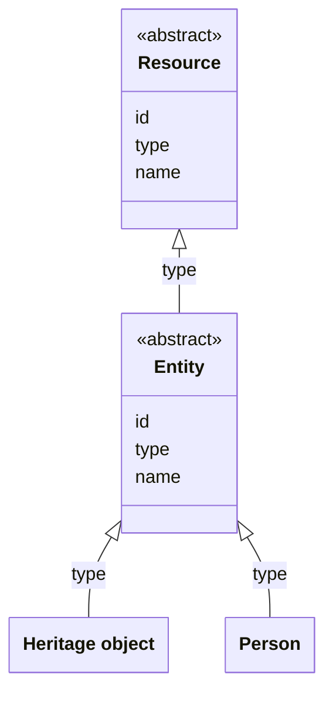

# Entities

## Introduction

An entity is an identifiable 'thing' relevant to heritage. For example: 'The Night Watch' (a painting), 'Rembrandt' (a person), 'Amsterdam' (a place) and 'Brabantine Gothic' (a concept) are all entities.

Entities are what every data layer is about. They are the heritage information that a data layer exposes through its API. Presentation layers present this information to their users. Everything else the data layer publishes — collections, facet values, keyword values — serves the entities: it organises, groups or finds them.

An entity has a URI of its own, independent of the collections it is a part of. The identifier of an entity is unique across all entity types and does not contain the type of the entity.

## Data model

An entity is a specialisation of a [Resource](resources.md#resource): it has an `id`, a `type` and a `name`. An entity is abstract: there is no entity whose type is `Entity`. Every entity has one of the concrete types that a data layer defines, published as part of its [type vocabulary](types.md).

The following class diagram visualises how entity types relate to a Resource and to each other. It shows two examples of the concrete types a data layer can define, 'Heritage object' and 'Person':



## Entity types

An entity can be of any type. A data layer decides which types are relevant to its API and the presentation layers it serves.

For example, a data layer that exposes information about...

1. **all sorts of heritage objects** where the exact type does not matter, defines the generic entity type 'Heritage object';
1. **books** and **cars** defines the specific entity types 'Book' and 'Car';
1. **historical places** defines the specific entity types 'City', 'Town' and 'Hamlet';
1. **datasets** with heritage information defines the specific entity types 'Dataset' and 'Distribution'.

The following table provides examples of common entity types:

| Entity type name | Description                                                                |
| ---------------- | -------------------------------------------------------------------------- |
| Heritage object  | A valued object, e.g. a building, painting, book or document.              |
| Person           | A human being.                                                             |
| Organisation     | An organised group of people.                                              |
| Place            | A spatial extent on the Earth's surface.                                   |
| Concept          | A unit of thought.                                                         |
| Event            | A thing that happened at a certain time and location.                      |
| Story            | An account of an event.                                                    |
| Dataset          | A collection of data, e.g. data about heritage objects.                    |
| Digital object   | A digital representation of an entity, e.g. an image of a heritage object. |

### Recommended data models

:::note To do:

Describe the recommended data models (e.g. for a heritage object, a person, a place) using e.g. Schema.org concepts.

:::

:::note To do:

Explain data modelling requirements, e.g.

- Each entity must refer to the data provider's publication layer from which it came (e.g. `isBasedOn`), must have a licence (e.g. `license`) and must have an ID that a presentation layer can use, e.g. for bookmarking (e.g. `identifier`);
- An entity should expose the [collections](collections.md) the entity is a member of. A presentation layer can then offer a 'more like this' or 'more from this collection' functionality.

:::

## Assigning identifiers to entities

Every entity has a URI. A presentation layer uses that URI to retrieve the entity: requesting it returns the entity via the [Retrieve an entity](#endpoint-retrieve-an-entity) endpoint. The URI is also the identifier of the entity: wherever the entity appears — for example, in the items of a collection or in the properties of another entity — the data layer refers to it with this same URI.

The URI of an entity always has the form `/{version}/entities/{id}`:

- `entities` is fixed. Every entity URI contains it.
- `{version}` is the version of the API of the data layer.
- `{id}` is the path identifier, and it is variable. The data layer determines it.

Two different things are both called `id`. In a response body, the `id` of an entity is its full URI, for example `https://example.org/v1/entities/1234`. In the URI form `/{version}/entities/{id}`, the `{id}` is the path identifier: the part after `/entities/`, for example `1234`. The requirements and examples in this section are about the path identifier.

The data layer _MUST_ determine the `{id}` in line with the following requirements:

- If the entity comes from a data provider — and most entities do — the `{id}` _MUST_ be traceable to the source identifier: the identifier that the data provider assigned to the entity.
- The `{id}` _MUST_ be deterministic: when the data layer processes the data of that data provider again, it must yield the same `{id}`. Otherwise a presentation layer cannot use the URI — for example, in the web address of a detail page, or when a user bookmarks, saves or favourites an entity.
- The `{id}` _MUST_ not change when the version of the API changes: `/v1/entities/{id}` may become `/v2/entities/{id}`, but the `{id}` stays the same.

These requirements do not promise that an `{id}` stays the same forever. A data layer cannot guarantee that: it depends on the data provider, and the source identifier may itself change.

The data layer _MAY_ choose any approach that satisfies the requirements of this section. The following approaches are examples of what an `{id}` may look like:

- **The `{id}` _is_ the source identifier.** For example, the source identifier of 'The Night Watch', as assigned by the Rijksmuseum, is `https://id.rijksmuseum.nl/200107928`. The URI of the entity is `https://example.org/v1/entities/https%3A%2F%2Fid.rijksmuseum.nl%2F200107928` (encoded so that it fits in a URI).
- **The `{id}` is a hash of the source identifier**. For example, the hash of the source identifier of 'The Night Watch' is `874f078c5723abf6f0d86dffbbb827b6c82cd0a26ee6c7657519cbab830cef4d` (created with the [BLAKE3](<https://en.wikipedia.org/wiki/BLAKE_(hash_function)>) hashing algorithm). The URI of the entity is `https://example.org/v1/entities/874f078c5723abf6f0d86dffbbb827b6c82cd0a26ee6c7657519cbab830cef4d`.
- **The `{id}` is an identifier generated by the data layer, traceable to the source identifier.** For example, `{id}` is a number (`1234`) or a Nano ID (`d8fe02e4`), assigned the first time the data layer takes the entity in and reused afterwards. The URI of the entity is `https://example.org/v1/entities/1234`.

## Endpoint: Retrieve an entity

The endpoint retrieves an entity. The data layer _MUST_ implement this endpoint if it publishes at least one entity.

### HTTP request

`GET /{version}/entities/{id}`

### Path parameters

| Name      | Data type | Cardinality | Description                                         |
| --------- | --------- | ----------- | --------------------------------------------------- |
| `version` | string    | 1           | The version of the API. Example: `v1`.              |
| `id`      | string    | 1           | The path identifier of the entity. Example: `1234`. |

### Query parameters

None.

### Request body

None.

### Response body

The response body _MUST_ contain at least the properties underneath. Additional properties depend on the data model of the entity, defined by the data layer.

| Name   | Data type | Cardinality | Description                   |
| ------ | --------- | ----------- | ----------------------------- |
| `id`   | string    | 1           | The identifier of the entity. |
| `type` | string    | 1           | The type of the entity.       |
| `name` | string    | 1           | The name of the entity.       |

### Example

An example request from a presentation layer:

```http
GET /v1/entities/1234
Host: example.org
```

The request indicates that the data layer should return the entity with ID `1234`.

The response body depends on the data model of the entity. An example:

```json
{
  "id": "https://example.org/v1/entities/1234",
  "type": "HeritageObject",
  "name": "The Night Watch",
  "additionalTypes": [
    {
      "id": "https://example.org/v1/entities/1122",
      "type": "Concept",
      "name": "Painting"
    }
  ],
  "description": "Rembrandt’s largest, most famous canvas was made for the Arquebusiers guild hall...",
  "dateCreated": "1642",
  "creators": [
    {
      "id": "https://example.org/v1/entities/5678",
      "type": "Person",
      "name": "Rembrandt"
    }
  ],
  "locationsCreated": [
    {
      "id": "https://example.org/v1/entities/9012",
      "type": "Place",
      "name": "Amsterdam"
    }
  ]
  // Other properties...
}
```

The response indicates that this entity is a `HeritageObject` and has name 'The Night Watch'. It is linked to other entities of types `Concept`, `Person` and `Place`.

:::note

This specification does not define an endpoint that retrieves a list of all entities. A presentation layer finds the entities of a data layer through [collections](collections.md): a data layer groups its entities into curated collections, and a presentation layer browses a collection or filters its items to find the entities it needs.

:::
