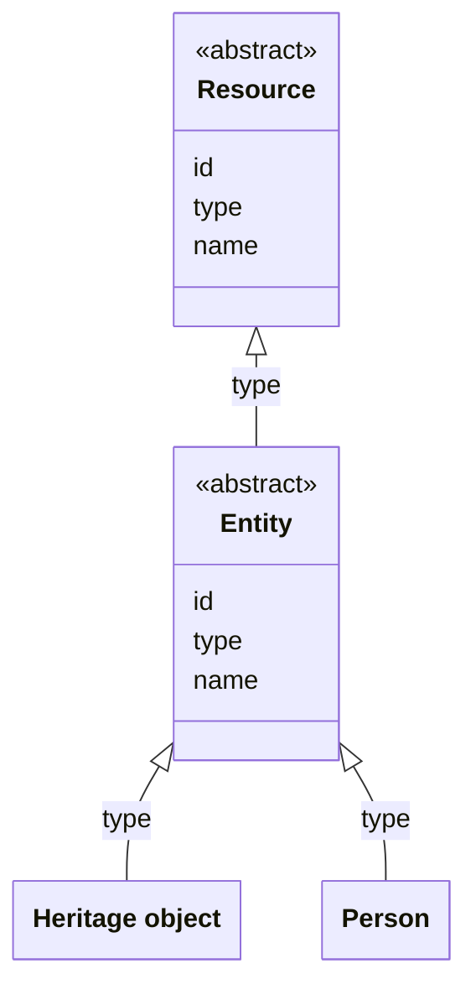

# Entities

## Introduction

An entity is an identifiable 'thing' relevant to heritage. For example: 'The Night Watch' (a painting), 'Rembrandt' (a person), 'Amsterdam' (a place) and 'Brabantine Gothic' (a concept) are all entities.

An entity has a URI of its own, independent of the collections it is a part of. The identifier of an entity is unique across all entity types and does not contain the type of the entity.

Entities can be grouped into [curated collections](collections.md). For example: all persons can be a part of the 'persons' collection, while 'The Night Watch' can be a part of the 'Masterpieces' collection and of the 'Paintings from the 17th century' collection. An entity can be a part of any number of collections, and of no collection at all. It is up to the data layer to decide how it groups its entities: a collection is a selection, not a type.

## Data model

An entity is a specialization of a [Resource](resources.md#resource): it has an `id`, a `type` and a `name`. An entity is abstract: there is no entity whose type is `Entity`. Every entity has one of the concrete types that a data layer defines, published as part of its [type vocabulary](types.md).

The following class diagram visualizes how entity types relate to a Resource and to each other. It shows two examples of the concrete types a data layer can define, 'Heritage object' and 'Person':



## Entity types

An entity can be of any type. A data layer decides which types are relevant to its API and the presentation layers it serves.

For example, an API that exposes information about...

1. **all sorts of heritage objects** where the exact type does not matter, defines the generic entity type 'Heritage object';
1. **books** and **cars** defines the specific entity types 'Book' and 'Car';
1. **historical places** defines the specific entity types 'City', 'Town' and 'Hamlet';
1. **datasets** with heritage information defines the specific entity types 'Dataset' and 'Distribution'.

The following table provides examples of common entity types:

| Entity type name | Description                                                                |
| ---------------- | -------------------------------------------------------------------------- |
| Heritage object  | A valued object, e.g. a building, painting, book or document.              |
| Person           | A human being.                                                             |
| Organization     | An organized group of people.                                              |
| Place            | A spatial extent on the Earth's surface.                                   |
| Concept          | A unit of thought.                                                         |
| Event            | A thing that happened at a certain time and location.                      |
| Story            | An account of an event.                                                    |
| Dataset          | A collection of data, e.g. data about heritage objects.                    |
| Digital object   | A digital representation of an entity, e.g. an image of a heritage object. |

### Recommended data models for entity types

:::note

**To do**:

- Describe the recommended data models (e.g. for a heritage object, a person, a place) using e.g. Schema.org concepts;
- Explain data modeling requirements, e.g. each entity must refer to the data provider's publication system from which it came (e.g. `isBasedOn`), and must have a license (e.g. `license`);

:::

## Endpoint: Retrieve an entity

The endpoint retrieves an entity. The API _MUST_ implement this endpoint if it publishes at least one entity.

### HTTP request

`GET /{version}/entities/{id}`

### Path parameters

| Name      | Data type | Cardinality | Description                                         |
| --------- | --------- | ----------- | --------------------------------------------------- |
| `version` | string    | 1           | The version of the API. Example: `v1`.              |
| `id`      | string    | 1           | The path identifier of the entity. Example: `1234`. |

### Query parameters

None.

### Request body

None.

### Response body

The response body _MUST_ contain at least the fields underneath. Additional fields depend on the data model of the entity, defined by the API.

| Name   | Data type | Cardinality | Description                   |
| ------ | --------- | ----------- | ----------------------------- |
| `id`   | string    | 1           | The identifier of the entity. |
| `type` | string    | 1           | The type of the entity.       |
| `name` | string    | 1           | The name of the entity.       |

### Example

An example request from a presentation layer:

```http
GET /v1/entities/1234
Host: example.org
```

The request indicates that the API should return the entity with ID `1234`.

The response body depends on the data model of the entity. An example:

```json
{
  "id": "https://example.org/v1/entities/1234",
  "type": "HeritageObject",
  "name": "The Night Watch",
  "additionalTypes": [
    {
      "id": "https://example.org/v1/entities/1122",
      "type": "Concept",
      "name": "Painting"
    }
  ],
  "description": "Rembrandt’s largest, most famous canvas was made for the Arquebusiers guild hall...",
  "dateCreated": "1642",
  "creators": [
    {
      "id": "https://example.org/v1/entities/5678",
      "type": "Person",
      "name": "Rembrandt"
    }
  ],
  "locationsCreated": [
    {
      "id": "https://example.org/v1/entities/9012",
      "type": "Place",
      "name": "Amsterdam"
    }
  ]
  // Other fields...
}
```

The response indicates that this entity is a `HeritageObject` and has name 'The Night Watch'. It is linked to other entities of types `Concept`, `Person` and `Place`.

:::note

**To be discussed**: an entity response does not expose the collections the entity is a member of. A presentation layer can therefore not offer a 'more like this' or 'more from this collection' functionality. Consider adding an optional field to the entity structure listing the [curated collections](collections.md) the entity is a part of?

:::
