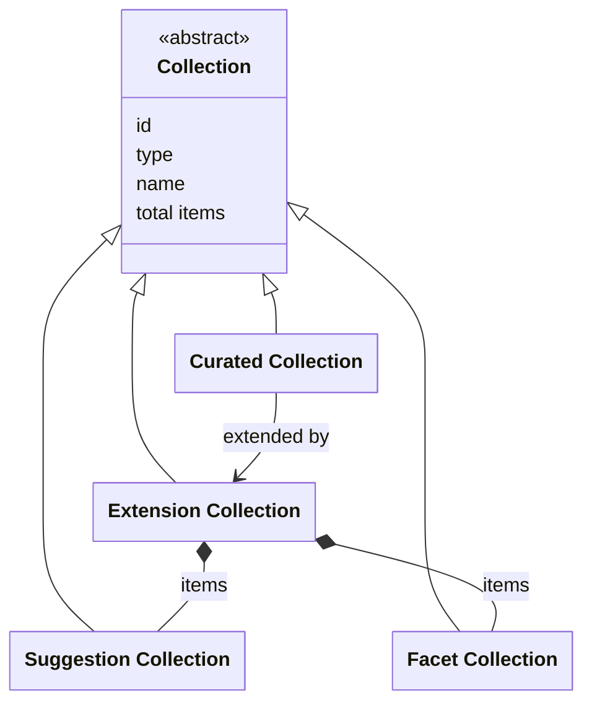

# Extensions

## Introduction

An extension is a resource that supplements a curated collection with additional functionality. This specification defines two core extensions: [Facets](facets.md) and [Suggestions](suggestions.md). A data layer may also implement its own custom extensions for specific use cases.

An extension is supplementary and, therefore, _OPTIONAL_. It's up to a data layer to decide whether or not to implement one.

A presentation layer discovers the extension collection through the curated collection itself: the `extendedBy` field of a curated collection points to its extension collection, and `extendedBy.id` is the URI to request. A collection with no extensions omits `extendedBy`, so a presentation layer knows there are none.

:::note

**To do**: rethink this section - the concept of 'extensions' may be too difficult. Generalize to, for example, 'capabilities'? See for example search result highlighting, the visual technique that wraps matching query words in HTML tags (like `<em>` or `<mark>`), showing users why a result matches their input. Is there a way to define this functionality as an extension according to the rules on this page, or should it be defined in a different way (see [Capability discovery](collections.md#capability-discovery))?

:::

## Data model

| Name                  | Description                                                                                                |
| --------------------- | ---------------------------------------------------------------------------------------------------------- |
| Collection            | An ordered list of resources. The generic type. See [Resources](resources.md).                             |
| Curated Collection    | An ordered list of entities or further curated collections. See [Collections](collections.md).             |
| Extension Collection  | A collection of extensions, adding additional functionality to a curated collection.                       |
| Suggestion Collection | An extension that provides suggestions. Specialization of `Collection`. See [Suggestions](suggestions.md). |
| Facet Collection      | An extension that provides facets. Specialization of `Collection`. See [Facets](facets.md).                |

The following class diagram visualizes the data model:



## Endpoint: Retrieve the extension collection of a curated collection

The endpoint retrieves the extension collection belonging to a curated collection. The API _MUST_ implement this endpoint if it supports extensions.

This is a discovery endpoint: it allows presentation layers to identify the extensions and their endpoint URIs. It lists every extension of the curated collection together - the facet collections and the suggestion collections side by side - and a presentation layer tells them apart by `type`.

### HTTP request

`GET /{version}/collections(/{...collections})/{collection}/{extensions}`

### Path parameters

| Name             | Data type | Cardinality | Description                                                                                        |
| ---------------- | --------- | ----------- | -------------------------------------------------------------------------------------------------- |
| `version`        | string    | 1           | The version of the API. Example: `v1`.                                                             |
| `...collections` | string    | 0 or more   | The path identifier(s) of the collection(s) the curated collection is part of. Example: `persons`. |
| `collection`     | string    | 1           | The path identifier of the curated collection. Example: `masterpieces`.                            |
| `extensions`     | string    | 1           | The path identifier of the extension collection. Example: `extensions`.                            |

### Query parameters

None.

### Request body

None.

### Response body

The response body _MUST_ contain at least the following fields:

| Name            | Data type         | Cardinality | Description                                                                                                                                                                                                                                                                                                               |
| --------------- | ----------------- | ----------- | ------------------------------------------------------------------------------------------------------------------------------------------------------------------------------------------------------------------------------------------------------------------------------------------------------------------------- |
| `id`            | string            | 1           | The identifier of the collection.                                                                                                                                                                                                                                                                                         |
| `type`          | string            | 1           | The type of the collection. It _MUST_ be `ExtensionCollection`.                                                                                                                                                                                                                                                           |
| `name`          | string            | 1           | The name of the collection.                                                                                                                                                                                                                                                                                               |
| `totalItems`    | number            | 1           | The total number of extensions in the collection.                                                                                                                                                                                                                                                                         |
| `items`         | array             | 1           | A list of all extensions. The API defines the order.                                                                                                                                                                                                                                                                      |
| `items[*]`      | Collection        | 1           | An extension: a collection that provides additional functionality to the curated collection.                                                                                                                                                                                                                              |
| `items[*].id`   | string            | 1           | The identifier of the extension collection.                                                                                                                                                                                                                                                                               |
| `items[*].type` | string            | 1           | The type of the extension collection. It _MUST_ be `Collection` or a specialization. A presentation layer recognizes an extension by its type: it is a suggestion collection if its `type` is `SuggestionCollection` or a specialization, and a facet collection if its `type` is `FacetCollection` or a specializationt. |
| `items[*].name` | string            | 1           | The name of the extension collection.                                                                                                                                                                                                                                                                                     |
| `extends`       | CuratedCollection | 1           | The curated collection that is extended by this collection.                                                                                                                                                                                                                                                               |
| `extends.id`    | string            | 1           | The identifier of the curated collection.                                                                                                                                                                                                                                                                                 |
| `extends.type`  | string            | 1           | The type of the curated collection. It _MUST_ be `CuratedCollection` or a specialization.                                                                                                                                                                                                                                 |
| `extends.name`  | string            | 1           | The name of the curated collection.                                                                                                                                                                                                                                                                                       |

### Example

An example request from a presentation layer:

```http
GET /v1/collections/objects/extensions
Host: example.org
```

The request indicates that the API should return the extension collection belonging to a curated collection (`objects`).

An example of the response body of the API:

```json
{
  "id": "https://example.org/v1/collections/objects/extensions",
  "type": "ExtensionCollection",
  "name": "Extensions",
  "totalItems": 3,
  "items": [
    {
      "id": "https://example.org/v1/collections/objects/extensions/centuries",
      "type": "FacetCollection",
      "name": "Made in century"
    },
    {
      "id": "https://example.org/v1/collections/objects/extensions/creators",
      "type": "FacetCollection",
      "name": "Creator"
    },
    {
      "id": "https://example.org/v1/collections/objects/extensions/keywords",
      "type": "KeywordSuggestionCollection",
      "name": "Keyword suggestions"
    }
  ],
  "extends": {
    "id": "https://example.org/v1/collections/objects",
    "type": "CuratedCollection",
    "name": "Heritage objects"
  }
}
```

The response indicates that a curated collection (`objects`) has three extensions: two facet collections and a keyword suggestion collection. A presentation layer recognizes each of them by its `type`: the `FacetCollection` and the `KeywordSuggestionCollection`. The presentation layer can use this information to dynamically create a user interface and offer specific functionality to users.
