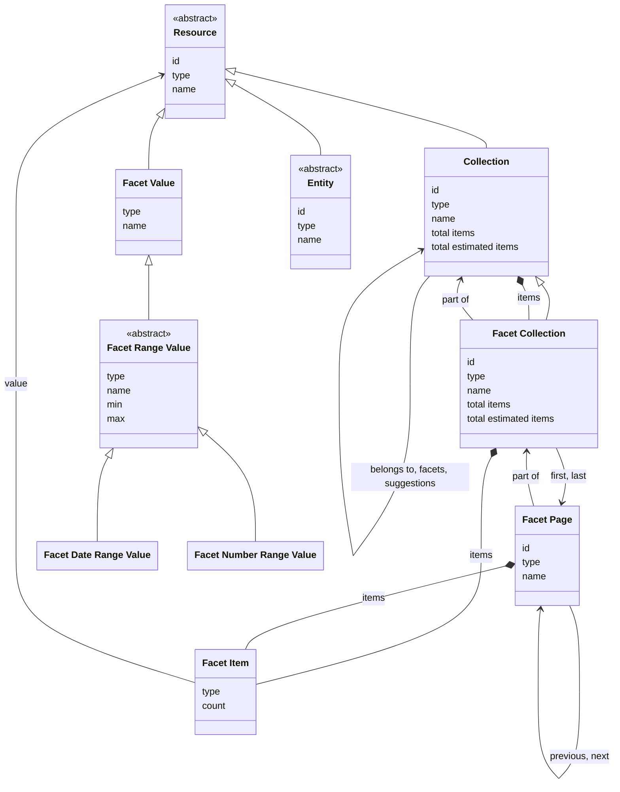

# Facets

## Introduction

A facet is a collection of values that a user can pick to narrow down a search. For example, a 'Creator' facet holds the creators of heritage objects, a 'Place of birth' facet holds the birth places of persons.

In this specification, the word _facet_ always means a **facet collection**: a list of categorized values for narrowing a search. The 'Creator' facet is the list of all creators, not one creator. A facet is a collection of **facet items**; one **facet item** is one option in that list, such as 'Jan de Vries', and the thing a facet item points to is its **value**, such as an [entity](entities.md).

Search engines use other words for the same things. Elasticsearch calls a facet an _aggregation_ and the facet items _buckets_. Solr calls a facet a _facet field_.

A presentation layer can browse the facet items in a facet collection, filter them, and ask for suggestions for them — just like any other collection. What makes a facet collection special is what its items hold: each item points to a value a user can use to narrow a search.

Facets are tied to a particular collection — the context collection — ensuring that results remain within the context of that collection. A data layer _MAY_ offer facets for any collection, except for a facet collection itself.

Facets are optional. A data layer _MAY_ implement them, depending on its requirements. A data layer advertises the facet collections it supports for a collection in the generic [`facets` property](resources.md#collection) of that collection. The property points to the list of facet collections, which a presentation layer retrieves with the endpoint [Retrieve the facet collections of a collection](#endpoint-retrieve-the-facet-collections-of-a-collection).

## Data model

| Name                     | Description                                                                                                                                                                                                                                                                                                   |
| ------------------------ | ------------------------------------------------------------------------------------------------------------------------------------------------------------------------------------------------------------------------------------------------------------------------------------------------------------- |
| Collection               | An ordered list of resources. The generic type. See [Resources](resources.md).                                                                                                                                                                                                                                |
| Facet Collection         | An ordered list of facet items. Specialization of Collection.                                                                                                                                                                                                                                                 |
| Facet Page               | An ordered sublist of facet items within a Facet Collection. Specialization of Page.                                                                                                                                                                                                                          |
| Facet Item               | A selectable option within a Facet Collection or Facet Page, pointing to a resource.                                                                                                                                                                                                                          |
| Resource                 | A 'thing' of a certain type. Every value of a facet item is a resource. See [Resources](resources.md).                                                                                                                                                                                                        |
| Facet Value              | A value of a facet item, e.g. a value with the name 'Jan de Vries'. A data layer uses a Facet Value to group several resources that have the same name into one facet item. It has no identity of its own.                                                                                                    |
| Facet Range Value        | A value of a facet item that covers a range, such as the years 1900 to 1950 or an age from 30 to 40. It has a `name`, a lower bound `min` and an upper bound `max`. It has no form of its own: a range value is either a Facet Date Range Value or a Facet Number Range Value. Specialization of Facet Value. |
| Facet Date Range Value   | A range of dates, such as the years 1900 to 1950. Its `min` and `max` are dates in [ISO 8601](https://en.wikipedia.org/wiki/ISO_8601). Specialization of Facet Range Value.                                                                                                                                   |
| Facet Number Range Value | A range of numbers, such as an age from 30 to 40. Its `min` and `max` are numbers. Specialization of Facet Range Value.                                                                                                                                                                                       |
| Entity                   | An identifiable 'thing' relevant to heritage. See [Entities](entities.md).                                                                                                                                                                                                                                    |

The following class diagram visualizes the data model:



## Facet collections

The data layer determines which facet collections to support. For example, an API that exposes information about...

1. **paintings** defines the facet collection 'Technique', to categorize the techniques used for creating the works of art;
1. **military personnel** defines the facet collection 'Military rank', to categorize the ranks of the persons;
1. **cars** defines the facet collection 'Color', to categorize the primary colors of the cars.

The following table lists some common facet collections:

**For heritage objects**:

| Name               | Description                                                                                                         |
| ------------------ | ------------------------------------------------------------------------------------------------------------------- |
| Type               | The types of heritage objects, e.g. 'Building', 'Painting'.                                                         |
| Creator            | The creators of heritage objects, e.g. 'Vincent van Gogh', 'Rembrandt'.                                             |
| Made in century    | The dates of creation of heritage objects grouped by century, e.g. '17th century', '18th century'.                  |
| Made in place      | The places of creation of heritage objects, e.g. 'Amsterdam', 'The Hague'.                                          |
| Publisher          | The heritage institutions that publish information about heritage objects, e.g. 'Rijksmuseum', 'National Archives'. |
| Part of collection | The collections a heritage object belongs to, e.g. 'Masterpieces', 'Great for kids'.                                |

**For persons**:

| Name               | Description                                                                                                |
| ------------------ | ---------------------------------------------------------------------------------------------------------- |
| Place of birth     | The places of birth of persons, e.g. 'Amsterdam', 'The Hague'.                                             |
| Occupation         | The occupations of persons, e.g. 'Blacksmith', 'Mayor'.                                                    |
| Publisher          | The heritage institutions that publish information about persons, e.g. 'Rijksmuseum', 'National Archives'. |
| Part of collection | The collections a person belongs to, e.g. 'Notable Dutch artists'.                                         |

## Facet items

A facet item points to a value. The value is a resource, e.g. an [entity](entities.md), a [collection](resources.md#collection), or a `FacetValue`. Every value has a `name`, but not every value has an `id`. That is what tells the kinds apart.

A resource with an `id` stands for one single thing. For example, an entity has an `id`, and that `id` belongs to one thing only. The `count` of the facet item is the number of occurrences of that one thing. In a 'Creator' facet, the entity 'Jan de Vries' with the ID `https://example.org/v1/entities/1234` has a `count` of 12: twelve heritage objects have this person as their creator.

A `FacetValue` does not have an `id`: it does not stand for one single thing but for several. All of them have the same name. The `count` of the facet item is the total number of occurrences of all of them together.

This difference matters when several resources have the same name. In a 'Creator' facet, three different persons can all be called 'Jan de Vries'. A data layer has two choices:

- **Use an entity for every person.** The facet has three items. All three items have the name 'Jan de Vries'. Every item has its own `id` and its own `count`. A user sees the same name three times, and sees nothing that tells the three items apart.
- **Use one `FacetValue` for the name.** The facet has one item, called 'Jan de Vries'. The item has no `id`. Its `count` is the sum of the occurrences of the three persons together.

A data layer can make this choice for each facet collection separately. The choice is the same for every kind of value, since collections can have the same name as well.

A facet collection _MUST_ use the same kind of value for all its items. This makes sure a presentation layer can present every item in the same way. A 'Creator' facet therefore uses either entities or `FacetValue`s, not a mixture of the two.

A presentation layer shows the `name` of the value. It uses the `id` when it needs to point to one specific thing and to retrieve more information about it, e.g. [about an entity](entities.md#endpoint-retrieve-an-entity) or [about a collection](collections.md#endpoint-retrieve-a-collection).

### Range values

A `FacetRangeValue` is a `FacetValue` that covers a range instead of one value. For example, it can cover the years 1900 to 1950 or an age from 30 to 40. It has a `name` for display, a lower bound `min`, and an upper bound `max`.

The `type` of a value says how to read its bounds. The `min` and `max` of a `FacetDateRangeValue` _MUST_ be dates in [ISO 8601](https://en.wikipedia.org/wiki/ISO_8601). For example, '1900', '1900-01' and '1900-01-01' are all dates. The `min` and `max` of a `FacetNumberRangeValue` _MUST_ be numbers.

A range value _MUST_ include its lower bound, but not its upper bound. For example, the value '1900–1909' has a `min` of `1900-01-01` and a `max` of `1910-01-01`: it covers 1 January 1900 up to, but not including, 1 January 1910. A range value _MAY_ have no lower bound or no upper bound: the value 'before 1500' has no upper bound, and the value 'after 1900' has no lower bound. The API _MAY_ leave out values that have no occurrences.

A facet collection _MUST NOT_ mix range values of different types, for example `FacetDateRangeValue`s together with `FacetNumberRangeValue`s. This makes sure a presentation layer can display the range values correctly. A facet collection _MAY_ return its range values in any order. If the client does not ask for a particular order, the API _SHOULD_ return them from the lowest to the highest, so that a presentation layer can place them in the right order, for example on the axis of a histogram.

The `name` is the label of the value. The API may use any text in it, such as '1900–1950', 'between 1900 and 1950', or '1900 to 1950'. A presentation layer _MUST NOT_ read the bounds out of the `name` — it must use the `min` and `max` properties. A presentation layer can use the bounds to place every facet value on a scale. It can draw a histogram, with one bar per value from its lower bound to its upper bound. It can draw a timeline, with one band per value that shows how long the range lasts.

## Endpoint: Retrieve the facet collections of a collection

The endpoint retrieves all facet collections of a collection. The API _MUST_ implement this endpoint if it supports facets.

### HTTP request

`GET /{version}/{...collections}/facets`

### Path parameters

| Name             | Data type | Cardinality | Description                                                                                                                                    |
| ---------------- | --------- | ----------- | ---------------------------------------------------------------------------------------------------------------------------------------------- |
| `version`        | string    | 1           | The version of the API. Example: `v1`.                                                                                                         |
| `...collections` | string    | 1 or more   | The path identifier(s) of the context collection, including the collections it is part of or that it contains. Example: `collections/objects`. |

### Query parameters

None.

### Request body

None.

### Response body

The response body _MUST_ contain at least the following properties:

| Name                  | Data type       | Cardinality | Description                                                                                                                                                                 |
| --------------------- | --------------- | ----------- | --------------------------------------------------------------------------------------------------------------------------------------------------------------------------- |
| `id`                  | string          | 1           | The identifier of the collection.                                                                                                                                           |
| `type`                | string          | 1           | The type of the collection. It _MUST_ be `Collection` or a specialization.                                                                                                  |
| `name`                | string          | 1           | The name of the collection.                                                                                                                                                 |
| `totalItems`          | number          | 0 or 1      | The exact total number of facet collections. Not set if the exact total is too costly to calculate. Mutually exclusive with `estimatedTotalItems`.                          |
| `estimatedTotalItems` | number          | 0 or 1      | An estimate of the total number of facet collections. It can be higher or lower than the real total. Not set if there is no estimate. Mutually exclusive with `totalItems`. |
| `items`               | array           | 1           | A list of the facet collections of the context collection.                                                                                                                  |
| `items[*]`            | FacetCollection | 1           | A facet collection.                                                                                                                                                         |
| `items[*].id`         | string          | 1           | The identifier of the facet collection.                                                                                                                                     |
| `items[*].type`       | string          | 1           | The type of the facet collection. It _MUST_ be `FacetCollection` or a specialization.                                                                                       |
| `items[*].name`       | string          | 1           | The name of the facet collection.                                                                                                                                           |
| `belongsTo`           | Collection      | 1           | The context collection that this is the list of facet collections for.                                                                                                      |
| `belongsTo.id`        | string          | 1           | The identifier of the collection.                                                                                                                                           |
| `belongsTo.type`      | string          | 1           | The type of the collection. It _MUST_ be `Collection` or a specialization.                                                                                                  |
| `belongsTo.name`      | string          | 1           | The name of the collection.                                                                                                                                                 |

The API _MUST NOT_ divide this collection into pages. The response body therefore does not contain `first` or `last`.

### Example

An example request from a presentation layer:

```http
GET /v1/collections/objects/facets
Host: example.org
```

The request indicates that the API should return all facet collections of a curated collection (`objects`).

An example of the response body of the API:

```json
{
  "id": "https://example.org/v1/collections/objects/facets",
  "type": "Collection",
  "name": "Facets",
  "totalItems": 4,
  "items": [
    {
      "id": "https://example.org/v1/collections/objects/facets/creators",
      "type": "FacetCollection",
      "name": "Creator"
    },
    {
      "id": "https://example.org/v1/collections/objects/facets/centuries",
      "type": "FacetCollection",
      "name": "Made in century"
    },
    {
      "id": "https://example.org/v1/collections/objects/facets/subjects",
      "type": "FacetCollection",
      "name": "Subject"
    },
    {
      "id": "https://example.org/v1/collections/objects/facets/collections",
      "type": "FacetCollection",
      "name": "Part of collection"
    }
  ],
  "belongsTo": {
    "id": "https://example.org/v1/collections/objects",
    "type": "CuratedCollection",
    "name": "Objects"
  }
}
```

## Endpoint: Retrieve a facet collection

The endpoint retrieves a facet collection. The API _MUST_ implement this endpoint if it supports facets.

### HTTP request

`GET /{version}/{...collections}/facets/{facet}`

### Path parameters

| Name             | Data type | Cardinality | Description                                                                                                                                    |
| ---------------- | --------- | ----------- | ---------------------------------------------------------------------------------------------------------------------------------------------- |
| `version`        | string    | 1           | The version of the API. Example: `v1`.                                                                                                         |
| `...collections` | string    | 1 or more   | The path identifier(s) of the context collection, including the collections it is part of or that it contains. Example: `collections/objects`. |
| `facet`          | string    | 1           | The path identifier of the facet collection. Example: `creators`, `centuries`.                                                                 |

### Query parameters

| Name      | Data type | Cardinality | Description                                                                                                                                                                                                                                |
| --------- | --------- | ----------- | ------------------------------------------------------------------------------------------------------------------------------------------------------------------------------------------------------------------------------------------ |
| `q`       | string    | 0 or 1      | A keyword query for filtering the facet items. Minimum length: defined by the API (e.g. 3 characters). Maximum length: defined by the API (e.g. 25 characters).                                                                            |
| `size`    | number    | 0 or 1      | The maximum number of facet items to retrieve. Minimum: 1. Default: 10. Maximum: defined by the API (e.g. 100).                                                                                                                            |
| `orderBy` | string    | 0 or 1      | The sorting order of the facet items. One of `count`, `value`. Default: `count:desc` (most frequent item first). The API defines which property of the value it sorts by (e.g. the `name`). For a range value, the API sorts by its `min`. |
| `filter`  | string    | 0 or more   | The rules for filtering the facet items. See [Filters](resources.md#filters).                                                                                                                                                              |

:::note To do:

Add the query parameters that carry the "search context" of the context collection, so that the facet items reflect the same search as the page in that collection (`q` and `filter` of endpoint [Retrieve a page in a collection](collections.md#endpoint-retrieve-a-page-in-a-collection)).

:::

### Request body

None.

### Response body

The response body _MUST_ contain at least the following properties:

| Name                  | Data type  | Cardinality | Description                                                                                                                                                                                                                                                      |
| --------------------- | ---------- | ----------- | ---------------------------------------------------------------------------------------------------------------------------------------------------------------------------------------------------------------------------------------------------------------- |
| `id`                  | string     | 1           | The identifier of the collection.                                                                                                                                                                                                                                |
| `type`                | string     | 1           | The type of the collection. It _MUST_ be `FacetCollection` or a specialization.                                                                                                                                                                                  |
| `name`                | string     | 1           | The name of the collection.                                                                                                                                                                                                                                      |
| `totalItems`          | number     | 0 or 1      | The exact total number of facet items in the collection. Not set if the exact total is too costly to calculate. Mutually exclusive with `estimatedTotalItems`.                                                                                                   |
| `estimatedTotalItems` | number     | 0 or 1      | An estimate of the total number of facet items in the collection. It can be higher or lower than the real total. Not set if there is no estimate. Mutually exclusive with `totalItems`.                                                                          |
| `items`               | array      | 0 or 1      | A list of the facet items in the collection. Not set if the collection is divided into [pages](resources.md#page).                                                                                                                                               |
| `items[*]`            | FacetItem  | 1           | A facet item.                                                                                                                                                                                                                                                    |
| `items[*].type`       | string     | 1           | The type of the facet item. It _MUST_ be `FacetItem`.                                                                                                                                                                                                            |
| `items[*].count`      | number     | 1           | The number of occurrences of the value. If the value is a `FacetValue`, the count covers all resources that the data layer grouped into it.                                                                                                                      |
| `items[*].value`      | Resource   | 1           | The value of the facet item: an entity, a collection, or a facet value that groups several resources.                                                                                                                                                            |
| `items[*].value.type` | string     | 1           | The type of the value of the facet item. It _MUST_ be `Resource` or a specialization. See [Facet items](#facet-items).                                                                                                                                           |
| `items[*].value.id`   | string     | 0 or 1      | The identifier of the value. Not set if the value is a `FacetValue`; a facet value has no identity.                                                                                                                                                              |
| `items[*].value.name` | string     | 1           | The name of the value.                                                                                                                                                                                                                                           |
| `items[*].value.min`  | string     | 0 or 1      | The lower bound of the range. Not set if the range has no lower bound, such as in a facet value 'before 1500'.                                                                                                                                                   |
| `items[*].value.max`  | string     | 0 or 1      | The upper bound of the range. Not set if the range has no upper bound, such as in a facet value 'after 1900'.                                                                                                                                                    |
| `first`               | FacetPage  | 0 or 1      | The first page in the collection. Not set if the collection is empty or if it is not divided into [pages](resources.md#page).                                                                                                                                    |
| `first.id`            | string     | 1           | The identifier of the first page in the collection.                                                                                                                                                                                                              |
| `first.type`          | string     | 1           | The type of the first page in the collection. It _MUST_ be `FacetPage` or a specialization.                                                                                                                                                                      |
| `last`                | FacetPage  | 0 or 1      | The last page in the collection. Not set if the collection is empty, if the collection is not divided into [pages](resources.md#page), or if the last page is unknown (e.g. in case of [cursor navigation](resources.md#page-navigation-and-cursor-navigation)). |
| `last.id`             | string     | 1           | The identifier of the last page in the collection.                                                                                                                                                                                                               |
| `last.type`           | string     | 1           | The type of the last page in the collection. It _MUST_ be `FacetPage` or a specialization.                                                                                                                                                                       |
| `partOf`              | Collection | 1           | The collection that lists the facet collections of the context collection, including this one. See the response body of endpoint [Retrieve the facet collections of a collection](#endpoint-retrieve-the-facet-collections-of-a-collection).                     |
| `partOf.id`           | string     | 1           | The identifier of the collection.                                                                                                                                                                                                                                |
| `partOf.type`         | string     | 1           | The type of the collection. It _MUST_ be `Collection` or a specialization.                                                                                                                                                                                       |
| `partOf.name`         | string     | 1           | The name of the collection.                                                                                                                                                                                                                                      |
| `suggestions`         | Collection | 0 or 1      | The list of this facet collection's suggestion collections. _MUST_ be omitted if the facet collection does not offer suggestions. See [Suggestions](suggestions.md).                                                                                             |
| `suggestions.id`      | string     | 1           | The identifier of the list.                                                                                                                                                                                                                                      |
| `suggestions.type`    | string     | 1           | The type of the list. It _MUST_ be `Collection` or a specialization.                                                                                                                                                                                             |
| `suggestions.name`    | string     | 1           | The name of the list.                                                                                                                                                                                                                                            |
| `capabilities`        | array      | 0 or 1      | The URIs of the capabilities the API implements for this collection. _MUST_ be omitted if the collection supports no capabilities. See [Capability discovery](resources.md#capability-discovery).                                                                |

### Example

An example request from a presentation layer:

```http
GET /v1/collections/objects/facets/centuries
Host: example.org
```

The request indicates that the API should return a facet collection (`centuries`) of a curated collection (`objects`).

An example of the response body of the API if the facet collection lists date ranges as its `items`:

```json
{
  "id": "https://example.org/v1/collections/objects/facets/centuries",
  "type": "FacetCollection",
  "name": "Made in century",
  "totalItems": 3,
  "items": [
    {
      "type": "FacetItem",
      "count": 41,
      "value": {
        "type": "FacetDateRangeValue",
        "name": "17th century",
        "min": "1601-01-01",
        "max": "1701-01-01"
      }
    },
    {
      "type": "FacetItem",
      "count": 27,
      "value": {
        "type": "FacetDateRangeValue",
        "name": "18th century",
        "min": "1701-01-01",
        "max": "1801-01-01"
      }
    },
    {
      "type": "FacetItem",
      "count": 12,
      "value": {
        "type": "FacetDateRangeValue",
        "name": "19th century",
        "min": "1801-01-01",
        "max": "1901-01-01"
      }
    }
  ],
  "partOf": {
    "id": "https://example.org/v1/collections/objects/facets",
    "type": "Collection",
    "name": "Facets"
  }
}
```

An example request from a presentation layer:

```http
GET /v1/collections/objects/facets/creators
Host: example.org
```

The request indicates that the API should return a facet collection (`creators`) of a curated collection (`objects`).

An example of the response body of the API if the facet collection is not divided into pages and lists entities as its `items`:

```json
{
  "id": "https://example.org/v1/collections/objects/facets/creators",
  "type": "FacetCollection",
  "name": "Creator",
  "totalItems": 3,
  "items": [
    {
      "type": "FacetItem",
      "count": 12,
      "value": {
        "id": "https://example.org/v1/entities/1234",
        "type": "Person",
        "name": "Arno Haag"
      }
    },
    {
      "type": "FacetItem",
      "count": 8,
      "value": {
        "id": "https://example.org/v1/entities/5678",
        "type": "Person",
        "name": "Hans de Haan"
      }
    },
    {
      "type": "FacetItem",
      "count": 2,
      "value": {
        "id": "https://example.org/v1/entities/3458",
        "type": "Person",
        "name": "John Jansen"
      }
    }
  ],
  "partOf": {
    "id": "https://example.org/v1/collections/objects/facets",
    "type": "Collection",
    "name": "Facets"
  }
}
```

An example of the response body of the API for the request above, if the facet collection lists `FacetValue`s as its `items`:

```json
{
  "id": "https://example.org/v1/collections/objects/facets/creators",
  "type": "FacetCollection",
  "name": "Creator",
  "totalItems": 3,
  "items": [
    {
      "type": "FacetItem",
      "count": 57,
      "value": {
        "type": "FacetValue",
        "name": "Arno Haag"
      }
    },
    {
      "type": "FacetItem",
      "count": 38,
      "value": {
        "type": "FacetValue",
        "name": "Hans de Haan"
      }
    },
    {
      "type": "FacetItem",
      "count": 23,
      "value": {
        "type": "FacetValue",
        "name": "John Jansen"
      }
    }
  ],
  "partOf": {
    "id": "https://example.org/v1/collections/objects/facets",
    "type": "Collection",
    "name": "Facets"
  }
}
```

An example request from a presentation layer:

```http
GET /v1/collections/objects/facets/collections
Host: example.org
```

The request indicates that the API should return a facet collection (`collections`) of a curated collection (`objects`).

An example of the response body of the API if the facet collection lists collections as its `items`:

```json
{
  "id": "https://example.org/v1/collections/objects/facets/collections",
  "type": "FacetCollection",
  "name": "Part of collection",
  "totalItems": 2,
  "items": [
    {
      "type": "FacetItem",
      "count": 80,
      "value": {
        "id": "https://example.org/v1/collections/masterpieces",
        "type": "CuratedCollection",
        "name": "Masterpieces"
      }
    },
    {
      "type": "FacetItem",
      "count": 34,
      "value": {
        "id": "https://example.org/v1/collections/great-for-kids",
        "type": "CuratedCollection",
        "name": "Great for kids"
      }
    }
  ],
  "partOf": {
    "id": "https://example.org/v1/collections/objects/facets",
    "type": "Collection",
    "name": "Facets"
  }
}
```

The response indicates that a user can narrow the search down to the resources in one of the collections.

An example of the response body of the API for the request above, if the facet collection is divided into pages:

```json
{
  "id": "https://example.org/v1/collections/objects/facets/creators",
  "type": "FacetCollection",
  "name": "Creator",
  "totalItems": 195,
  "first": {
    "id": "https://example.org/v1/collections/objects/facets/creators?page=1",
    "type": "FacetPage"
  },
  "last": {
    "id": "https://example.org/v1/collections/objects/facets/creators?page=20",
    "type": "FacetPage"
  },
  "partOf": {
    "id": "https://example.org/v1/collections/objects/facets",
    "type": "Collection",
    "name": "Facets"
  },
  "capabilities": ["https://specs.nde.nl/rest/v1/page-pagination"]
}
```

## Endpoint: Retrieve a page in a facet collection

The endpoint retrieves a page in a facet collection. The API _MUST_ implement this endpoint for every facet collection it divides into [pages](resources.md#page).

### HTTP request

`GET /{version}/{...collections}/facets/{facet}?page={page}`

### Path parameters

| Name             | Data type | Cardinality | Description                                                                                                                                    |
| ---------------- | --------- | ----------- | ---------------------------------------------------------------------------------------------------------------------------------------------- |
| `version`        | string    | 1           | The version of the API. Example: `v1`.                                                                                                         |
| `...collections` | string    | 1 or more   | The path identifier(s) of the context collection, including the collections it is part of or that it contains. Example: `collections/objects`. |
| `facet`          | string    | 1           | The path identifier of the facet collection. Example: `creators`, `centuries`.                                                                 |

### Query parameters

| Name      | Data type | Cardinality | Description                                                                                                                                                                                                                                |
| --------- | --------- | ----------- | ------------------------------------------------------------------------------------------------------------------------------------------------------------------------------------------------------------------------------------------ |
| `page`    | string    | 1           | The identifier of the page: a page number or cursor, depending on the [pagination strategy](resources.md#page-navigation-and-cursor-navigation) of the API.                                                                                |
| `q`       | string    | 0 or 1      | A keyword query for filtering the facet items. Minimum length: defined by the API (e.g. 3 characters). Maximum length: defined by the API (e.g. 25 characters).                                                                            |
| `size`    | number    | 0 or 1      | The maximum number of facet items to retrieve. Minimum: 1. Default: 10. Maximum: defined by the API (e.g. 100).                                                                                                                            |
| `orderBy` | string    | 0 or 1      | The sorting order of the facet items. One of `count`, `value`. Default: `count:desc` (most frequent item first). The API defines which property of the value it sorts by (e.g. the `name`). For a range value, the API sorts by its `min`. |
| `filter`  | string    | 0 or more   | The rules for filtering the facet items. See [Filters](resources.md#filters).                                                                                                                                                              |

:::note To do:

Add the query parameters that carry the "search context" of the context collection, so that the facet items reflect the same search as the page in that collection (`q` and `filter` of endpoint [Retrieve a page in a collection](collections.md#endpoint-retrieve-a-page-in-a-collection)).

:::

### Request body

None.

### Response body

The response body _MUST_ contain at least the following properties:

| Name                         | Data type       | Cardinality | Description                                                                                                                                                                                    |
| ---------------------------- | --------------- | ----------- | ---------------------------------------------------------------------------------------------------------------------------------------------------------------------------------------------- |
| `id`                         | string          | 1           | The identifier of the current page.                                                                                                                                                            |
| `type`                       | string          | 1           | The type of the page. It _MUST_ be `FacetPage` or a specialization.                                                                                                                            |
| `name`                       | string          | 1           | The name of the page.                                                                                                                                                                          |
| `items`                      | array           | 1           | A list of facet items.                                                                                                                                                                         |
| `items[*]`                   | FacetItem       | 1           | A facet item.                                                                                                                                                                                  |
| `items[*].type`              | string          | 1           | The type of the facet item. It _MUST_ be `FacetItem`.                                                                                                                                          |
| `items[*].count`             | number          | 1           | The number of occurrences of the value. If the value is a `FacetValue`, the count covers all resources that the data layer grouped into it.                                                    |
| `items[*].value`             | Resource        | 1           | The value of the facet item: an entity, a collection, or a facet value that groups several resources.                                                                                          |
| `items[*].value.type`        | string          | 1           | The type of the value of the facet item. It _MUST_ be `Resource` or a specialization. See [Facet items](#facet-items).                                                                         |
| `items[*].value.id`          | string          | 0 or 1      | The identifier of the value. Not set if the value is a `FacetValue`; a facet value has no identity.                                                                                            |
| `items[*].value.name`        | string          | 1           | The name of the value.                                                                                                                                                                         |
| `items[*].value.min`         | string          | 0 or 1      | The lower bound of the range. Not set if the range has no lower bound, such as in a facet value 'before 1500'.                                                                                 |
| `items[*].value.max`         | string          | 0 or 1      | The upper bound of the range. Not set if the range has no upper bound, such as in a facet value 'after 1900'.                                                                                  |
| `prev`                       | FacetPage       | 0 or 1      | The previous page in the collection. Not set if there is no previous page.                                                                                                                     |
| `prev.id`                    | string          | 1           | The identifier of the previous page in the collection.                                                                                                                                         |
| `prev.type`                  | string          | 1           | The type of the previous page in the collection. It _MUST_ be `FacetPage` or a specialization.                                                                                                 |
| `next`                       | FacetPage       | 0 or 1      | The next page in the collection. Not set if there is no next page.                                                                                                                             |
| `next.id`                    | string          | 1           | The identifier of the next page in the collection.                                                                                                                                             |
| `next.type`                  | string          | 1           | The type of the next page in the collection. It _MUST_ be `FacetPage` or a specialization.                                                                                                     |
| `partOf`                     | FacetCollection | 1           | The collection to which the items contained by the page belong. See the response body of endpoint [Retrieve a facet collection](#endpoint-retrieve-a-facet-collection).                        |
| `partOf.id`                  | string          | 1           | The identifier of the facet collection.                                                                                                                                                        |
| `partOf.type`                | string          | 1           | The type of the facet collection. It _MUST_ be `FacetCollection` or a specialization.                                                                                                          |
| `partOf.name`                | string          | 1           | The name of the facet collection.                                                                                                                                                              |
| `partOf.totalItems`          | number          | 0 or 1      | The exact total number of items in the facet collection. Not set if the exact total is too costly to calculate. Mutually exclusive with `partOf.estimatedTotalItems`.                          |
| `partOf.estimatedTotalItems` | number          | 0 or 1      | An estimate of the total number of items in the facet collection. It can be higher or lower than the real total. Not set if there is no estimate. Mutually exclusive with `partOf.totalItems`. |
| `partOf.first`               | FacetPage       | 1           | The first page in the collection.                                                                                                                                                              |
| `partOf.first.id`            | string          | 1           | The identifier of the first page in the collection.                                                                                                                                            |
| `partOf.first.type`          | string          | 1           | The type of the first page in the collection. It _MUST_ be `FacetPage` or a specialization.                                                                                                    |
| `partOf.last`                | FacetPage       | 0 or 1      | The last page in the collection. Not set if the last page is unknown (e.g. in case of [cursor navigation](resources.md#page-navigation-and-cursor-navigation)).                                |
| `partOf.last.id`             | string          | 1           | The identifier of the last page in the collection.                                                                                                                                             |
| `partOf.last.type`           | string          | 1           | The type of the last page in the collection. It _MUST_ be `FacetPage` or a specialization.                                                                                                     |

### Example

An example request from a presentation layer:

```http
GET /v1/collections/objects/facets/creators?page=3
Host: example.org
```

The request indicates that the API should return page 3 in a facet collection (`creators`) of a curated collection (`objects`).

An example of the response body of the API:

```json
{
  "id": "https://example.org/v1/collections/objects/facets/creators?page=3",
  "type": "FacetPage",
  "name": "Creator",
  "items": [
    {
      "type": "FacetItem",
      "count": 12,
      "value": {
        "id": "https://example.org/v1/entities/1234",
        "type": "Person",
        "name": "Arno Haag"
        // Optionally: other properties...
      }
    },
    {
      "type": "FacetItem",
      "count": 8,
      "value": {
        "id": "https://example.org/v1/entities/5678",
        "type": "Person",
        "name": "Hans de Haan"
        // Optionally: other properties...
      }
    }
    // Other items...
  ],
  "prev": {
    "id": "https://example.org/v1/collections/objects/facets/creators?page=2",
    "type": "FacetPage"
  },
  "next": {
    "id": "https://example.org/v1/collections/objects/facets/creators?page=4",
    "type": "FacetPage"
  },
  "partOf": {
    "id": "https://example.org/v1/collections/objects/facets/creators",
    "type": "FacetCollection",
    "name": "Creator",
    "totalItems": 195,
    "first": {
      "id": "https://example.org/v1/collections/objects/facets/creators?page=1",
      "type": "FacetPage"
    },
    "last": {
      "id": "https://example.org/v1/collections/objects/facets/creators?page=20",
      "type": "FacetPage"
    }
  }
}
```
