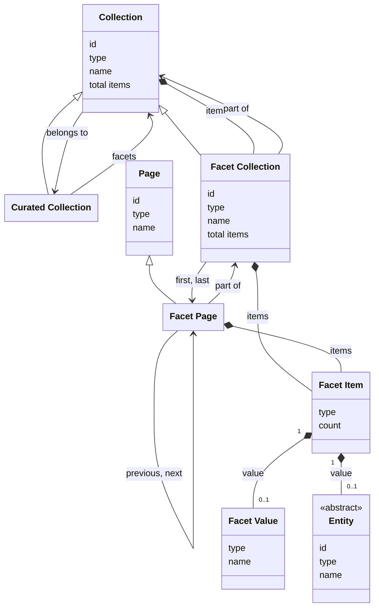

# Facets

## Introduction

A facet is a collection of categorized values to narrow down search results. For example, the creators of heritage objects can be organized into a 'Creator' facet.

Facets are tied to a particular [curated collection](collections.md), ensuring that results remain within the context of that collection.

Facets are optional. A data layer _MAY_ implement them, depending on its requirements. A data layer advertises the facet collections it supports for a curated collection in the [`facets` field of that collection](resources.md#capability-discovery). The field points to the list of facet collections, which a presentation layer retrieves with endpoint [Retrieve the facet collections of a curated collection](#endpoint-retrieve-the-facet-collections-of-a-curated-collection).

A facet collection _MAY_ itself [offer suggestions](suggestions.md) for its facet items, so that a user can find a facet value by typing. It does so by including the `suggestions` field in its response body, pointing to the list of its suggestion collections. A presentation layer retrieves that list with endpoint [Retrieve the suggestion collections of a collection](suggestions.md#endpoint-retrieve-the-suggestion-collections-of-a-collection).

A suggested value in the context of a facet collection is a `FacetValue` or an `Entity`: the same values a facet item can point to. Suggestions are not the same as the facet items that endpoint [Retrieve a facet collection](#endpoint-retrieve-a-facet-collection) returns for a `q`. A data layer ranks suggestions for autocompletion, and may offer names that its facet items do not contain.

:::note

**To do**: clarify the facet functionality: presentation layers not only want to retrieve the facets, they also want to be able to browse and filter facets.

:::

## Data model

| Name             | Description                                                                                                                                                                                  |
| ---------------- | -------------------------------------------------------------------------------------------------------------------------------------------------------------------------------------------- |
| Collection       | An ordered list of resources. The generic type. See [Resources](resources.md).                                                                                                               |
| Facet Collection | An ordered list of facet items. Specialization of Collection.                                                                                                                                |
| Facet Page       | An ordered sublist of facet items within a Facet Collection. Specialization of Page.                                                                                                         |
| Facet Item       | A selectable option within a Facet Collection or Facet Page, pointing to an Entity or a Facet Value.                                                                                         |
| Facet Value      | A value of a facet item, e.g. the name 'Jan de Vries'. A data layer uses a Facet Value to group several entities that have the same name into one facet item. It has no identity of its own. |
| Entity           | An identifiable 'thing' relevant to heritage. See [Entities](entities.md).                                                                                                                   |

The following class diagram visualizes the data model:



## Facets

The data layer determines which facets to support. This specification does not require any specific facets.

For example, an API that exposes information about...

1. **paintings** defines the facet 'Technique', to categorize the techniques used for creating the works of art;
1. **military personnel** defines the facet 'Military rank', to categorize the ranks of the persons;
1. **cars** defines the facet 'Color', to categorize the primary colors of the cars.

The following table lists some common facets:

**For heritage objects**:

| Facet name      | Description                                                                                                         |
| --------------- | ------------------------------------------------------------------------------------------------------------------- |
| Type            | The types of heritage objects, e.g. 'Building', 'Painting'.                                                         |
| Creator         | The creators of heritage objects, e.g. 'Vincent van Gogh', 'Rembrandt'.                                             |
| Made in century | The dates of creation of heritage objects grouped by century, e.g. '17th century', '18th century'.                  |
| Made in place   | The places of creation of heritage objects, e.g. 'Amsterdam', 'The Hague'.                                          |
| Publisher       | The heritage institutions that publish information about heritage objects, e.g. 'Rijksmuseum', 'National Archives'. |

**For persons**:

| Facet name     | Description                                                                                                |
| -------------- | ---------------------------------------------------------------------------------------------------------- |
| Place of birth | The places of birth of persons, e.g. 'Amsterdam', 'The Hague'.                                             |
| Occupation     | The occupations of persons, e.g. 'Blacksmith', 'Mayor'.                                                    |
| Publisher      | The heritage institutions that publish information about persons, e.g. 'Rijksmuseum', 'National Archives'. |

## Identification of facet items

A facet item points to a value. The value is either an [entity](entities.md) or a `FacetValue`. Both kinds of value have a `name`, but they do not stand for the same thing.

An entity stands for one single thing. An entity has an `id`, and that `id` belongs to one thing only. The `count` of the facet item is the number of occurrences of that one thing. In a 'Creator' facet, the entity 'Arno Haag' with the ID `https://example.org/v1/entities/1234` has a `count` of 12: twelve heritage objects have this person as their creator.

A `FacetValue` is only a name. It has no `id`, because it does not stand for one single thing. A `FacetValue` can stand for several entities. All of them have the same name. The `count` of the facet item is the total number of occurrences of all of them together.

This difference matters when several entities have the same name. In a 'Creator' facet, three different persons can all be called 'Jan de Vries'. A data layer has two choices:

- **Use an entity for every person.** The facet has three items. All three items have the name 'Jan de Vries'. Every item has its own `id` and its own `count`. A user sees the same name three times, and sees nothing that tells the three items apart.
- **Use one `FacetValue` for the name.** The facet has one item, called 'Jan de Vries'. The item has no `id`. Its `count` is the sum of the occurrences of the three persons together.

A data layer can make this choice for each facet collection separately.

A presentation layer shows the `name` of the value in both cases. It uses the `id` when it needs to point to one specific thing, for example to retrieve more information about it. A `FacetValue` has no `id`, so a presentation layer can only use it as a name. It cannot use it to point to one specific entity.

## Endpoint: Retrieve the facet collections of a curated collection

The endpoint retrieves all facet collections of a curated collection. The API _MUST_ implement this endpoint if it supports facets.

### HTTP request

`GET /{version}/collections(/{...collections})/{collection}/facets`

### Path parameters

| Name             | Data type | Cardinality | Description                                                                                        |
| ---------------- | --------- | ----------- | -------------------------------------------------------------------------------------------------- |
| `version`        | string    | 1           | The version of the API. Example: `v1`.                                                             |
| `...collections` | string    | 0 or more   | The path identifier(s) of the collection(s) the curated collection is part of. Example: `persons`. |
| `collection`     | string    | 1           | The path identifier of the curated collection. Example: `masterpieces`.                            |

### Query parameters

None.

### Request body

None.

### Response body

The response body _MUST_ contain at least the following fields:

| Name             | Data type       | Cardinality | Description                                                                                          |
| ---------------- | --------------- | ----------- | ---------------------------------------------------------------------------------------------------- |
| `id`             | string          | 1           | The identifier of the collection.                                                                    |
| `type`           | string          | 1           | The type of the collection. It _MUST_ be `Collection` or a specialization.                           |
| `name`           | string          | 1           | The name of the collection.                                                                          |
| `totalItems`     | number          | 0 or 1      | The total number of facet collections. May be an estimate. Not set if it is too costly to calculate. |
| `items`          | array           | 1           | A list of the facet collections of the curated collection.                                           |
| `items[*]`       | FacetCollection | 1           | A facet collection.                                                                                  |
| `items[*].id`    | string          | 1           | The identifier of the facet collection.                                                              |
| `items[*].type`  | string          | 1           | The type of the facet collection. It _MUST_ be `FacetCollection` or a specialization.                |
| `items[*].name`  | string          | 1           | The name of the facet collection.                                                                    |
| `belongsTo`      | Collection      | 1           | The curated collection that this is the list of facet collections for.                               |
| `belongsTo.id`   | string          | 1           | The identifier of the collection.                                                                    |
| `belongsTo.type` | string          | 1           | The type of the collection. It _MUST_ be `Collection` or a specialization.                           |
| `belongsTo.name` | string          | 1           | The name of the collection.                                                                          |

The API _MUST NOT_ divide this collection into pages. The response body therefore does not contain `first` or `last`.

### Example

An example request from a presentation layer:

```http
GET /v1/collections/objects/facets
Host: example.org
```

The request indicates that the API should return all facet collections of a curated collection (`objects`).

An example of the response body of the API:

```json
{
  "id": "https://example.org/v1/collections/objects/facets",
  "type": "Collection",
  "name": "Facets",
  "totalItems": 3,
  "items": [
    {
      "id": "https://example.org/v1/collections/objects/facets/creators",
      "type": "FacetCollection",
      "name": "Creator"
    },
    {
      "id": "https://example.org/v1/collections/objects/facets/centuries",
      "type": "FacetCollection",
      "name": "Made in century"
    },
    {
      "id": "https://example.org/v1/collections/objects/facets/subjects",
      "type": "FacetCollection",
      "name": "Subject"
    }
  ],
  "belongsTo": {
    "id": "https://example.org/v1/collections/objects",
    "type": "CuratedCollection",
    "name": "Objects"
  }
}
```

## Endpoint: Retrieve a facet collection

The endpoint retrieves a facet collection. The API _MUST_ implement this endpoint if it supports facets.

### HTTP request

`GET /{version}/collections(/{...collections})/{collection}/facets/{facet}`

### Path parameters

| Name             | Data type | Cardinality | Description                                                                                        |
| ---------------- | --------- | ----------- | -------------------------------------------------------------------------------------------------- |
| `version`        | string    | 1           | The version of the API. Example: `v1`.                                                             |
| `...collections` | string    | 0 or more   | The path identifier(s) of the collection(s) the curated collection is part of. Example: `persons`. |
| `collection`     | string    | 1           | The path identifier of the curated collection. Example: `masterpieces`.                            |
| `facet`          | string    | 1           | The path identifier of the facet collection. Example: `creators`, `centuries`.                     |

### Query parameters

| Name      | Data type | Cardinality | Description                                                                                                                                                                                             |
| --------- | --------- | ----------- | ------------------------------------------------------------------------------------------------------------------------------------------------------------------------------------------------------- |
| `q`       | string    | 0 or 1      | A keyword query for filtering the facet items. Minimum length: defined by the API (e.g. 3 characters). Maximum length: defined by the API (e.g. 25 characters).                                         |
| `size`    | number    | 0 or 1      | The maximum number of facet items to retrieve. Minimum: 1. Default: 10. Maximum: defined by the API (e.g. 100).                                                                                         |
| `orderBy` | string    | 0 or 1      | The sorting order of the facet items. One of `count`, `value`. Default: `count:desc` (most frequent item first). The API defines which value is used to sort by `value` (e.g. the `name` of an entity). |

:::note

**To do**: add the query parameters representing the "search context" from the curated collection (`q` and `filter` from endpoint [Retrieve a page in a collection](collections.md#endpoint-retrieve-a-page-in-a-collection)).

:::

### Request body

None.

### Response body

The response body _MUST_ contain at least the following fields:

| Name                  | Data type          | Cardinality | Description                                                                                                                                                                                                                                                |
| --------------------- | ------------------ | ----------- | ---------------------------------------------------------------------------------------------------------------------------------------------------------------------------------------------------------------------------------------------------------- |
| `id`                  | string             | 1           | The identifier of the collection.                                                                                                                                                                                                                          |
| `type`                | string             | 1           | The type of the collection. It _MUST_ be `FacetCollection` or a specialization.                                                                                                                                                                            |
| `name`                | string             | 1           | The name of the collection.                                                                                                                                                                                                                                |
| `totalItems`          | number             | 0 or 1      | The total number of facet items in the collection. May be an estimate. Not set if it is too costly to calculate.                                                                                                                                           |
| `items`               | array              | 0 or 1      | A list of the facet items in the collection. Not set if the collection is divided into [pages](resources.md#page-structure).                                                                                                                               |
| `items[*]`            | FacetItem          | 1           | A facet item.                                                                                                                                                                                                                                              |
| `items[*].type`       | string             | 1           | The type of the facet item. It _MUST_ be `FacetItem`.                                                                                                                                                                                                      |
| `items[*].count`      | number             | 1           | The number of occurrences of the value. If the value is a `FacetValue`, the count covers all entities that the data layer grouped into it.                                                                                                                 |
| `items[*].value`      | Entity, FacetValue | 1           | The value of the facet item: an entity, or a facet value that groups several entities.                                                                                                                                                                     |
| `items[*].value.type` | string             | 1           | The type of the value of the facet item. It _MUST_ be `FacetValue` or a specialization of `Entity`.                                                                                                                                                        |
| `items[*].value.id`   | string             | 0 or 1      | The identifier of the entity. Not set if the `type` is `FacetValue`; a facet value has no identity.                                                                                                                                                        |
| `items[*].value.name` | string             | 1           | The name of the facet value or entity.                                                                                                                                                                                                                     |
| `first`               | FacetPage          | 0 or 1      | The first page in the collection. Not set if the collection is empty or if it is not divided into [pages](resources.md#page-structure).                                                                                                                    |
| `first.id`            | string             | 1           | The identifier of the first page in the collection.                                                                                                                                                                                                        |
| `first.type`          | string             | 1           | The type of the first page in the collection. It _MUST_ be `FacetPage` or a specialization.                                                                                                                                                                |
| `last`                | FacetPage          | 0 or 1      | The last page in the collection. Not set if the collection is empty, if the collection is not divided into [pages](resources.md#page-structure), or if the last page is unknown (e.g. in case of [cursor pagination](resources.md#pagination)).            |
| `last.id`             | string             | 1           | The identifier of the last page in the collection.                                                                                                                                                                                                         |
| `last.type`           | string             | 1           | The type of the last page in the collection. It _MUST_ be `FacetPage` or a specialization.                                                                                                                                                                 |
| `partOf`              | Collection         | 1           | The collection that lists the facet collections of a curated collection, including this one. See the response body of endpoint [Retrieve the facet collections of a curated collection](#endpoint-retrieve-the-facet-collections-of-a-curated-collection). |
| `partOf.id`           | string             | 1           | The identifier of the collection.                                                                                                                                                                                                                          |
| `partOf.type`         | string             | 1           | The type of the collection. It _MUST_ be `Collection` or a specialization.                                                                                                                                                                                 |
| `partOf.name`         | string             | 1           | The name of the collection.                                                                                                                                                                                                                                |
| `suggestions`         | Collection         | 0 or 1      | The list of this facet collection's suggestion collections. The field _MUST_ be omitted if the facet collection does not offer suggestions. See [Suggestions](suggestions.md).                                                                             |
| `suggestions.id`      | string             | 1           | The identifier of the list.                                                                                                                                                                                                                                |
| `suggestions.type`    | string             | 1           | The type of the list. It _MUST_ be `Collection` or a specialization.                                                                                                                                                                                       |
| `suggestions.name`    | string             | 1           | The name of the list.                                                                                                                                                                                                                                      |

### Example

An example request from a presentation layer:

```http
GET /v1/collections/objects/facets/creators
Host: example.org
```

The request indicates that the API should return a facet collection (`creators`) of a curated collection (`objects`).

An example of the response body of the API if the facet collection is not divided into pages and lists entities as its `items`:

```json
{
  "id": "https://example.org/v1/collections/objects/facets/creators",
  "type": "FacetCollection",
  "name": "Creator",
  "totalItems": 3,
  "items": [
    {
      "type": "FacetItem",
      "count": 12,
      "value": {
        "id": "https://example.org/v1/entities/1234",
        "type": "Person",
        "name": "Arno Haag"
      }
    },
    {
      "type": "FacetItem",
      "count": 8,
      "value": {
        "id": "https://example.org/v1/entities/5678",
        "type": "Person",
        "name": "Hans de Haan"
      }
    },
    {
      "type": "FacetItem",
      "count": 2,
      "value": {
        "id": "https://example.org/v1/entities/3458",
        "type": "Person",
        "name": "John Jansen"
      }
    }
  ],
  "partOf": {
    "id": "https://example.org/v1/collections/objects/facets",
    "type": "Collection",
    "name": "Facets"
  },
  "suggestions": {
    "id": "https://example.org/v1/collections/objects/facets/creators/suggestions",
    "type": "Collection",
    "name": "Suggestions"
  }
}
```

An example of the response body of the API for the request above, if the facet collection lists `FacetValue`s as its `items`:

```json
{
  "id": "https://example.org/v1/collections/objects/facets/creators",
  "type": "FacetCollection",
  "name": "Creator",
  "totalItems": 3,
  "items": [
    {
      "type": "FacetItem",
      "count": 57,
      "value": {
        "type": "FacetValue",
        "name": "Arno Haag"
      }
    },
    {
      "type": "FacetItem",
      "count": 38,
      "value": {
        "type": "FacetValue",
        "name": "Hans de Haan"
      }
    },
    {
      "type": "FacetItem",
      "count": 23,
      "value": {
        "type": "FacetValue",
        "name": "John Jansen"
      }
    }
  ],
  "partOf": {
    "id": "https://example.org/v1/collections/objects/facets",
    "type": "Collection",
    "name": "Facets"
  }
}
```

An example of the response body of the API for the request above, if the facet collection is divided into pages:

```json
{
  "id": "https://example.org/v1/collections/objects/facets/creators",
  "type": "FacetCollection",
  "name": "Creator",
  "totalItems": 195,
  "first": {
    "id": "https://example.org/v1/collections/objects/facets/creators?page=1",
    "type": "FacetPage"
  },
  "last": {
    "id": "https://example.org/v1/collections/objects/facets/creators?page=20",
    "type": "FacetPage"
  },
  "partOf": {
    "id": "https://example.org/v1/collections/objects/facets",
    "type": "Collection",
    "name": "Facets"
  }
}
```

## Endpoint: Retrieve a page in a facet collection

The endpoint retrieves a page in a facet collection. The API _MUST_ implement this endpoint for every facet collection it divides into [pages](resources.md#page-structure).

### HTTP request

`GET /{version}/collections(/{...collections})/{collection}/facets/{facet}?page={page}`

### Path parameters

| Name             | Data type | Cardinality | Description                                                                                        |
| ---------------- | --------- | ----------- | -------------------------------------------------------------------------------------------------- |
| `version`        | string    | 1           | The version of the API. Example: `v1`.                                                             |
| `...collections` | string    | 0 or more   | The path identifier(s) of the collection(s) the curated collection is part of. Example: `persons`. |
| `collection`     | string    | 1           | The path identifier of the curated collection. Example: `masterpieces`.                            |
| `facet`          | string    | 1           | The path identifier of the facet collection. Example: `creators`, `centuries`.                     |

### Query parameters

| Name      | Data type | Cardinality | Description                                                                                                                                                                                             |
| --------- | --------- | ----------- | ------------------------------------------------------------------------------------------------------------------------------------------------------------------------------------------------------- |
| `page`    | string    | 1           | The identifier of the page: a page number or cursor, depending on the [pagination strategy](resources.md#pagination) of the API.                                                                        |
| `q`       | string    | 0 or 1      | A keyword query for filtering the facet items. Minimum length: defined by the API (e.g. 3 characters). Maximum length: defined by the API (e.g. 25 characters).                                         |
| `size`    | number    | 0 or 1      | The maximum number of facet items to retrieve. Minimum: 1. Default: 10. Maximum: defined by the API (e.g. 100).                                                                                         |
| `orderBy` | string    | 0 or 1      | The sorting order of the facet items. One of `count`, `value`. Default: `count:desc` (most frequent item first). The API defines which value is used to sort by `value` (e.g. the `name` of an entity). |

:::note

**To do**: add the query parameters representing the "search context" from the curated collection (`q` and `filter` from endpoint [Retrieve a page in a collection](collections.md#endpoint-retrieve-a-page-in-a-collection)).

:::

### Request body

None.

### Response body

The response body _MUST_ contain at least the following fields:

| Name                  | Data type          | Cardinality | Description                                                                                                                                                             |
| --------------------- | ------------------ | ----------- | ----------------------------------------------------------------------------------------------------------------------------------------------------------------------- |
| `id`                  | string             | 1           | The identifier of the current page.                                                                                                                                     |
| `type`                | string             | 1           | The type of the page. It _MUST_ be `FacetPage` or a specialization.                                                                                                     |
| `name`                | string             | 1           | The name of the page.                                                                                                                                                   |
| `items`               | array              | 1           | A list of facet items.                                                                                                                                                  |
| `items[*]`            | FacetItem          | 1           | A facet item.                                                                                                                                                           |
| `items[*].type`       | string             | 1           | The type of the facet item. It _MUST_ be `FacetItem`.                                                                                                                   |
| `items[*].count`      | number             | 1           | The number of occurrences of the value. If the value is a `FacetValue`, the count covers all entities that the data layer grouped into it.                              |
| `items[*].value`      | Entity, FacetValue | 1           | The value of the facet item: an entity, or a facet value that groups several entities.                                                                                  |
| `items[*].value.type` | string             | 1           | The type of the value of the facet item. It _MUST_ be `FacetValue` or a specialization of `Entity`.                                                                     |
| `items[*].value.id`   | string             | 0 or 1      | The identifier of the entity. Not set if the `type` is `FacetValue`; a facet value has no identity.                                                                     |
| `items[*].value.name` | string             | 1           | The name of the facet value or entity.                                                                                                                                  |
| `prev`                | FacetPage          | 0 or 1      | The previous page in the collection. Not set if there is no previous page.                                                                                              |
| `prev.id`             | string             | 1           | The identifier of the previous page in the collection.                                                                                                                  |
| `prev.type`           | string             | 1           | The type of the previous page in the collection. It _MUST_ be `FacetPage` or a specialization.                                                                          |
| `next`                | FacetPage          | 0 or 1      | The next page in the collection. Not set if there is no next page.                                                                                                      |
| `next.id`             | string             | 1           | The identifier of the next page in the collection.                                                                                                                      |
| `next.type`           | string             | 1           | The type of the next page in the collection. It _MUST_ be `FacetPage` or a specialization.                                                                              |
| `partOf`              | FacetCollection    | 1           | The collection to which the items contained by the page belong. See the response body of endpoint [Retrieve a facet collection](#endpoint-retrieve-a-facet-collection). |
| `partOf.id`           | string             | 1           | The identifier of the facet collection.                                                                                                                                 |
| `partOf.type`         | string             | 1           | The type of the facet collection. It _MUST_ be `FacetCollection` or a specialization.                                                                                   |
| `partOf.name`         | string             | 1           | The name of the facet collection.                                                                                                                                       |
| `partOf.totalItems`   | number             | 0 or 1      | The total number of items in the facet collection. May be an estimate. Not set if it is too costly to calculate.                                                        |
| `partOf.first`        | FacetPage          | 1           | The first page in the collection.                                                                                                                                       |
| `partOf.first.id`     | string             | 1           | The identifier of the first page in the collection.                                                                                                                     |
| `partOf.first.type`   | string             | 1           | The type of the first page in the collection. It _MUST_ be `FacetPage` or a specialization.                                                                             |
| `partOf.last`         | FacetPage          | 0 or 1      | The last page in the collection. Not set if the last page is unknown (e.g. in case of [cursor pagination](resources.md#pagination)).                                    |
| `partOf.last.id`      | string             | 1           | The identifier of the last page in the collection.                                                                                                                      |
| `partOf.last.type`    | string             | 1           | The type of the last page in the collection. It _MUST_ be `FacetPage` or a specialization.                                                                              |

### Example

An example request from a presentation layer:

```http
GET /v1/collections/objects/facets/creators?page=3
Host: example.org
```

The request indicates that the API should return page 3 in a facet collection (`creators`) of a curated collection (`objects`).

An example of the response body of the API:

```json
{
  "id": "https://example.org/v1/collections/objects/facets/creators?page=3",
  "type": "FacetPage",
  "name": "Creator",
  "items": [
    {
      "type": "FacetItem",
      "count": 12,
      "value": {
        "id": "https://example.org/v1/entities/1234",
        "type": "Person",
        "name": "Arno Haag"
        // Optionally: other fields...
      }
    },
    {
      "type": "FacetItem",
      "count": 8,
      "value": {
        "id": "https://example.org/v1/entities/5678",
        "type": "Person",
        "name": "Hans de Haan"
        // Optionally: other fields...
      }
    }
    // Other items...
  ],
  "prev": {
    "id": "https://example.org/v1/collections/objects/facets/creators?page=2",
    "type": "FacetPage"
  },
  "next": {
    "id": "https://example.org/v1/collections/objects/facets/creators?page=4",
    "type": "FacetPage"
  },
  "partOf": {
    "id": "https://example.org/v1/collections/objects/facets/creators",
    "type": "FacetCollection",
    "name": "Creator",
    "totalItems": 195,
    "first": {
      "id": "https://example.org/v1/collections/objects/facets/creators?page=1",
      "type": "FacetPage"
    },
    "last": {
      "id": "https://example.org/v1/collections/objects/facets/creators?page=20",
      "type": "FacetPage"
    }
  }
}
```
