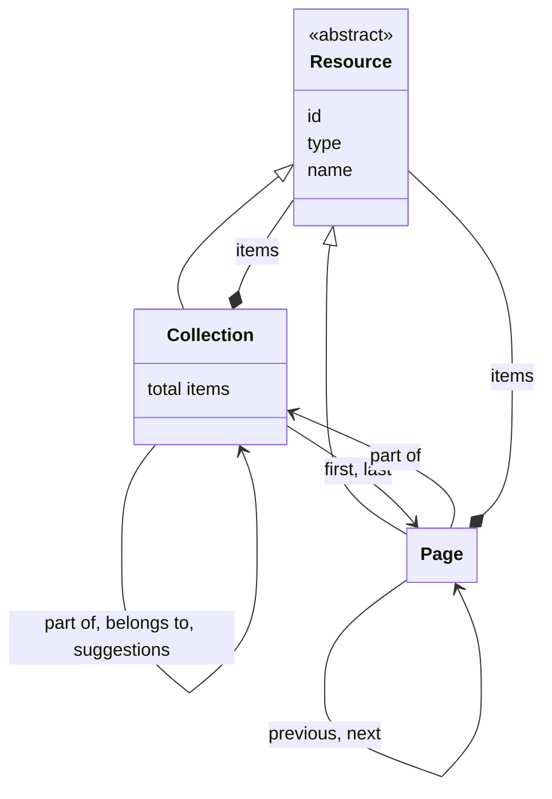
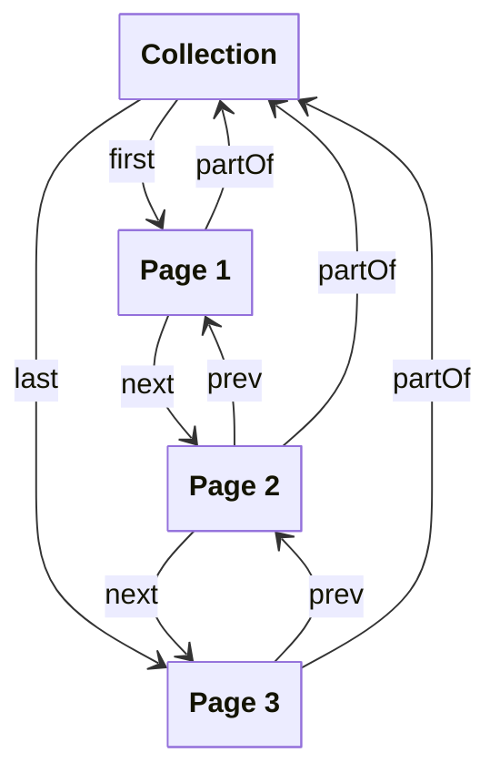

# Resources

## Introduction

The API of a data layer is centered around resources. A resource represents a 'thing' of a certain type. It can correspond to anything — from a physical object (e.g. a building or a person) to an abstract concept (e.g. a collection or a type of art work).

## Data model

This specification defines the following resource types:

| Name       | Description                                                                                                                                                                                                                                                                   |
| ---------- | ----------------------------------------------------------------------------------------------------------------------------------------------------------------------------------------------------------------------------------------------------------------------------- |
| Resource   | A 'thing' of a certain type. All other resource types extend from it. A Resource is abstract: there is no resource whose type is `Resource` - it needs a concrete type. This specification defines a number of concrete types. The API may additionally define its own types. |
| Collection | An ordered list of resources. A Collection may contain further collections, and may consist of pages, containing sublists of the resources in the collection.                                                                                                                 |
| Page       | An ordered sublist of resources within a Collection.                                                                                                                                                                                                                          |

The following class diagram visualizes the relationships between the resource types:



## Resource

A Resource, regardless of type, contains at least the following fields:

| Name   | Data type | Cardinality | Description                                                                                                                                                                                                                                                     |
| ------ | --------- | ----------- | --------------------------------------------------------------------------------------------------------------------------------------------------------------------------------------------------------------------------------------------------------------- |
| `id`   | string    | 0 or 1      | The identifier of the resource, if known. It _MUST_ be a dereferenceable [HTTP URI](https://httpwg.org/specs/rfc9110.html#uri.schemes). Optional for volatile, non-persistent resources, such as [Keyword Values](suggestions.md) or [Facet Values](facets.md). |
| `type` | string    | 1           | The type of the resource. This specification defines a number of [types](#data-model). The API may additionally define its own types.                                                                                                                           |
| `name` | string    | 0 or 1      | The name of the resource, if known and relevant to the resource.                                                                                                                                                                                                |

### Resource identification with URIs

:::note

**To do**: explain how resources must be identified with URIs:

- See the general requirements of the REST API Design Rules, e.g. plural names (`/entities`, not `/entity`), lower case names (`/entities`, not `/Entities`), dashes (`/heritage-objects`, not `/heritageObjects`), slashes to denote hierarchy (`/collections/persons`, not `/collections-persons`);
- Use camel case in query parameters (`?filterBy=dateCreated`, not `?filter-by=date-created`);
- Individual resources must have deterministic IDs if they come from publication systems of data providers;
- URIs must still be treated as if they were opaque strings ("the URI patterns are to facilitate developers understanding the API, not to facilitate software to interact with it").

:::

### Example

Example of the response body:

```json
{
  "id": "https://example.org/v1/entities/1234",
  "type": "HeritageObject",
  "name": "The Night Watch",
  // And then, depending on the resource, other fields, such as:
  "additionalTypes": [
    {
      "id": "https://example.org/v1/entities/5678",
      "type": "Concept",
      "name": "Painting"
    }
  ],
  "description": "Rembrandt’s largest, most famous canvas was made for the Arquebusiers guild hall..."
}
```

The response indicates that this resource has identifier `https://example.org/v1/entities/1234`, is a `HeritageObject` and has name 'The Night Watch'.

Note the `additionalTypes` list: every item in this list is also a resource and has the same top-level fields: `id`, `type` and `name`.

## Collection

A Collection contains at least the following fields:

| Name                  | Data type  | Cardinality | Description                                                                                                                                                                                                                                                        |
| --------------------- | ---------- | ----------- | ------------------------------------------------------------------------------------------------------------------------------------------------------------------------------------------------------------------------------------------------------------------ |
| `id`                  | string     | 1           | The identifier of the collection.                                                                                                                                                                                                                                  |
| `type`                | string     | 1           | The type of the collection. It _MUST_ be `Collection` or a specialization.                                                                                                                                                                                         |
| `name`                | string     | 1           | The name of the collection.                                                                                                                                                                                                                                        |
| `totalItems`          | number     | 0 or 1      | The exact total number of items in the collection, being its further collections, its resources, or both. The field _MAY_ be omitted by the API if the exact total is too costly to calculate. Mutually exclusive with `estimatedTotalItems`.                      |
| `estimatedTotalItems` | number     | 0 or 1      | An estimate of the total number of items in the collection. It can be higher or lower than the real total. The field _MAY_ be omitted by the API if it has no estimate. Mutually exclusive with `totalItems`.                                                      |
| `items`               | array      | 0 or 1      | A list of the items in the collection. Not set if the Collection is divided into [pages](#page).                                                                                                                                                                   |
| `items[*]`            | Resource   | 1           | A [resource](resources.md#resource). A resource can be of [any type](#data-model), including `Collection` or a specialization.                                                                                                                                     |
| `first`               | Page       | 0 or 1      | The first page in the collection. Not set if the collection is empty or if it is not divided into [pages](#page).                                                                                                                                                  |
| `first.id`            | string     | 1           | The identifier of the first page in the collection.                                                                                                                                                                                                                |
| `first.type`          | string     | 1           | The type of the first page in the collection. It _MUST_ be `Page` or a specialization.                                                                                                                                                                             |
| `last`                | Page       | 0 or 1      | The last page in the collection. Not set if the collection is empty, if the collection is not divided into [pages](#page), or if the last page is unknown (e.g. in case of [cursor navigation](#page-navigation-and-cursor-navigation)).                           |
| `last.id`             | string     | 1           | The identifier of the last page in the collection.                                                                                                                                                                                                                 |
| `last.type`           | string     | 1           | The type of the last page in the collection. It _MUST_ be `Page` or a specialization.                                                                                                                                                                              |
| `partOf`              | Collection | 0 or 1      | The collection of which this collection is a part. Not set if this collection is the root of a collection tree.                                                                                                                                                    |
| `partOf.id`           | string     | 1           | The identifier of the collection.                                                                                                                                                                                                                                  |
| `partOf.type`         | string     | 1           | The type of the collection. It _MUST_ be `Collection` or a specialization.                                                                                                                                                                                         |
| `partOf.name`         | string     | 1           | The name of the collection.                                                                                                                                                                                                                                        |
| `belongsTo`           | Collection | 0 or 1      | The collection that the collections in this collection belong to, such as a list of [facet collections](facets.md) that belongs to a curated collection. Not set if this collection does not group collections of another collection.                              |
| `belongsTo.id`        | string     | 1           | The identifier of the collection.                                                                                                                                                                                                                                  |
| `belongsTo.type`      | string     | 1           | The type of the collection. It _MUST_ be `Collection` or a specialization.                                                                                                                                                                                         |
| `belongsTo.name`      | string     | 1           | The name of the collection.                                                                                                                                                                                                                                        |
| `suggestions`         | Collection | 0 or 1      | The collection of this collection's suggestion collections. Not set if the collection does not offer suggestions, or if the collection is a suggestion collection: a suggestion collection _MUST NOT_ offer suggestions itself. See [Suggestions](suggestions.md). |
| `suggestions.id`      | string     | 1           | The identifier of the collection.                                                                                                                                                                                                                                  |
| `suggestions.type`    | string     | 1           | The type of the collection. It _MUST_ be `Collection` or a specialization.                                                                                                                                                                                         |
| `suggestions.name`    | string     | 1           | The name of the collection.                                                                                                                                                                                                                                        |
| `capabilities`        | array      | 0 or 1      | The URIs of the capabilities the API implements for this collection. The field _MUST_ be omitted if the collection supports no capabilities. See [Capability discovery](#capability-discovery).                                                                    |

### The collection tree

Collections form a tree: the `items` of a collection can contain further collections. There is no separate type for a 'collection of collections': a collection that groups other collections is a collection like any other. This keeps the structure a presentation layer has to learn down to one collection type.

Every collection tree has one root: the collection that has no `partOf`. Every other collection in that tree _MUST_ have a `partOf`. This makes the tree connected and every collection in it reachable from its root. A collection _MUST NOT_ be part of itself, directly or indirectly: the tree _MUST_ be acyclic, so that a presentation layer can traverse it without looping.

A data layer _MAY_ offer more than one collection tree. The [facet collections](facets.md#endpoint-retrieve-the-facet-collections-of-a-curated-collection) and [suggestion collections](suggestions.md#endpoint-retrieve-the-suggestion-collections-of-a-collection) of a collection, for example, form trees of their own. Their root is not part of the collection tree of that collection - it has no `partOf` and uses `belongsTo` instead.

A presentation layer walks a tree from its root. It requests the root, and for every item in a collection it recurses if the item's `type` is `Collection` or a specialization of it, and renders the item as a resource otherwise. It does not need to know in advance whether a collection holds further collections or resources, or whether the collections it encounters are divided into pages. Every collection, including one that groups other collections, can be divided into pages, so a tree with many branches can be traversed a page at a time.

### Collection paths

This specification does not prescribe a path for each type of collection: a data layer exposes a collection at a path of its own choosing. The endpoints for the parts of a collection, such as its [facet collections](facets.md) or its [suggestion collections](suggestions.md), hang off the path of the collection they belong to.

### Example

Example of the response body of the root collection:

```json
{
  "id": "https://example.org/v1/collections",
  "type": "Collection",
  "name": "Collections",
  "totalItems": 2,
  "items": [
    {
      "id": "https://example.org/v1/collections/objects",
      "type": "Collection",
      "name": "Heritage objects"
    },
    {
      "id": "https://example.org/v1/collections/persons",
      "type": "Collection",
      "name": "Persons"
    }
  ]
}
```

The response indicates that the root groups two further collections.

Example of the response body when the collection is divided into pages:

```json
{
  "id": "https://example.org/v1/collections/objects",
  "type": "Collection",
  "name": "Heritage objects",
  "totalItems": 195,
  "first": {
    "id": "https://example.org/v1/collections/objects?page=1",
    "type": "Page"
  },
  "partOf": {
    "id": "https://example.org/v1/collections",
    "type": "Collection",
    "name": "Collections"
  },
  "capabilities": ["https://specs.nde.nl/rest/v1/page-pagination"]
}
```

The response indicates that this collection consists of 195 items, accessible via the `first` page.

### Capability discovery

A collection can do more than return a list of items. It can support a keyword search, filters, facets, suggestions or pagination. Each of these is a _capability_: something that a collection supports. Every collection advertises its own capabilities, so that a presentation layer can discover what a collection supports and adapt its user interface to it.

This specification defines the following capabilities:

| Capability URI                                   | Description                                                                                   |
| ------------------------------------------------ | --------------------------------------------------------------------------------------------- |
| `https://specs.nde.nl/rest/v1/keyword-search`    | The collection supports keyword search.                                                       |
| `https://specs.nde.nl/rest/v1/filtering`         | The collection supports filtering.                                                            |
| `https://specs.nde.nl/rest/v1/facets`            | The collection supports [facets](facets.md).                                                  |
| `https://specs.nde.nl/rest/v1/suggestions`       | The collection supports [suggestions](suggestions.md).                                        |
| `https://specs.nde.nl/rest/v1/highlighting`      | The collection supports text highlighting in string fields matching a keyword query.          |
| `https://specs.nde.nl/rest/v1/page-pagination`   | The collection supports pagination by [page numbers](#page-navigation-and-cursor-navigation). |
| `https://specs.nde.nl/rest/v1/cursor-pagination` | The collection supports pagination by [a cursor](#page-navigation-and-cursor-navigation).     |

Capabilities are a property of a single collection. A presentation layer _MUST NOT_ infer the capabilities of a collection from the capabilities of its ancestors in the collection tree.

The `capabilities` field tells a presentation layer that a collection supports something. It does not tell it how to use it: the endpoints and query parameters of the collection do that.

Two capabilities come with a property that points to a collection. The `facets` property of a curated collection points to its list of facet collections; see [Facets](facets.md). The `suggestions` property of a collection points to its list of suggestion collections; see [Suggestions](suggestions.md). The other capabilities have no such property. A presentation layer finds them in this specification: `q` for a keyword search, `filter` for filtering, and `page` for a page.

## Page

A Page contains at least the following fields:

| Name                         | Data type  | Cardinality | Description                                                                                                                                                                                                                                          |
| ---------------------------- | ---------- | ----------- | ---------------------------------------------------------------------------------------------------------------------------------------------------------------------------------------------------------------------------------------------------- |
| `id`                         | string     | 1           | The identifier of the page.                                                                                                                                                                                                                          |
| `type`                       | string     | 1           | The type of the page. It _MUST_ be `Page` or a specialization.                                                                                                                                                                                       |
| `name`                       | string     | 1           | The name of the page.                                                                                                                                                                                                                                |
| `items`                      | array      | 1           | A list of resources in the page. Empty if there are no resources.                                                                                                                                                                                    |
| `items[*]`                   | Resource   | 1           | A [resource](resources.md#resource). A resource can be of [any type](#data-model).                                                                                                                                                                   |
| `prev`                       | Page       | 0 or 1      | The previous page in the collection. Not set if there is no previous page.                                                                                                                                                                           |
| `prev.id`                    | string     | 1           | The identifier of the previous page in the collection.                                                                                                                                                                                               |
| `prev.type`                  | string     | 1           | The type of the previous page in the collection. It _MUST_ be `Page` or a specialization.                                                                                                                                                            |
| `next`                       | Page       | 0 or 1      | The next page in the collection. Not set if there is no next page.                                                                                                                                                                                   |
| `next.id`                    | string     | 1           | The identifier of the next page in the collection.                                                                                                                                                                                                   |
| `next.type`                  | string     | 1           | The type of the next page in the collection. It _MUST_ be `Page` or a specialization.                                                                                                                                                                |
| `partOf`                     | Collection | 1           | The collection to which the items contained by the page belong.                                                                                                                                                                                      |
| `partOf.id`                  | string     | 1           | The identifier of the collection.                                                                                                                                                                                                                    |
| `partOf.type`                | string     | 1           | The type of the collection. It _MUST_ be `Collection` or a specialization.                                                                                                                                                                           |
| `partOf.name`                | string     | 1           | The name of the collection.                                                                                                                                                                                                                          |
| `partOf.totalItems`          | number     | 0 or 1      | The exact total number of items in the collection, being its further collections, its resources, or both. The field _MAY_ be omitted by the API if the exact total is too costly to calculate. Mutually exclusive with `partOf.estimatedTotalItems`. |
| `partOf.estimatedTotalItems` | number     | 0 or 1      | An estimate of the total number of items in the collection. It can be higher or lower than the real total. The field _MAY_ be omitted by the API if it has no estimate. Mutually exclusive with `partOf.totalItems`.                                 |
| `partOf.first`               | Page       | 1           | The first page in the collection.                                                                                                                                                                                                                    |
| `partOf.first.id`            | string     | 1           | The identifier of the first page in the collection.                                                                                                                                                                                                  |
| `partOf.first.type`          | string     | 1           | The type of the first page in the collection. It _MUST_ be `Page` or a specialization.                                                                                                                                                               |
| `partOf.last`                | Page       | 0 or 1      | The last page in the collection. Not set if the last page is unknown (e.g. in case of [cursor navigation](#page-navigation-and-cursor-navigation)).                                                                                                  |
| `partOf.last.id`             | string     | 1           | The identifier of the last page in the collection.                                                                                                                                                                                                   |
| `partOf.last.type`           | string     | 1           | The type of the last page in the collection. It _MUST_ be `Page` or a specialization.                                                                                                                                                                |

### Pagination

Pagination means splitting the items of a collection into smaller lists. Each smaller list is a Page. A Page is a resource of its own: it has its own identifier, and a presentation layer requests it like any other resource.

A data layer needs pagination when its collections are large. A single collection may contain hundreds of thousands of items. It is impractical to return all of them in one response: the response takes long to build and long to download, and a presentation layer usually shows only a few items at a time. With pagination, the API returns a small number of items per response, and the presentation layer asks for more only when it needs more.

A data layer _MAY_ divide any collection into pages. It does not have to. A collection _MAY_ return all of its items at once, in its `items` field.

#### Pages and collections

A collection that is divided into pages has two fields that point to its pages:

- `first`: the first page of the collection.
- `last`: the last page of the collection, if the API knows it.

A page has three fields that point to its place in the collection:

- `prev`: the page before it, if there is one.
- `next`: the page after it, if there is one.
- `partOf`: the collection that the page belongs to.

With these fields, a presentation layer walks through a collection. It requests the collection and follows `first`. It then follows `next` until there is no `next` left, which means it has reached the end. It goes back with `prev`, or it jumps to the end with the collection's `last`.

The `prev` and the `next` of a page _MUST_ be pages of the same collection. They _MUST_ also point back at each other: if the `next` of one page is another page, the `prev` of that other page _MUST_ be the first one. The pages of a collection _MUST_ form one sequence without loops, so that a presentation layer can walk through them without getting stuck. The `first` of a collection _MUST_ be the page that has no `prev`. Its `last`, if it is set, _MUST_ be the page that has no `next`.

The following diagram visualizes the relationships:



#### Page navigation and cursor navigation

Pagination means that a collection is split into pages. Navigation is how a presentation layer moves through those pages. A data layer uses one of two pagination strategies: page navigation and cursor navigation.

A presentation layer asks for a page with the `page` query parameter. The value of `page` is either a number or a cursor:

- **Page navigation**: the value is a number that says which page the presentation layer wants, such as `?page=3`.
- **Cursor navigation**: the value is a token that the API has given itself, such as `?page=eyJpZCI6MTIzfQ`. The token points to a place in the collection.

Both are allowed. A data layer _MAY_ use page navigation, _MAY_ use cursor navigation, and _MAY_ use both across its collections. A data layer _SHOULD_ use the same strategy for all of its collections, so that a presentation layer can handle every collection in one way. A data layer _SHOULD NOT_ use page navigation for one collection and cursor navigation for another.

A data layer _MUST_ make its pagination strategy explicit. A collection that is divided into pages _MUST_ advertise exactly one of `https://specs.nde.nl/rest/v1/page-pagination` and `https://specs.nde.nl/rest/v1/cursor-pagination` in its [`capabilities`](#capability-discovery) field, and _MUST NOT_ advertise both. A collection that is not divided into pages _MUST NOT_ advertise either of them. There is no default: a presentation layer _MUST NOT_ assume a pagination strategy for a collection that advertises neither.

Counting all items of a collection costs time. Page navigation usually needs that number to know which page comes last, and cursor navigation usually does not. A data layer that uses page navigation _MAY_ return an exact `totalItems`, and a data layer that uses cursor navigation _MAY_ return an `estimatedTotalItems`. This is not a rule: a data layer _MAY_ return either field with either strategy.

When it uses page navigation, a data layer _MUST_ number the first page `1`, not `0`.

Page navigation is easy to use. A presentation layer can send a user straight to page 7, and the user sees 'page 7 of 20'. The cost is that the API has to count or skip over items, which becomes slow on a large collection. It also becomes less reliable over time: if items are added or removed while a user is browsing, the numbers move, and the user can see an item twice or miss it.

With cursor navigation, the API does not have to count. It remembers where the previous response ended and continues from there. This is fast on a large collection, and it does not shift when items are added or removed. The cost is that a presentation layer cannot jump to an arbitrary page, because it has no number to jump to. For that reason a collection that uses cursor navigation usually has no `last` page: the API does not know which page is last. A data layer that does know _MAY_ set `last`. A presentation layer can then follow `last` and walk back through the collection with `prev`.

A cursor is a token that only the API understands. A presentation layer _MUST_ pass a cursor back unchanged, and _MUST NOT_ try to read it or build one. A cursor _MUST_ only be used with the collection and the query it came from. A presentation layer _MUST NOT_ reuse a cursor for another collection or another query.

A data layer _MUST_ respond with a `400` status code if `page` has a value of the wrong kind for the strategy that the collection uses: a number where the collection expects a cursor, or a cursor where it expects a number. It _MUST NOT_ treat a `page` value it does not understand as page 1, because a presentation layer would then be shown the wrong page without knowing it.

### Example

The examples below show the two ways in which a presentation layer can navigate through a collection.

Example of the response body with page navigation:

```json
{
  "id": "https://example.org/v1/collections/objects?page=3",
  "type": "Page",
  "name": "Heritage objects: page 3",
  "items": [
    {
      "id": "https://example.org/v1/entities/1234",
      "type": "HeritageObject",
      "name": "The Night Watch"
      // Other fields...
    }
    // Other items...
  ],
  "prev": {
    "id": "https://example.org/v1/collections/objects?page=2",
    "type": "Page"
  },
  "next": {
    "id": "https://example.org/v1/collections/objects?page=4",
    "type": "Page"
  },
  "partOf": {
    "id": "https://example.org/v1/collections/objects",
    "type": "Collection",
    "name": "Heritage objects",
    "totalItems": 195,
    "first": {
      "id": "https://example.org/v1/collections/objects?page=1",
      "type": "Page"
    },
    "last": {
      "id": "https://example.org/v1/collections/objects?page=20",
      "type": "Page"
    }
  }
}
```

The response indicates that this page contains items (`items`), is related to a previous page (`prev`) and a next page (`next`) and its items are part of a collection (`partOf`). Because the API knows which page is last, `partOf` points to it.

Example of the response body with cursor navigation:

```json
{
  "id": "https://example.org/v1/collections/objects?page=eyJpZCI6MTIzfQ",
  "type": "Page",
  "name": "Heritage objects",
  "items": [
    {
      "id": "https://example.org/v1/entities/1234",
      "type": "HeritageObject",
      "name": "The Night Watch"
      // Other fields...
    }
    // Other items...
  ],
  "prev": {
    "id": "https://example.org/v1/collections/objects?page=eyJpZCI6MTAwfQ",
    "type": "Page"
  },
  "next": {
    "id": "https://example.org/v1/collections/objects?page=eyJpZCI6MTQ1fQ",
    "type": "Page"
  },
  "partOf": {
    "id": "https://example.org/v1/collections/objects",
    "type": "Collection",
    "name": "Heritage objects",
    "totalItems": 195,
    "first": {
      "id": "https://example.org/v1/collections/objects?page=eyJpZCI6MX0",
      "type": "Page"
    }
  }
}
```

This response has the same fields as the previous one, with two differences. The page is identified by a cursor instead of a number. The `partOf` field has no `last`, because the API does not know which page is last. A presentation layer can walk through the collection with `next`, but it cannot jump to the end.
