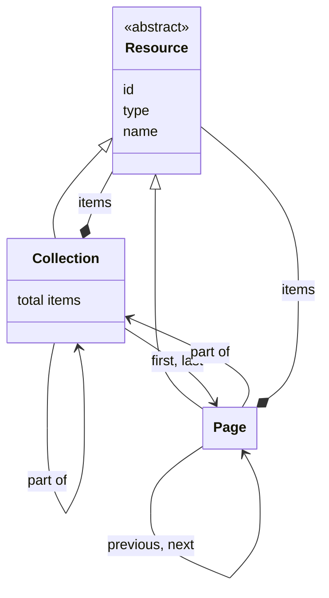

# Resources

## Introduction

The API of a data layer is centered around resources. A resource represents a 'thing' of a certain type. It can correspond to anything — from a physical object (e.g. a building or a person) to an abstract concept (e.g. a collection or a type of art work).

## Data model

This specification defines the following generic resource types:

| Name       | Description                                                                                                                                                   |
| ---------- | ------------------------------------------------------------------------------------------------------------------------------------------------------------- |
| Resource   | A 'thing' of a certain type. All other resource types extend from it.                                                                                         |
| Collection | An ordered list of resources. A Collection may contain further collections, and may consist of pages, containing sublists of the resources in the collection. |
| Page       | An ordered sublist of resources within a Collection.                                                                                                          |

The resource types are extensible. This specification defines the generic `Collection` and `Page` types, which the data layer API specializes where it needs to. The API may also define its own [resource types](types.md).

The following class diagram visualizes the relationships between the resource types:



## Resource structure

A Resource, regardless of type, contains at least the following fields:

| Name   | Data type | Cardinality | Description                                                                                                                                                               |
| ------ | --------- | ----------- | ------------------------------------------------------------------------------------------------------------------------------------------------------------------------- |
| `id`   | string    | 0 or 1      | The identifier of the resource, if known. It _MUST_ be an [HTTP URI](https://httpwg.org/specs/rfc9110.html#uri.schemes). Optional for volatile, non-persistent resources. |
| `type` | string    | 1           | The type of the resource. This specification defines a number of [types](#data-model). The API may additionally define its own types.                                     |
| `name` | string    | 0 or 1      | The name of the resource, if known and relevant to the resource.                                                                                                          |

### Example

Example of the response body:

```json
{
  "id": "https://example.org/v1/entities/1234",
  "type": "HeritageObject",
  "name": "The Night Watch",
  // And then, depending on the resource, other fields, such as:
  "additionalTypes": [
    {
      "id": "https://example.org/v1/entities/5678",
      "type": "Concept",
      "name": "Painting"
    }
  ],
  "description": "Rembrandt’s largest, most famous canvas was made for the Arquebusiers guild hall..."
}
```

The response indicates that this resource has identifier `https://example.org/v1/entities/1234`, is a 'Heritage object' and has name 'The Night Watch'.

Note the `additionalTypes` list: every item in this list is also a resource and has the same top-level fields: `id`, `type` and `name`.

## Collection structure

A Collection contains at least the following fields:

| Name          | Data type  | Cardinality | Description                                                                                                                                                                                                                                                    |
| ------------- | ---------- | ----------- | -------------------------------------------------------------------------------------------------------------------------------------------------------------------------------------------------------------------------------------------------------------- |
| `id`          | string     | 1           | The identifier of the collection.                                                                                                                                                                                                                              |
| `type`        | string     | 1           | The type of the collection. It _MUST_ be `Collection` or a specialization.                                                                                                                                                                                     |
| `name`        | string     | 1           | The name of the collection.                                                                                                                                                                                                                                    |
| `totalItems`  | number     | 0 or 1      | The total number of items in the collection, being its further collections, its resources, or both. This _MAY_ be an estimate, especially in case of a large collection. The field _MAY_ be omitted by the API if the total number is too costly to calculate. |
| `items`       | array      | 0 or 1      | A list of the items in the collection. Not set if the Collection is divided into [pages](#page-structure).                                                                                                                                                     |
| `items[*]`    | Resource   | 1           | A [resource](resources.md#resource-structure). A resource can be of [any type](#data-model), including `Collection` or a specialization.                                                                                                                       |
| `first`       | Page       | 0 or 1      | The first page in the collection. Not set if the collection is empty or if it is not divided into [pages](#page-structure).                                                                                                                                    |
| `first.id`    | string     | 1           | The identifier of the first page in the collection.                                                                                                                                                                                                            |
| `first.type`  | string     | 1           | The type of the first page in the collection. It _MUST_ be `Page` or a specialization.                                                                                                                                                                         |
| `last`        | Page       | 0 or 1      | The last page in the collection. Not set if the collection is empty, if the collection is not divided into [pages](#page-structure), or if the last page is unknown (e.g. in case of [cursor pagination](#pagination)).                                        |
| `last.id`     | string     | 1           | The identifier of the last page in the collection.                                                                                                                                                                                                             |
| `last.type`   | string     | 1           | The type of the last page in the collection. It _MUST_ be `Page` or a specialization.                                                                                                                                                                          |
| `partOf`      | Collection | 0 or 1      | The collection of which this collection is a part. Not set if this collection is the root of the collection tree.                                                                                                                                              |
| `partOf.id`   | string     | 1           | The identifier of the collection.                                                                                                                                                                                                                              |
| `partOf.type` | string     | 1           | The type of the collection. It _MUST_ be `Collection` or a specialization.                                                                                                                                                                                     |
| `partOf.name` | string     | 1           | The name of the collection.                                                                                                                                                                                                                                    |

### The collection tree

Collections form a tree: the `items` of a collection can contain further collections. There is no separate type for a 'collection of collections': a collection that groups other collections is a collection like any other. This keeps the structure a presentation layer has to learn down to one collection type.

The root of the tree is the collection that has no `partOf`. Every other collection _MUST_ have a `partOf` - this makes the tree connected and every collection reachable from the root. A collection _MUST NOT_ be part of itself, directly or indirectly: the tree _MUST_ be acyclic, so that a presentation layer can traverse it without looping.

A presentation layer walks the tree from the root. It requests the root, and for every item in a collection it recurses if the item's `type` is `Collection` or a specialization of it, and renders the item as a resource otherwise. It does not need to know in advance whether a collection holds further collections or resources, or whether the collections it encounters are divided into pages. Every collection, including one that groups other collections, can be divided into pages, so a tree with many branches can be traversed a page at a time.

### Example

Example of the response body of the root collection:

```json
{
  "id": "https://example.org/v1/collections",
  "type": "Collection",
  "name": "Collections",
  "totalItems": 2,
  "items": [
    {
      "id": "https://example.org/v1/collections/objects",
      "type": "Collection",
      "name": "Heritage objects"
    },
    {
      "id": "https://example.org/v1/collections/persons",
      "type": "Collection",
      "name": "Persons"
    }
  ]
}
```

The response indicates that the root groups two further collections.

Example of the response body when the collection is divided into pages:

```json
{
  "id": "https://example.org/v1/collections/objects",
  "type": "Collection",
  "name": "Heritage objects",
  "totalItems": 195,
  "first": {
    "id": "https://example.org/v1/collections/objects?page=1",
    "type": "Page"
  },
  "partOf": {
    "id": "https://example.org/v1/collections",
    "type": "Collection",
    "name": "Collections"
  }
}
```

The response indicates that this collection consists of 195 items, accessible via the `first` page.

## Page structure

A Page contains at least the following fields:

| Name                | Data type  | Cardinality | Description                                                                                                                                                                                                                                                    |
| ------------------- | ---------- | ----------- | -------------------------------------------------------------------------------------------------------------------------------------------------------------------------------------------------------------------------------------------------------------- |
| `id`                | string     | 1           | The identifier of the page.                                                                                                                                                                                                                                    |
| `type`              | string     | 1           | The type of the page. It _MUST_ be `Page` or a specialization.                                                                                                                                                                                                 |
| `name`              | string     | 1           | The name of the page.                                                                                                                                                                                                                                          |
| `items`             | array      | 1           | A list of resources in the page. Empty if there are no resources.                                                                                                                                                                                              |
| `items[*]`          | Resource   | 1           | A [resource](resources.md#resource-structure). A resource can be of [any type](#data-model).                                                                                                                                                                   |
| `prev`              | Page       | 0 or 1      | The previous page in the collection. Not set if there is no previous page.                                                                                                                                                                                     |
| `prev.id`           | string     | 1           | The identifier of the previous page in the collection.                                                                                                                                                                                                         |
| `prev.type`         | string     | 1           | The type of the previous page in the collection. It _MUST_ be `Page` or a specialization.                                                                                                                                                                      |
| `next`              | Page       | 0 or 1      | The next page in the collection. Not set if there is no next page.                                                                                                                                                                                             |
| `next.id`           | string     | 1           | The identifier of the next page in the collection.                                                                                                                                                                                                             |
| `next.type`         | string     | 1           | The type of the next page in the collection. It _MUST_ be `Page` or a specialization.                                                                                                                                                                          |
| `partOf`            | Collection | 1           | The collection to which the items contained by the page belong.                                                                                                                                                                                                |
| `partOf.id`         | string     | 1           | The identifier of the collection.                                                                                                                                                                                                                              |
| `partOf.type`       | string     | 1           | The type of the collection. It _MUST_ be `Collection` or a specialization.                                                                                                                                                                                     |
| `partOf.name`       | string     | 1           | The name of the collection.                                                                                                                                                                                                                                    |
| `partOf.totalItems` | number     | 0 or 1      | The total number of items in the collection, being its further collections, its resources, or both. This _MAY_ be an estimate, especially in case of a large collection. The field _MAY_ be omitted by the API if the total number is too costly to calculate. |
| `partOf.first`      | Page       | 1           | The first page in the collection.                                                                                                                                                                                                                              |
| `partOf.first.id`   | string     | 1           | The identifier of the first page in the collection.                                                                                                                                                                                                            |
| `partOf.first.type` | string     | 1           | The type of the first page in the collection. It _MUST_ be `Page` or a specialization.                                                                                                                                                                         |
| `partOf.last`       | Page       | 0 or 1      | The last page in the collection. Not set if the last page is unknown (e.g. in case of [cursor pagination](#pagination)).                                                                                                                                       |
| `partOf.last.id`    | string     | 1           | The identifier of the last page in the collection.                                                                                                                                                                                                             |
| `partOf.last.type`  | string     | 1           | The type of the last page in the collection. It _MUST_ be `Page` or a specialization.                                                                                                                                                                          |

### Example

Example of the response body:

```json
{
  "id": "https://example.org/v1/collections/objects?page=3",
  "type": "Page",
  "name": "Heritage objects: page 3",
  "items": [
    {
      "id": "https://example.org/v1/entities/1234",
      "type": "HeritageObject",
      "name": "The Night Watch"
      // Other fields...
    }
    // Other items...
  ],
  "prev": {
    "id": "https://example.org/v1/collections/objects?page=2",
    "type": "Page"
  },
  "next": {
    "id": "https://example.org/v1/collections/objects?page=4",
    "type": "Page"
  },
  "partOf": {
    "id": "https://example.org/v1/collections/objects",
    "type": "Collection",
    "name": "Heritage objects",
    "totalItems": 195,
    "first": {
      "id": "https://example.org/v1/collections/objects?page=1",
      "type": "Page"
    },
    "last": {
      "id": "https://example.org/v1/collections/objects?page=20",
      "type": "Page"
    }
  }
}
```

The response indicates that this page contains items (`items`), is related to a previous page (`prev`) and a next page (`next`) and its items are part of a collection (`partOf`).

### Pagination

:::note

**To do**:

- Explain how pagination between pages works.
- Explain the choice between page and cursor navigation.

:::

## Resource identification with URIs

:::note

**To do**: explain how resources must be identified with URIs:

- See the general requirements of the REST API Design Rules, e.g. plural names (`/entities`, not `/entity`), lower case names (`/entities`, not `/Entities`), dashes (`/heritage-objects`, not `/heritageObjects`), slashes to denote hierarchy (`/collections/persons`, not `/collections-persons`);
- Use camel case in query parameters (`?filterBy=dateCreated`, not `?filter-by=date-created`);
- Individual resources must have deterministic IDs if they come from publication systems of data providers;
- URIs must still be treated as if they were opaque strings ("the URI patterns are to facilitate developers understanding the API, not to facilitate software to interact with it").
- A slash in the URI of a collection expresses its place in the collection tree, the same way a slash in a URI expresses a hierarchy elsewhere. The URI of a collection should therefore reflect the path from the root to it, and the `partOf` of a collection should agree with it. A client must not derive either from the URI, though, because it is the API that decides.
- The URI of a published resource is dereferenceable: a `GET` request on it _MUST_ return that resource.

:::
