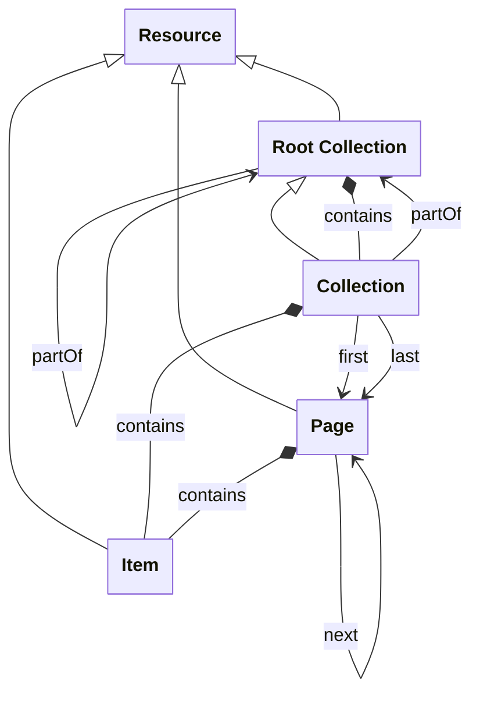

# Resources

## Introduction

The API of a data layer is centered around resources. A resource represents a 'thing' of a certain type. It can correspond to anything — from a physical object (e.g. a building or a person) to an abstract concept (e.g. a collection or a type of art work).

## Resource types

This specification defines the following high-level resource types:

| Name            | Description                                                                                                                                                       |
| --------------- | ----------------------------------------------------------------------------------------------------------------------------------------------------------------- |
| Resource        | A 'thing' of a certain type. All other resource types extend from it.                                                                                             |
| Root Collection | An ordered list of collections.                                                                                                                                   |
| Collection      | An ordered list of items. A collection may be a part of a root collection. A collection may consist of pages, containing sublists of the items in the collection. |
| Page            | An ordered sublist of items within a collection.                                                                                                                  |
| Item            | A 'thing' of a certain type, but not a Root Collection, Collection or Page.                                                                                       |

The resource types are extensible. This specification defines, for example, an [Entity Collection](entities.md#data-model) and an [Entity Page](entities.md#data-model), specialized versions of the generic Collection and Page, respectively. Similarly, the API of a data layer may define its own resource types, extending the existing ones.

:::note

**To be discussed**: the name 'Root Collection' is a bit technical and could suggest that it's always at the top. Rename to e.g. 'Base Collection', 'Parent Collection' or 'Collection Series' (per DCAT - 'Dataset Series')?

:::

The following class diagram visualizes the relationships between the resource types:



## Resource structure

A Resource, regardless of type, contains at least the following fields:

| Name   | Data type | Cardinality | Description                                                                                                                                          |
| ------ | --------- | ----------- | ---------------------------------------------------------------------------------------------------------------------------------------------------- |
| `id`   | string    | 0 or 1      | The identifier of the resource, if known. It _MUST_ be a URI. Optional for volatile, non-persistent resources.                                       |
| `type` | string    | 1           | The type of the resource. This specification defines a number of [high-level types](#resource-types). The API may additionally define its own types. |
| `name` | string    | 0 or 1      | The name of the resource, if known and relevant to the resource.                                                                                     |

Example of the response body:

```json
{
  "id": "https://example.org/v1/entities/objects/1234",
  "type": "HeritageObject",
  "name": "The Night Watch",
  // And then, depending on the resource, other fields, such as:
  "additionalTypes": [
    {
      "id": "https://example.org/v1/entities/concepts/5678",
      "type": "Concept",
      "name": "Painting"
    }
  ],
  "description": "Rembrandt’s largest, most famous canvas was made for the Arquebusiers guild hall..."
}
```

The response indicates that this resource has identifier `https://example.org/v1/entities/objects/1234`, is a 'Heritage object' and has name 'The Night Watch'.

Note the `additionalTypes` list. Every item in this list is also a resource and has the same top-level fields: `id`, `type` and `name`.

## Root Collection structure

A Root Collection contains at least the following fields:

| Name          | Data type      | Cardinality | Description                                                                                                                                                                                                   |
| ------------- | -------------- | ----------- | ------------------------------------------------------------------------------------------------------------------------------------------------------------------------------------------------------------- |
| `id`          | string         | 1           | The identifier of the collection. It _MUST_ be a URI.                                                                                                                                                         |
| `type`        | string         | 1           | The type of the collection. It _MUST_ be `RootCollection` or a specialization.                                                                                                                                |
| `name`        | string         | 1           | The name of the collection.                                                                                                                                                                                   |
| `totalItems`  | number         | 0 or 1      | The total number of collections in the collection. This _MAY_ be an estimate, especially in case of a large collection. The field _MAY_ be omitted by the API if the total number is too costly to calculate. |
| `items`       | array          | 1           | A list of all collections in the collection. Every item _MUST_ be `RootCollection` or `Collection` or a specialization.                                                                                       |
| `partOf`      | RootCollection | 0 or 1      | The collection of which this collection is a part. Not set if this collection is the top-level root collection.                                                                                               |
| `partOf.id`   | string         | 1           | The identifier of the collection.                                                                                                                                                                             |
| `partOf.type` | string         | 1           | The type of the collection. It _MUST_ be `RootCollection` or a specialization.                                                                                                                                |

### Example

Example of the response body:

```json
{
  "id": "https://example.org/v1/entities",
  "type": "RootEntityCollection",
  "name": "Entities",
  "totalItems": 2,
  "items": [
    {
      "id": "https://example.org/v1/entities/objects",
      "type": "EntityCollection",
      "name": "Heritage objects"
    },
    {
      "id": "https://example.org/v1/entities/persons",
      "type": "EntityCollection",
      "name": "Persons"
    }
  ]
}
```

## Collection structure

A Collection contains at least the following fields:

| Name          | Data type      | Cardinality | Description                                                                                                                                                                                                 |
| ------------- | -------------- | ----------- | ----------------------------------------------------------------------------------------------------------------------------------------------------------------------------------------------------------- |
| `id`          | string         | 1           | The identifier of the collection. It _MUST_ be a URI.                                                                                                                                                       |
| `type`        | string         | 1           | The type of the collection. This specification defines specific types. The API may additionally define its own types.                                                                                       |
| `name`        | string         | 1           | The name of the collection.                                                                                                                                                                                 |
| `totalItems`  | number         | 0 or 1      | The total number of resources in the collection. This _MAY_ be an estimate, especially in case of a large collection. The field _MAY_ be omitted by the API if the total number is too costly to calculate. |
| `items`       | array          | 0 or 1      | A list of resources in the collection. A resource can be of [any type](#resource-types). Not set if the resources are parts of [pages](#page-structure).                                                    |
| `first`       | Page           | 0 or 1      | The first page in the collection. Not set if the collection is empty.                                                                                                                                       |
| `first.id`    | string         | 1           | The identifier of the first page in the collection.                                                                                                                                                         |
| `first.type`  | string         | 1           | The type of the first page in the collection. This specification defines specific types. The API may additionally define its own types.                                                                     |
| `last`        | Page           | 0 or 1      | The last page in the collection. Not set if the collection is empty or the last page is unknown (e.g. in case of [cursor pagination](resources.md#pagination)).                                             |
| `last.id`     | string         | 1           | The identifier of the last page in the collection.                                                                                                                                                          |
| `last.type`   | string         | 1           | The type of the last page in the collection. This specification defines specific types. The API may additionally define its own types .                                                                     |
| `partOf`      | RootCollection | 1           | The collection of which this collection is a part.                                                                                                                                                          |
| `partOf.id`   | string         | 1           | The identifier of the collection.                                                                                                                                                                           |
| `partOf.type` | string         | 1           | The type of the collection. It _MUST_ be `RootCollection` or a specialization.                                                                                                                              |

### Example

Example of the response body when a collection embeds its items directly:

```json
{
  "id": "https://example.org/v1/collections/objects/extensions/suggestions/keywords?q=mil",
  "type": "KeywordSuggestionCollection",
  "name": "Keyword suggestions",
  "totalItems": 2,
  "items": [
    {
      "type": "SuggestionTerm",
      "relevance": 98,
      "value": {
        "type": "KeywordSuggestion",
        "name": "mill"
      }
    },
    {
      "type": "SuggestionTerm",
      "relevance": 92,
      "value": {
        "type": "KeywordSuggestion",
        "name": "windmill"
      }
    }
  ],
  "partOf": {
    "id": "https://example.org/v1/collections/objects/extensions/suggestions",
    "type": "RootSuggestionCollection"
  }
}
```

The response indicates that this collection consists of 2 items, accessible via `items`.

Example of the response body when the collection is divided into pages:

```json
{
  "id": "https://example.org/v1/entities/objects",
  "type": "EntityCollection",
  "name": "Heritage objects",
  "totalItems": 195,
  "first": {
    "id": "https://example.org/v1/entities/objects?page=1",
    "type": "EntityPage"
  },
  "partOf": {
    "id": "https://example.org/v1/entities",
    "type": "RootEntityCollection"
  }
}
```

The response indicates that this collection consists of 195 items, accessible via the `first` page.

## Page structure

A Page contains at least the following fields:

| Name        | Data type  | Cardinality | Description                                                                                                                                                           |
| ----------- | ---------- | ----------- | --------------------------------------------------------------------------------------------------------------------------------------------------------------------- |
| `id`        | string     | 1           | The identifier of the page. It _MUST_ be a URI.                                                                                                                       |
| `type`      | string     | 1           | The type of the page. This specification defines specific types, e.g. `EntityPage`. The API may additionally define its own types.                                    |
| `name`      | string     | 1           | The name of the page.                                                                                                                                                 |
| `items`     | array      | 1           | A list of resources in the page. Empty if there are no resources. A resource can be of [any type](#resource-types).                                                   |
| `prev`      | Page       | 0 or 1      | The previous page in the collection. Not set if there is no previous page.                                                                                            |
| `prev.id`   | string     | 1           | The identifier of the previous page in the collection.                                                                                                                |
| `prev.type` | string     | 1           | The type of the previous page in the collection. This specification defines specific types, e.g. `EntityPage`. The API may additionally define its own types.         |
| `next`      | Page       | 0 or 1      | The next page in the collection. Not set if there is no next page.                                                                                                    |
| `next.id`   | string     | 1           | The identifier of the next page in the collection.                                                                                                                    |
| `next.type` | string     | 1           | The type of the next page in the collection. This specification defines specific types, e.g. `EntityPage`. The API may additionally define its own types.             |
| `partOf`    | Collection | 1           | The collection to which the items contained by the page belong. All fields of a collection _MUST_ be embedded. See the [Collection structure](#collection-structure). |

### Pagination

:::note

**To do**:

- Explain how pagination between pages works.
- Explain the choice between page and cursor navigation.

:::

### Example

Example of the response body:

```json
{
  "id": "https://example.org/v1/entities/objects?page=3",
  "type": "EntityPage",
  "name": "Heritage objects",
  "items": [
    {
      "id": "https://example.org/v1/entities/objects/1234",
      "type": "HeritageObject",
      "name": "The Night Watch"
      // Other fields...
    }
    // Other items...
  ],
  "prev": {
    "id": "https://example.org/v1/entities/objects?page=2",
    "type": "EntityPage"
  },
  "next": {
    "id": "https://example.org/v1/entities/objects?page=4",
    "type": "EntityPage"
  },
  "partOf": {
    "id": "https://example.org/v1/entities/objects",
    "type": "EntityCollection",
    "name": "Heritage objects",
    "totalItems": 195,
    "first": {
      "id": "https://example.org/v1/entities/objects?page=1",
      "type": "EntityPage"
    },
    "last": {
      "id": "https://example.org/v1/entities/objects?page=20",
      "type": "EntityPage"
    }
  }
}
```

The response indicates that this page contains items (`items`), is related to a previous page (`prev`) and a next page (`next`) and its items are part of a collection (`partOf`).

## Resource identification with URIs

:::note

**To do**: explain how resources must be identified with URIs:

- See the general requirements of the REST API Design Rules, e.g. plural names (`/entities`, not `/entity`), lower case names (`/entities`, not `/Entities`), dashes (`/heritage-objects`, not `/heritageObjects`), slashes to denote hierarchy (`/entities/persons`, not `/entities-persons`);
- Use camel case in query parameters (`?filterBy=dateCreated`, not `?filter-by=date-created`);
- Individual resources must have deterministic IDs if they come from publication systems of data providers;
- URIs must still be treated as if they were opaque strings ("the URI patterns are to facilitate developers understanding the API, not to facilitate software to interact with it").

:::
