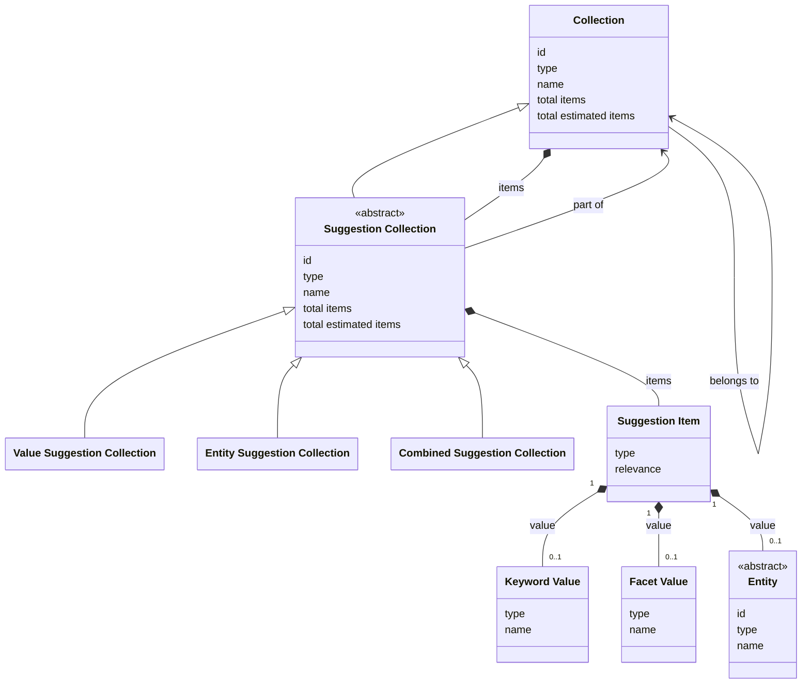

# Suggestions

## Introduction

A suggestion is a value displayed as a user types, such as a keyword, a name, or a facet value. For example: if a user types 'rem', suggestions might be 'Rembrandt' or 'Rem Koolhaas'. Suggestions help users save time. A user can select one of the suggested values and find resources matching the suggestion. This functionality is also known as autocompletion or typeahead.

Suggestions are tied to a particular collection — the context collection — ensuring that results remain within the context of that collection. A data layer _MAY_ offer suggestions for any collection, except for a suggestion collection itself.

Suggestions are optional. A data layer _MAY_ implement them, depending on its requirements. A data layer advertises the suggestion collections it supports for a collection in the generic [`suggestions` property](resources.md#collection) of that collection. The property points to the list of suggestion collections, which a presentation layer retrieves with endpoint [Retrieve the suggestion collections of a collection](#endpoint-retrieve-the-suggestion-collections-of-a-collection).

## Data model

| Name                           | Description                                                                                                                                                        |
| ------------------------------ | ------------------------------------------------------------------------------------------------------------------------------------------------------------------ |
| Collection                     | An ordered list of resources. The generic type. See [Resources](resources.md).                                                                                     |
| Suggestion Collection          | An ordered list of suggestion items. This is an abstract type: a suggestion collection is always of one of the concrete types below. Specialization of Collection. |
| Value Suggestion Collection    | An ordered list of value suggestions: values without identity, such as keywords or facet values. Specialization of Suggestion Collection.                          |
| Entity Suggestion Collection   | An ordered list of entities. Specialization of Suggestion Collection.                                                                                              |
| Combined Suggestion Collection | An ordered list of value suggestions and entities. Specialization of Suggestion Collection.                                                                        |
| Suggestion Item                | A selectable option within a Suggestion Collection, pointing to a value within the context collection.                                                             |
| Keyword Value                  | A keyword matching a suggestion query, e.g. 'windmill'. The keyword can be used as input to search for resources and find all that match it.                       |
| Facet Value                    | A value of a facet item, e.g. the name 'Jan de Vries'. See [Facets](facets.md).                                                                                    |
| Entity                         | An identifiable 'thing' relevant to heritage, matching a suggestion query, e.g. a heritage object named 'A Watermill'. See [Entities](entities.md).                |

The following class diagram visualizes the data model:



## Search strategies

Suggestions can be found by using different search strategies. The data layer decides which strategy fits best. Common strategies include:

1. **Prefix search**. Prefix search restricts results to strings that start with the user's input. For example, the query `mil` will return `mill`, but not `windmill`. This strategy is optimized for speed and predictability; it is best suited for scenarios where users are searching for specific resources by their primary name or when the data layer wants to encourage an 'autocomplete-as-you-type' experience starting from the first letter.
1. **Infix search**. Infix search is a more flexible matching that looks for a query anywhere within a string. For example, the query `mil` will return `mill` and `windmill`. This is the recommended strategy when the data layer wants users to discover resources using parts of a name, even if they do not know exactly how the name begins. Be aware that infix search can be more computationally expensive than prefix search.

## Endpoint: Retrieve the suggestion collections of a collection

The endpoint retrieves all suggestion collections of a collection. The API _MUST_ implement this endpoint if it supports suggestions.

### HTTP request

`GET /{version}/{...collection}/suggestions`

### Path parameters

| Name            | Data type | Cardinality | Description                                                                                                                                                                              |
| --------------- | --------- | ----------- | ---------------------------------------------------------------------------------------------------------------------------------------------------------------------------------------- |
| `version`       | string    | 1           | The version of the API. Example: `v1`.                                                                                                                                                   |
| `...collection` | string    | 1 or more   | The path identifier(s) of the context collection, including the collections it is part of or that it contains. Example: `collections/objects`, or `collections/objects/facets/creators`. |

### Query parameters

None.

### Request body

None.

### Response body

The response body _MUST_ contain at least the following properties:

| Name                  | Data type            | Cardinality | Description                                                                                                                                                                      |
| --------------------- | -------------------- | ----------- | -------------------------------------------------------------------------------------------------------------------------------------------------------------------------------- |
| `id`                  | string               | 1           | The identifier of the collection.                                                                                                                                                |
| `type`                | string               | 1           | The type of the collection. It _MUST_ be `Collection` or a specialization.                                                                                                       |
| `name`                | string               | 1           | The name of the collection.                                                                                                                                                      |
| `totalItems`          | number               | 0 or 1      | The exact total number of suggestion collections. Not set if the exact total is too costly to calculate. Mutually exclusive with `estimatedTotalItems`.                          |
| `estimatedTotalItems` | number               | 0 or 1      | An estimate of the total number of suggestion collections. It can be higher or lower than the real total. Not set if there is no estimate. Mutually exclusive with `totalItems`. |
| `items`               | array                | 1           | A list of the suggestion collections of the context collection.                                                                                                                  |
| `items[*]`            | SuggestionCollection | 1           | A suggestion collection.                                                                                                                                                         |
| `items[*].id`         | string               | 1           | The identifier of the suggestion collection.                                                                                                                                     |
| `items[*].type`       | string               | 1           | The type of the suggestion collection. It _MUST_ be a specialization of `SuggestionCollection`.                                                                                  |
| `items[*].name`       | string               | 1           | The name of the suggestion collection.                                                                                                                                           |
| `belongsTo`           | Collection           | 1           | The context collection that this is the list of suggestion collections for.                                                                                                      |
| `belongsTo.id`        | string               | 1           | The identifier of the context collection.                                                                                                                                        |
| `belongsTo.type`      | string               | 1           | The type of the context collection. It _MUST_ be `Collection` or a specialization.                                                                                               |
| `belongsTo.name`      | string               | 1           | The name of the context collection.                                                                                                                                              |

The API _MUST NOT_ divide this collection into pages. The response body therefore does not contain `first` or `last`.

### Example

An example request from a presentation layer:

```http
GET /v1/collections/objects/suggestions
Host: example.org
```

The request indicates that the API should return all suggestion collections of a curated collection (`objects`).

An example of the response body of the API:

```json
{
  "id": "https://example.org/v1/collections/objects/suggestions",
  "type": "Collection",
  "name": "Suggestions",
  "totalItems": 3,
  "items": [
    {
      "id": "https://example.org/v1/collections/objects/suggestions/values",
      "type": "ValueSuggestionCollection",
      "name": "Value suggestions"
    },
    {
      "id": "https://example.org/v1/collections/objects/suggestions/entities",
      "type": "EntitySuggestionCollection",
      "name": "Entity suggestions"
    },
    {
      "id": "https://example.org/v1/collections/objects/suggestions/combinations",
      "type": "CombinedSuggestionCollection",
      "name": "Value and entity suggestions"
    }
  ],
  "belongsTo": {
    "id": "https://example.org/v1/collections/objects",
    "type": "CuratedCollection",
    "name": "Objects"
  }
}
```

## Endpoint: Suggest values

The endpoint retrieves a list of values without identity matching a query: keywords in the context of a curated collection, facet values in the context of a facet collection. A presentation layer can use a suggested keyword as input to search for resources and find all resources that match the keyword. The endpoint is _OPTIONAL_: it _MAY_ be implemented by the API.

### HTTP request

`GET /{version}/{...collection}/suggestions/{suggestion}`

### Path parameters

| Name            | Data type | Cardinality | Description                                                                                                                                                                              |
| --------------- | --------- | ----------- | ---------------------------------------------------------------------------------------------------------------------------------------------------------------------------------------- |
| `version`       | string    | 1           | The version of the API. Example: `v1`.                                                                                                                                                   |
| `...collection` | string    | 1 or more   | The path identifier(s) of the context collection, including the collections it is part of or that it contains. Example: `collections/objects`, or `collections/objects/facets/creators`. |
| `suggestion`    | string    | 1           | The path identifier of the value suggestion collection. Example: `values`.                                                                                                               |

### Query parameters

| Name      | Data type | Cardinality | Description                                                                                                                                                                                                                                  |
| --------- | --------- | ----------- | -------------------------------------------------------------------------------------------------------------------------------------------------------------------------------------------------------------------------------------------- |
| `q`       | string    | 1           | A query for filtering the suggestion items. Minimum length: defined by the API (e.g. 3 characters). Maximum length: defined by the API (e.g. 25 characters). The API defines how the query is matched, e.g. by using prefix or infix search. |
| `size`    | number    | 0 or 1      | The maximum number of suggestion items to retrieve. Minimum: 1. Default: 10. Maximum: defined by the API (e.g. 25).                                                                                                                          |
| `orderBy` | string    | 0 or 1      | The sorting order of the suggestion items. It _MUST_ be one of `relevance`, `value`. Default: `relevance:desc` (most relevant suggestion first). The API defines which value is used to sort by `value` (e.g. the `name` of a value).        |

### Request body

None.

### Response body

The response body _MUST_ contain at least the following properties:

| Name                  | Data type                | Cardinality | Description                                                                                                                                                                                                                                       |
| --------------------- | ------------------------ | ----------- | ------------------------------------------------------------------------------------------------------------------------------------------------------------------------------------------------------------------------------------------------- |
| `id`                  | string                   | 1           | The identifier of the collection.                                                                                                                                                                                                                 |
| `type`                | string                   | 1           | The type of the collection. It _MUST_ be `ValueSuggestionCollection`.                                                                                                                                                                             |
| `name`                | string                   | 1           | The name of the collection.                                                                                                                                                                                                                       |
| `totalItems`          | number                   | 1           | The exact total number of suggestion items in the collection.                                                                                                                                                                                     |
| `items`               | array                    | 1           | A list of suggestion items. Empty if no suggestions matched the query.                                                                                                                                                                            |
| `items[*]`            | SuggestionItem           | 1           | A suggestion item.                                                                                                                                                                                                                                |
| `items[*].type`       | string                   | 1           | The type of the suggestion item. It _MUST_ be `SuggestionItem`.                                                                                                                                                                                   |
| `items[*].relevance`  | number                   | 1           | The relevance of the suggestion to the query. It _MUST_ be a whole number between 0 (not relevant) and 100 (relevant).                                                                                                                            |
| `items[*].value`      | KeywordValue, FacetValue | 1           | The suggested value: a keyword or a facet value.                                                                                                                                                                                                  |
| `items[*].value.type` | string                   | 1           | The type of the value. It _MUST_ be `KeywordValue` or `FacetValue`.                                                                                                                                                                               |
| `items[*].value.name` | string                   | 1           | The name of the value.                                                                                                                                                                                                                            |
| `partOf`              | Collection               | 1           | The collection that lists the suggestion collections of a collection, including this one. See the response body of endpoint [Retrieve the suggestion collections of a collection](#endpoint-retrieve-the-suggestion-collections-of-a-collection). |
| `partOf.id`           | string                   | 1           | The identifier of the collection.                                                                                                                                                                                                                 |
| `partOf.type`         | string                   | 1           | The type of the collection. It _MUST_ be `Collection` or a specialization.                                                                                                                                                                        |
| `partOf.name`         | string                   | 1           | The name of the collection.                                                                                                                                                                                                                       |

The API _MUST NOT_ divide this collection into pages. The response body therefore does not contain `first` or `last`.

### Example

An example request from a presentation layer:

```http
GET /v1/collections/objects/suggestions/values?q=mil
Host: example.org
```

The request indicates that the API should return value suggestions from a curated collection (`objects`) matching a specific query (`mil`).

An example of the response body of the API:

```json
{
  "id": "https://example.org/v1/collections/objects/suggestions/values?q=mil",
  "type": "ValueSuggestionCollection",
  "name": "Value suggestions",
  "totalItems": 2,
  "items": [
    {
      "type": "SuggestionItem",
      "relevance": 98,
      "value": {
        "type": "KeywordValue",
        "name": "mill"
      }
    },
    {
      "type": "SuggestionItem",
      "relevance": 92,
      "value": {
        "type": "KeywordValue",
        "name": "windmill"
      }
    }
  ],
  "partOf": {
    "id": "https://example.org/v1/collections/objects/suggestions",
    "type": "Collection",
    "name": "Suggestions"
  }
}
```

## Endpoint: Suggest entities

The endpoint retrieves a list of entities matching a query. An entity in the list can then be [directly retrieved](entities.md#endpoint-retrieve-an-entity). The endpoint is _OPTIONAL_: it _MAY_ be implemented by the API.

### HTTP request

`GET /{version}/{...collection}/suggestions/{suggestion}`

### Path parameters

| Name            | Data type | Cardinality | Description                                                                                                                                                                              |
| --------------- | --------- | ----------- | ---------------------------------------------------------------------------------------------------------------------------------------------------------------------------------------- |
| `version`       | string    | 1           | The version of the API. Example: `v1`.                                                                                                                                                   |
| `...collection` | string    | 1 or more   | The path identifier(s) of the context collection, including the collections it is part of or that it contains. Example: `collections/objects`, or `collections/objects/facets/creators`. |
| `suggestion`    | string    | 1           | The path identifier of the entity suggestion collection. Example: `entities`.                                                                                                            |

### Query parameters

| Name      | Data type | Cardinality | Description                                                                                                                                                                                                                                  |
| --------- | --------- | ----------- | -------------------------------------------------------------------------------------------------------------------------------------------------------------------------------------------------------------------------------------------- |
| `q`       | string    | 1           | A query for filtering the suggestion items. Minimum length: defined by the API (e.g. 3 characters). Maximum length: defined by the API (e.g. 25 characters). The API defines how the query is matched, e.g. by using prefix or infix search. |
| `size`    | number    | 0 or 1      | The maximum number of suggestion items to retrieve. Minimum: 1. Default: 10. Maximum: defined by the API (e.g. 25).                                                                                                                          |
| `orderBy` | string    | 0 or 1      | The sorting order of the suggestion items. One of `relevance`, `value`. Default: `relevance:desc` (most relevant suggestion first). The API defines which value is used to sort by `value` (e.g. the `name` of an entity).                   |

### Request body

None.

### Response body

The response body _MUST_ contain at least the following properties:

| Name                  | Data type      | Cardinality | Description                                                                                                                                                                                                                                       |
| --------------------- | -------------- | ----------- | ------------------------------------------------------------------------------------------------------------------------------------------------------------------------------------------------------------------------------------------------- |
| `id`                  | string         | 1           | The identifier of the collection.                                                                                                                                                                                                                 |
| `type`                | string         | 1           | The type of the collection. It _MUST_ be `EntitySuggestionCollection`.                                                                                                                                                                            |
| `name`                | string         | 1           | The name of the collection.                                                                                                                                                                                                                       |
| `totalItems`          | number         | 1           | The exact total number of suggestion items in the collection.                                                                                                                                                                                     |
| `items`               | array          | 1           | A list of suggestions items. Empty if no suggestions matched the query.                                                                                                                                                                           |
| `items[*]`            | SuggestionItem | 1           | A suggestion item.                                                                                                                                                                                                                                |
| `items[*].type`       | string         | 1           | The type of the suggestion item. It _MUST_ be `SuggestionItem`.                                                                                                                                                                                   |
| `items[*].relevance`  | number         | 1           | The relevance of the suggestion to the query. It _MUST_ be a whole number between 0 (not relevant) and 100 (relevant).                                                                                                                            |
| `items[*].value`      | Entity         | 1           | The suggested entity.                                                                                                                                                                                                                             |
| `items[*].value.id`   | string         | 1           | The identifier of the entity.                                                                                                                                                                                                                     |
| `items[*].value.type` | string         | 1           | The [type](entities.md#entity-types) of the entity.                                                                                                                                                                                               |
| `items[*].value.name` | string         | 1           | The name of the entity.                                                                                                                                                                                                                           |
| `partOf`              | Collection     | 1           | The collection that lists the suggestion collections of a collection, including this one. See the response body of endpoint [Retrieve the suggestion collections of a collection](#endpoint-retrieve-the-suggestion-collections-of-a-collection). |
| `partOf.id`           | string         | 1           | The identifier of the collection.                                                                                                                                                                                                                 |
| `partOf.type`         | string         | 1           | The type of the collection. It _MUST_ be `Collection` or a specialization.                                                                                                                                                                        |
| `partOf.name`         | string         | 1           | The name of the collection.                                                                                                                                                                                                                       |

The API _MUST NOT_ divide this collection into pages. The response body therefore does not contain `first` or `last`.

The API _MAY_ expose additional properties about a suggested entity.

### Example

An example request from a presentation layer:

```http
GET /v1/collections/objects/suggestions/entities?q=mil
Host: example.org
```

The request indicates that the API should return entity suggestions from a curated collection (`objects`) matching a specific query (`mil`).

An example of the response body of the API:

```json
{
  "id": "https://example.org/v1/collections/objects/suggestions/entities?q=mil",
  "type": "EntitySuggestionCollection",
  "name": "Entity suggestions",
  "totalItems": 2,
  "items": [
    {
      "type": "SuggestionItem",
      "relevance": 98,
      "value": {
        "id": "https://example.org/v1/entities/1234",
        "type": "HeritageObject",
        "name": "A Watermill"
        // Optionally: other properties
      }
    },
    {
      "type": "SuggestionItem",
      "relevance": 92,
      "value": {
        "id": "https://example.org/v1/entities/5678",
        "type": "HeritageObject",
        "name": "Windmill at Wijk bij Duurstede"
        // Optionally: other properties
      }
    }
  ],
  "partOf": {
    "id": "https://example.org/v1/collections/objects/suggestions",
    "type": "Collection",
    "name": "Suggestions"
  }
}
```

## Endpoint: Suggest values and entities, combined

The endpoint retrieves a list of both values (keywords or facet values) and entities matching a query. The API determines the distribution between values and entities returned (e.g. proportional or based on relevance). The endpoint is _OPTIONAL_: it _MAY_ be implemented by the API.

### HTTP request

`GET /{version}/{...collection}/suggestions/{suggestion}`

### Path parameters

| Name            | Data type | Cardinality | Description                                                                                                                                                                              |
| --------------- | --------- | ----------- | ---------------------------------------------------------------------------------------------------------------------------------------------------------------------------------------- |
| `version`       | string    | 1           | The version of the API. Example: `v1`.                                                                                                                                                   |
| `...collection` | string    | 1 or more   | The path identifier(s) of the context collection, including the collections it is part of or that it contains. Example: `collections/objects`, or `collections/objects/facets/creators`. |
| `suggestion`    | string    | 1           | The path identifier of the value and entity suggestion collection. Example: `combinations`.                                                                                              |

### Query parameters

| Name      | Data type | Cardinality | Description                                                                                                                                                                                                                                         |
| --------- | --------- | ----------- | --------------------------------------------------------------------------------------------------------------------------------------------------------------------------------------------------------------------------------------------------- |
| `q`       | string    | 1           | A query for filtering the suggestion items. Minimum length: defined by the API (e.g. 3 characters). Maximum length: defined by the API (e.g. 25 characters). The API defines how the query is matched, e.g. by using prefix or infix search.        |
| `size`    | number    | 0 or 1      | The maximum number of suggestion items to retrieve. Default: 10. Maximum: 25.                                                                                                                                                                       |
| `orderBy` | string    | 0 or 1      | The sorting order of the suggestion items. One of `relevance`, `value`. Default: `relevance:desc` (most relevant suggestion first). The API defines which value is used to sort by `value` (e.g. the `name` of a value or the `name` of an entity). |

### Request body

None.

### Response body

The response body _MUST_ contain at least the following properties:

| Name                  | Data type                        | Cardinality | Description                                                                                                                                                                                                                                       |
| --------------------- | -------------------------------- | ----------- | ------------------------------------------------------------------------------------------------------------------------------------------------------------------------------------------------------------------------------------------------- |
| `id`                  | string                           | 1           | The identifier of the collection.                                                                                                                                                                                                                 |
| `type`                | string                           | 1           | The type of the collection. It _MUST_ be `CombinedSuggestionCollection`.                                                                                                                                                                          |
| `name`                | string                           | 1           | The name of the collection.                                                                                                                                                                                                                       |
| `totalItems`          | number                           | 1           | The exact total number of suggestion items in the collection.                                                                                                                                                                                     |
| `items`               | array                            | 1           | A list of suggestions items. Empty if no suggestions matched the query.                                                                                                                                                                           |
| `items[*]`            | SuggestionItem                   | 1           | A suggestion item.                                                                                                                                                                                                                                |
| `items[*].type`       | string                           | 1           | The type of the suggestion item. It _MUST_ be `SuggestionItem`.                                                                                                                                                                                   |
| `items[*].relevance`  | number                           | 1           | The relevance of the suggestion to the query. It _MUST_ be a whole number between 0 (not relevant) and 100 (relevant).                                                                                                                            |
| `items[*].value`      | Entity, KeywordValue, FacetValue | 1           | The value of the suggestion item: an entity, a keyword, or a facet value.                                                                                                                                                                         |
| `items[*].value.id`   | string                           | 0 or 1      | The identifier of the entity. Not set if the `type` is `KeywordValue` or `FacetValue`; a value without identity has no `id`.                                                                                                                      |
| `items[*].value.type` | string                           | 1           | The type of the value of the suggestion item. It _MUST_ be `KeywordValue`, `FacetValue`, or a specialization of `Entity`.                                                                                                                         |
| `items[*].value.name` | string                           | 1           | The name of the value or entity.                                                                                                                                                                                                                  |
| `partOf`              | Collection                       | 1           | The collection that lists the suggestion collections of a collection, including this one. See the response body of endpoint [Retrieve the suggestion collections of a collection](#endpoint-retrieve-the-suggestion-collections-of-a-collection). |
| `partOf.id`           | string                           | 1           | The identifier of the collection.                                                                                                                                                                                                                 |
| `partOf.type`         | string                           | 1           | The type of the collection. It _MUST_ be `Collection` or a specialization.                                                                                                                                                                        |
| `partOf.name`         | string                           | 1           | The name of the collection.                                                                                                                                                                                                                       |

The API _MUST NOT_ divide this collection into pages. The response body therefore does not contain `first` or `last`.

The API _MAY_ expose additional properties about a suggested entity.

### Example

An example request from a presentation layer:

```http
GET /v1/collections/objects/suggestions/combinations?q=mil
Host: example.org
```

The request indicates that the API should return value and entity suggestions from a curated collection (`objects`) matching a specific query (`mil`).

An example of the response body of the API:

```json
{
  "id": "https://example.org/v1/collections/objects/suggestions/combinations?q=mil",
  "type": "CombinedSuggestionCollection",
  "name": "Value and entity suggestions",
  "totalItems": 2,
  "items": [
    {
      "type": "SuggestionItem",
      "relevance": 98,
      "value": {
        "type": "KeywordValue",
        "name": "windmill"
      }
    },
    {
      "type": "SuggestionItem",
      "relevance": 95,
      "value": {
        "id": "https://example.org/v1/entities/1234",
        "type": "HeritageObject",
        "name": "A Watermill"
        // Optionally: other properties
      }
    }
  ],
  "partOf": {
    "id": "https://example.org/v1/collections/objects/suggestions",
    "type": "Collection",
    "name": "Suggestions"
  }
}
```
