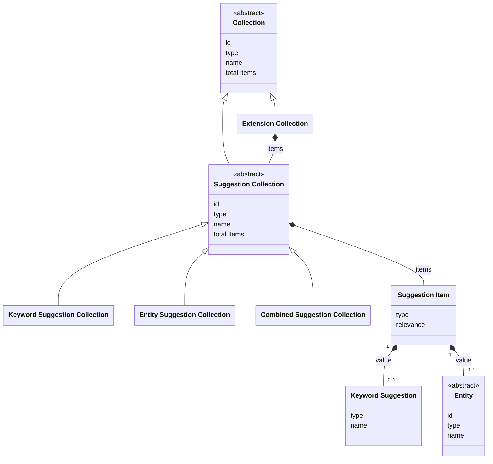

# Suggestions

## Introduction

A suggestion is a keyword or name displayed as a user types. For example: if a user types 'rem', suggestions might be 'Rembrandt' or 'Rem Koolhaas'. Suggestions help users save time. A user can select one of the suggested keywords or names and find entities matching the suggestion. This functionality is also known as autocompletion or typeahead.

Suggestions are tied to a particular [curated collection](collections.md), ensuring that results remain within the context of that collection.

Suggestions are an _OPTIONAL_ [extension](extensions.md). A data layer may choose whether or not to implement them. A data layer advertises the suggestion collections it supports for a curated collection as [items of its extension collection](extensions.md#endpoint-retrieve-the-extension-collection-of-a-curated-collection).

## Data model

| Name                           | Description                                                                                                                                          |
| ------------------------------ | ---------------------------------------------------------------------------------------------------------------------------------------------------- |
| Collection                     | An ordered list of resources. The generic type. See [Resources](resources.md).                                                                       |
| Extension Collection           | A collection of extensions, adding additional functionality to a curated collection. See [Extensions](extensions.md).                                |
| Suggestion Collection          | An ordered list of suggestion items. Abstract: a suggestion collection is always of one of the concrete types below. Specialization of `Collection`. |
| Keyword Suggestion Collection  | An ordered list of keyword suggestions. Specialization of Suggestion Collection.                                                                     |
| Entity Suggestion Collection   | An ordered list of entities. Specialization of Suggestion Collection.                                                                                |
| Combined Suggestion Collection | An ordered list of keyword suggestions and entities. Specialization of Suggestion Collection.                                                        |
| Suggestion Item                | A selectable option within a Suggestion Collection, pointing to a Keyword Suggestion or an Entity.                                                   |
| Keyword Suggestion             | A keyword matching a suggestion query, e.g. 'windmill'. The keyword can be used as input to search for entities and find all that match it.          |
| Entity                         | An identifiable 'thing' relevant to heritage, matching a suggestion query, e.g. a heritage object named 'A Watermill'. See [Entities](entities.md).  |

The following class diagram visualizes the data model:



## Search strategies

Suggestions can be found by using different search strategies. The data layer decides which strategy fits best. Common strategies include:

1. **Prefix search**. Prefix search restricts results to strings that start with the user's input. For example, the query `mil` will return `mill`, but not `windmill`. This strategy is optimized for speed and predictability; it is best suited for scenarios where users are searching for specific entities by their primary name or when the data layer wants to encourage an 'autocomplete-as-you-type' experience starting from the first letter.
1. **Infix search**. Infix search is a more flexible matching that looks for a query anywhere within a string. For example, the query `mil` will return `mill` and `windmill`. This is the recommended strategy when the data layer wants users to discover entities using parts of a name, even if they do not know exactly how the name begins. Be aware that infix search can be more computationally expensive than prefix search.

## Endpoint: Suggest keywords

The endpoint retrieves a list of keywords matching a query. A presentation layer can use a keyword as input to [search for entities](collections.md#endpoint-retrieve-a-page-in-a-collection) and find all entities that match the keyword. The endpoint is _OPTIONAL_: it _MAY_ be implemented by the API.

### HTTP request

`GET /{version}/collections(/{...collections})/{collection}/{extensions}/{suggestion}`

### Path parameters

| Name             | Data type | Cardinality | Description                                                                                        |
| ---------------- | --------- | ----------- | -------------------------------------------------------------------------------------------------- |
| `version`        | string    | 1           | The version of the API. Example: `v1`.                                                             |
| `...collections` | string    | 0 or more   | The path identifier(s) of the collection(s) the curated collection is part of. Example: `persons`. |
| `collection`     | string    | 1           | The path identifier of the curated collection. Example: `masterpieces`.                            |
| `extensions`     | string    | 1           | The path identifier of the extension collection of the curated collection. Example: `extensions`.  |
| `suggestion`     | string    | 1           | The path identifier of the keyword suggestion collection. Example: `keywords`.                     |

### Query parameters

| Name      | Data type | Cardinality | Description                                                                                                                                                                                                                                          |
| --------- | --------- | ----------- | ---------------------------------------------------------------------------------------------------------------------------------------------------------------------------------------------------------------------------------------------------- |
| `q`       | string    | 1           | A keyword query for filtering the suggestion items. Minimum length: defined by the API (e.g. 3 characters). Maximum length: defined by the API (e.g. 25 characters). The API defines how the query is matched, e.g. by using prefix or infix search. |
| `size`    | number    | 0 or 1      | The maximum number of suggestion items to retrieve. Minimum: 1. Default: 10. Maximum: defined by the API (e.g. 25).                                                                                                                                  |
| `orderBy` | string    | 0 or 1      | The sorting order of the suggestion items. It _MUST_ be one of `relevance`, `value`. Default: `relevance:desc` (most relevant suggestion first). The API defines which value is used to sort by `value` (e.g. the `name` of a keyword).              |

### Request body

None.

### Response body

The response body _MUST_ contain at least the following fields:

| Name                  | Data type           | Cardinality | Description                                                                                                            |
| --------------------- | ------------------- | ----------- | ---------------------------------------------------------------------------------------------------------------------- |
| `id`                  | string              | 1           | The identifier of the collection.                                                                                      |
| `type`                | string              | 1           | The type of the collection. It _MUST_ be `KeywordSuggestionCollection`.                                                |
| `name`                | string              | 1           | The name of the collection.                                                                                            |
| `totalItems`          | number              | 1           | The total number of suggestion items in the collection.                                                                |
| `items`               | array               | 1           | A list of suggestion items. Empty if no suggestions matched the query.                                                 |
| `items[*]`            | SuggestionItem      | 1           | A suggestion item.                                                                                                     |
| `items[*].type`       | string              | 1           | The type of the suggestion item. It _MUST_ be `SuggestionItem`.                                                        |
| `items[*].relevance`  | number              | 1           | The relevance of the suggestion to the query. It _MUST_ be a whole number between 0 (not relevant) and 100 (relevant). |
| `items[*].value`      | KeywordSuggestion   | 1           | The suggested keyword.                                                                                                 |
| `items[*].value.type` | string              | 1           | The type of the keyword. It _MUST_ be `KeywordSuggestion`.                                                             |
| `items[*].value.name` | string              | 1           | The name of the keyword.                                                                                               |
| `partOf`              | ExtensionCollection | 1           | The extension collection of which this suggestion collection is a part.                                                |
| `partOf.id`           | string              | 1           | The identifier of the extension collection.                                                                            |
| `partOf.type`         | string              | 1           | The type of the extension collection. It _MUST_ be `ExtensionCollection`.                                              |
| `partOf.name`         | string              | 1           | The name of the extension collection.                                                                                  |

### Example

An example request from a presentation layer:

```http
GET /v1/collections/objects/extensions/keywords?q=mil
Host: example.org
```

The request indicates that the API should return keyword suggestions from a curated collection (`objects`) matching a specific query (`mil`).

An example of the response body of the API:

```json
{
  "id": "https://example.org/v1/collections/objects/extensions/keywords?q=mil",
  "type": "KeywordSuggestionCollection",
  "name": "Keyword suggestions",
  "totalItems": 2,
  "items": [
    {
      "type": "SuggestionItem",
      "relevance": 98,
      "value": {
        "type": "KeywordSuggestion",
        "name": "mill"
      }
    },
    {
      "type": "SuggestionItem",
      "relevance": 92,
      "value": {
        "type": "KeywordSuggestion",
        "name": "windmill"
      }
    }
  ],
  "partOf": {
    "id": "https://example.org/v1/collections/objects/extensions",
    "type": "ExtensionCollection",
    "name": "Extensions"
  }
}
```

## Endpoint: Suggest entities

The endpoint retrieves a list of entities matching a query. An entity in the list can then be [directly retrieved](entities.md#endpoint-retrieve-an-entity). The endpoint is _OPTIONAL_: it _MAY_ be implemented by the API.

### HTTP request

`GET /{version}/collections(/{...collections})/{collection}/{extensions}/{suggestion}`

### Path parameters

| Name             | Data type | Cardinality | Description                                                                                        |
| ---------------- | --------- | ----------- | -------------------------------------------------------------------------------------------------- |
| `version`        | string    | 1           | The version of the API. Example: `v1`.                                                             |
| `...collections` | string    | 0 or more   | The path identifier(s) of the collection(s) the curated collection is part of. Example: `persons`. |
| `collection`     | string    | 1           | The path identifier of the curated collection. Example: `masterpieces`.                            |
| `extensions`     | string    | 1           | The path identifier of the extension collection of the curated collection. Example: `extensions`.  |
| `suggestion`     | string    | 1           | The path identifier of the entity suggestion collection. Example: `entities`.                      |

### Query parameters

| Name      | Data type | Cardinality | Description                                                                                                                                                                                                                                          |
| --------- | --------- | ----------- | ---------------------------------------------------------------------------------------------------------------------------------------------------------------------------------------------------------------------------------------------------- |
| `q`       | string    | 1           | A keyword query for filtering the suggestion items. Minimum length: defined by the API (e.g. 3 characters). Maximum length: defined by the API (e.g. 25 characters). The API defines how the query is matched, e.g. by using prefix or infix search. |
| `size`    | number    | 0 or 1      | The maximum number of suggestion items to retrieve. Minimum: 1. Default: 10. Maximum: defined by the API (e.g. 25).                                                                                                                                  |
| `orderBy` | string    | 0 or 1      | The sorting order of the suggestion items. One of `relevance`, `value`. Default: `relevance:desc` (most relevant suggestion first). The API defines which value is used to sort by `value` (e.g. the `name` of an entity).                           |

### Request body

None.

### Response body

The response body _MUST_ contain at least the following fields:

| Name                  | Data type           | Cardinality | Description                                                                                                            |
| --------------------- | ------------------- | ----------- | ---------------------------------------------------------------------------------------------------------------------- |
| `id`                  | string              | 1           | The identifier of the collection.                                                                                      |
| `type`                | string              | 1           | The type of the collection. It _MUST_ be `EntitySuggestionCollection`.                                                 |
| `name`                | string              | 1           | The name of the collection.                                                                                            |
| `totalItems`          | number              | 1           | The total number of suggestion items in the collection.                                                                |
| `items`               | array               | 1           | A list of suggestions items. Empty if no suggestions matched the query.                                                |
| `items[*]`            | SuggestionItem      | 1           | A suggestion item.                                                                                                     |
| `items[*].type`       | string              | 1           | The type of the suggestion item. It _MUST_ be `SuggestionItem`.                                                        |
| `items[*].relevance`  | number              | 1           | The relevance of the suggestion to the query. It _MUST_ be a whole number between 0 (not relevant) and 100 (relevant). |
| `items[*].value`      | Entity              | 1           | The suggested entity.                                                                                                  |
| `items[*].value.id`   | string              | 1           | The identifier of the entity.                                                                                          |
| `items[*].value.type` | string              | 1           | The [type](entities.md#entity-types) of the entity.                                                                    |
| `items[*].value.name` | string              | 1           | The name of the entity.                                                                                                |
| `partOf`              | ExtensionCollection | 1           | The extension collection of which this suggestion collection is a part.                                                |
| `partOf.id`           | string              | 1           | The identifier of the extension collection.                                                                            |
| `partOf.type`         | string              | 1           | The type of the extension collection. It _MUST_ be `ExtensionCollection`.                                              |
| `partOf.name`         | string              | 1           | The name of the extension collection.                                                                                  |

The API _MAY_ expose additional fields about a suggested entity.

### Example

An example request from a presentation layer:

```http
GET /v1/collections/objects/extensions/entities?q=mil
Host: example.org
```

The request indicates that the API should return entity suggestions from a curated collection (`objects`) matching a specific query (`mil`).

An example of the response body of the API:

```json
{
  "id": "https://example.org/v1/collections/objects/extensions/entities?q=mil",
  "type": "EntitySuggestionCollection",
  "name": "Entity suggestions",
  "totalItems": 2,
  "items": [
    {
      "type": "SuggestionItem",
      "relevance": 98,
      "value": {
        "id": "https://example.org/v1/entities/objects/1234",
        "type": "HeritageObject",
        "name": "A Watermill"
        // Optionally: other fields
      }
    },
    {
      "type": "SuggestionItem",
      "relevance": 92,
      "value": {
        "id": "https://example.org/v1/entities/objects/5678",
        "type": "HeritageObject",
        "name": "Windmill at Wijk bij Duurstede"
        // Optionally: other fields
      }
    }
  ],
  "partOf": {
    "id": "https://example.org/v1/collections/objects/extensions",
    "type": "ExtensionCollection",
    "name": "Extensions"
  }
}
```

## Endpoint: Suggest keywords and entities, combined

The endpoint retrieves a list of both keywords and entities matching a query. The API determines the distribution between keywords and entities returned (e.g. proportional or based on relevance). The endpoint is _OPTIONAL_: it _MAY_ be implemented by the API.

### HTTP request

`GET /{version}/collections(/{...collections})/{collection}/{extensions}/{suggestion}`

### Path parameters

| Name             | Data type | Cardinality | Description                                                                                        |
| ---------------- | --------- | ----------- | -------------------------------------------------------------------------------------------------- |
| `version`        | string    | 1           | The version of the API. Example: `v1`.                                                             |
| `...collections` | string    | 0 or more   | The path identifier(s) of the collection(s) the curated collection is part of. Example: `persons`. |
| `collection`     | string    | 1           | The path identifier of the curated collection. Example: `masterpieces`.                            |
| `extensions`     | string    | 1           | The path identifier of the extension collection of the curated collection. Example: `extensions`.  |
| `suggestion`     | string    | 1           | The path identifier of the keyword and entity suggestion collection. Example: `combinations`.      |

### Query parameters

| Name      | Data type | Cardinality | Description                                                                                                                                                                                                                                           |
| --------- | --------- | ----------- | ----------------------------------------------------------------------------------------------------------------------------------------------------------------------------------------------------------------------------------------------------- |
| `q`       | string    | 1           | A keyword query for filtering the suggestion items. Minimum length: defined by the API (e.g. 3 characters). Maximum length: defined by the API (e.g. 25 characters). The API defines how the query is matched, e.g. by using prefix or infix search.  |
| `size`    | number    | 0 or 1      | The maximum number of suggestion items to retrieve. Default: 10. Maximum: 25.                                                                                                                                                                         |
| `orderBy` | string    | 0 or 1      | The sorting order of the suggestion items. One of `relevance`, `value`. Default: `relevance:desc` (most relevant suggestion first). The API defines which value is used to sort by `value` (e.g. the `name` of a keyword or the `name` of an entity). |

### Request body

None.

### Response body

The response body _MUST_ contain at least the following fields:

| Name                  | Data type                 | Cardinality | Description                                                                                                            |
| --------------------- | ------------------------- | ----------- | ---------------------------------------------------------------------------------------------------------------------- |
| `id`                  | string                    | 1           | The identifier of the collection.                                                                                      |
| `type`                | string                    | 1           | The type of the collection. It _MUST_ be `CombinedSuggestionCollection`.                                               |
| `name`                | string                    | 1           | The name of the collection.                                                                                            |
| `totalItems`          | number                    | 1           | The total number of suggestion items in the collection.                                                                |
| `items`               | array                     | 1           | A list of suggestions items. Empty if no suggestions matched the query.                                                |
| `items[*]`            | SuggestionItem            | 1           | A suggestion item.                                                                                                     |
| `items[*].type`       | string                    | 1           | The type of the suggestion item. It _MUST_ be `SuggestionItem`.                                                        |
| `items[*].relevance`  | number                    | 1           | The relevance of the suggestion to the query. It _MUST_ be a whole number between 0 (not relevant) and 100 (relevant). |
| `items[*].value`      | KeywordSuggestion, Entity | 1           | The suggested keyword or entity.                                                                                       |
| `items[*].value.id`   | string                    | 0 or 1      | The identifier of the entity. Not set if the `type` is `KeywordSuggestion`; a keyword has no identity.                 |
| `items[*].value.type` | string                    | 1           | The type of the keyword (it _MUST_ be `KeywordSuggestion`) or the [type](entities.md#entity-types) of the entity.      |
| `items[*].value.name` | string                    | 1           | The name of the keyword or entity.                                                                                     |
| `partOf`              | ExtensionCollection       | 1           | The extension collection of which this suggestion collection is a part.                                                |
| `partOf.id`           | string                    | 1           | The identifier of the extension collection.                                                                            |
| `partOf.type`         | string                    | 1           | The type of the extension collection. It _MUST_ be `ExtensionCollection`.                                              |
| `partOf.name`         | string                    | 1           | The name of the extension collection.                                                                                  |

The API _MAY_ expose additional fields about a suggested entity.

### Example

An example request from a presentation layer:

```http
GET /v1/collections/objects/extensions/combinations?q=mil
Host: example.org
```

The request indicates that the API should return keyword and entity suggestions from a curated collection (`objects`) matching a specific query (`mil`).

An example of the response body of the API:

```json
{
  "id": "https://example.org/v1/collections/objects/extensions/combinations?q=mil",
  "type": "CombinedSuggestionCollection",
  "name": "Keyword and entity suggestions",
  "totalItems": 2,
  "items": [
    {
      "type": "SuggestionItem",
      "relevance": 98,
      "value": {
        "type": "KeywordSuggestion",
        "name": "windmill"
      }
    },
    {
      "type": "SuggestionItem",
      "relevance": 95,
      "value": {
        "id": "https://example.org/v1/entities/objects/1234",
        "type": "HeritageObject",
        "name": "A Watermill"
        // Optionally: other fields
      }
    }
  ],
  "partOf": {
    "id": "https://example.org/v1/collections/objects/extensions",
    "type": "ExtensionCollection",
    "name": "Extensions"
  }
}
```
