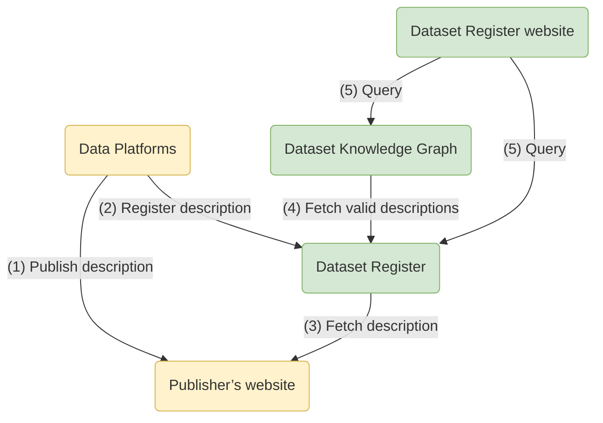
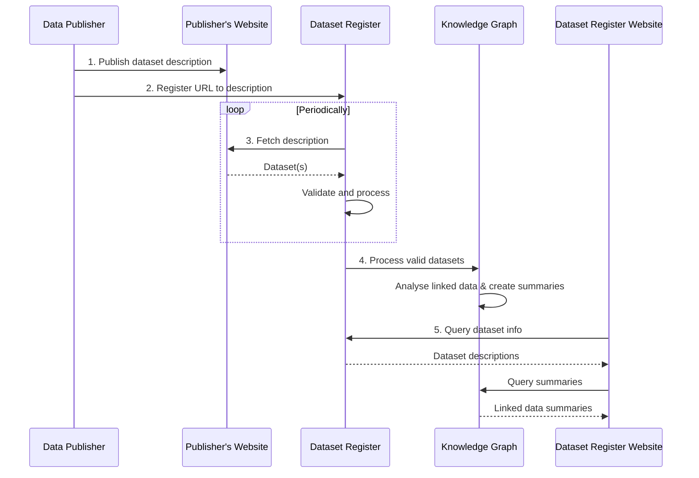

# Dataset Register

The Dataset Register is the list of datasets in the Dutch heritage network.
For each dataset, it provides a [machine-readable](../../glossary.md#machine-readable) [description](../../glossary.md#dataset-description)
that includes:

* the dataset’s name, creator and publisher
* information on how to access the dataset’s content, for example data dumps and SPARQL endpoints
* licensing information.

## Where to go next

**If you are publishing a dataset**, register your dataset description via the [REST API](api.md). The Register fetches it, validates it against the [Requirements for Datasets](https://docs.nde.nl/requirements-datasets/), and stores the result. See also [Register your dataset](../../publish/register.md) for the publisher-side walkthrough.

**If you are consuming the Register**, query the [SPARQL endpoint](sparql.md). The [data model](data-model.md) describes the DCAT-AP-NL shapes you will encounter in the results.

**If you are browsing**, the [Dataset Register website](https://datasetregister.netwerkdigitaalerfgoed.nl/en/datasets) provides a human-readable search interface.

Keep reading here for an overview of the Dataset Register’s architeture, components and flows.

## Components

The Dataset Register service is made up of several cooperating components:

* a [**REST API**](api.md) that accepts dataset registrations and validates incoming descriptions;
* a **crawler** that periodically re-fetches every registered URL, re-validates the response,
  and writes the result to the store;
* an **RDF store** that holds all valid dataset descriptions and exposes them via a [SPARQL endpoint](sparql.md)
* a [**website**](https://datasetregister.netwerkdigitaalerfgoed.nl) that lets people browse and search the contents of the store.

The diagram below shows how the Dataset Register sits between the publishing side
(Data Platforms and publishers’ websites) and the consuming side (the Dataset Register website,
the Knowledge Graph, and third-party applications):

## Registration flow

To make a dataset description visible on the Dataset Register website,
[Data Platforms](../../glossary.md#data-platform) and the Dataset Register cooperate in the following steps.

1. A [Collection Manager](../../glossary#collection-manager) produces a [dataset description](../../glossary.md#dataset-description)
   and publishes it on the web (e.g. on a website or in a SPARQL endpoint).
2. The URL to the dataset description is registered with the Dataset Register.
3. The Dataset Register validates the dataset description and stores it for later retrieval. 
4. Periodically, the Dataset Register fetches, validates and stores all dataset descriptions again.
5. The [NDE Dataset Knowledge Graph](../dataset-knowledge-graph/index.md) periodically fetches valid descriptions from the Dataset Register,
   analyses linked datasets, and stores their summaries. 
6. When users consult the Dataset Register website, information from the Dataset Register and the Knowledge Graph is combined.

This flow is explained in more detail in the two diagrams below.

### Flow chart

```mermaid
flowchart TD
    P(Data Platforms)
    W("Publisher’s website")
    R(Dataset Register)
    K(Dataset Knowledge Graph)
    U(Dataset Register website)

    style P fill:#FFF2CC,stroke:#D6B656
    style W fill:#FFF2CC,stroke:#D6B656
    style R fill:#D5E8D4,stroke:#82B366
    style K fill:#D5E8D4,stroke:#82B366
    style U fill:#D5E8D4,stroke:#82B366

    P -- "(1) Publish description" --> W
    P -- "(2) Register description" --> R
    R -- "(3) Fetch description" --> W
    K -- "(4) Fetch valid descriptions" --> R
    U -- "(5) Query" --> K & R
```

### Sequence diagram

```mermaid
sequenceDiagram
    participant P as Data Publisher
    participant W as Publisher's Website
    participant R as Dataset Register
    participant K as Knowledge Graph
    participant U as Dataset Register Website

    P->>W: 1. Publish dataset description
    P->>R: 2. Register URL to description
    loop Periodically
        R->>W: 3. Fetch description
        W-->>R: Dataset(s)
        R->>R: Validate and process
    end
    R->>K: 4. Process valid datasets
    K->>K: Analyse linked data & create summaries
    U->>R: 5. Query dataset info
    R-->>U: Dataset descriptions
    U->>K: Query summaries
    K-->>U: Linked data summaries
```

## Source code

The Dataset Register is [open source](https://github.com/netwerk-digitaal-erfgoed/dataset-register). 
