# Dataset Register

The Dataset Register is the list of datasets in the Dutch heritage network.
For each dataset, it provides a [machine-readable](../../glossary.md#machine-readable) [description](../../glossary.md#dataset-description)
that includes:

* the dataset name, publisher
* information on how to access the dataset’s content, for example data dumps and SPARQL endpoints

## Components

* Users can search the [Dataset Register website](https://datasetregister.netwerkdigitaalerfgoed.nl/en/datasets)
  for datasets.
* Software developers that want to find datasets may want to use the [Dataset Register SPARQL endpoint](sparql.md).
* Software developers that want to register dataset descriptions should use the [Dataset Register REST API](api.md).

## Registration flow

To make a dataset description visible on the Dataset Register website,
[Data Platforms](../../glossary.md#data-platform) follow these steps
(see also the [Requirements for Datasets](https://docs.nde.nl/requirements-datasets/)):

1. A [Collection Manager](../../glossary#collection-manager) produces a [dataset description](../../glossary.md#dataset-description)
   and publishes it on the web (e.g. on a website or in a SPARQL endpoint).
2. The URL to the dataset description is registered with the Dataset Register.
3. The Dataset Register periodically fetches all dataset descriptions, validates them, and stores them for later retrieval.
4. The [Dataset Knowledge Graph](../dataset-knowledge-graph/index.md) periodically fetches valid descriptions from the Dataset Register,
   analyses linked datasets, and stores their summaries.
5. When users consult the Dataset Register website, information from the Dataset Register and the Knowledge Graph is combined.

### Flow chart

```mermaid
flowchart TD
    P(Data Platforms)
    W("Data Provider’s website")
    R(Dataset Register)
    K(Dataset Knowledge Graph)
    U(Dataset Register website)

    style P fill:#FFF2CC,stroke:#D6B656
    style W fill:#FFF2CC,stroke:#D6B656
    style R fill:#D5E8D4,stroke:#82B366
    style K fill:#D5E8D4,stroke:#82B366
    style U fill:#D5E8D4,stroke:#82B366

    P -- "(1) Publish description" --> W
    P -- "(2) Register description" --> R
    R -- "(3) Fetch description" --> W
    K -- "(4) Fetch valid descriptions" --> R
    U -- "(5) Query" --> K & R
```

### Sequence diagram

