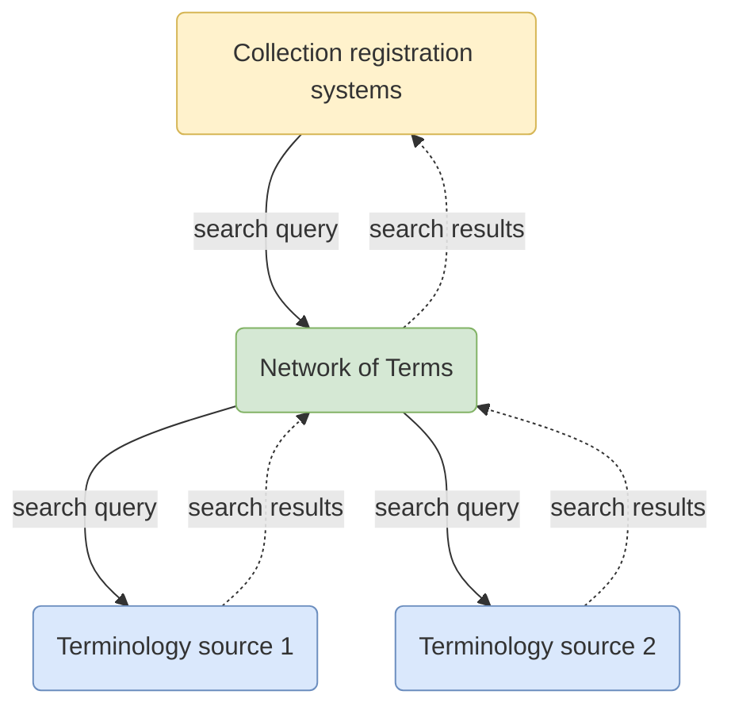

# Network of Terms

The Network of Terms is a **search engine for finding [terms](/glossary.md#term)** in terminology sources (such as thesauri, classification
systems and reference lists).

Given a textual search query, the Network of Terms searches one or more [terminology sources](../../glossary.md#terminology-source) in
**real-time** and returns matching terms, including their labels and URIs. The Network of Terms offers a **simple search
interface**, **handles errors** gracefully in case a source does not respond well and **harmonizes the results** to the
SKOS data model.

The Network of Terms is intended for [collection managers](../../glossary.md#collection-manager) that want to improve the findability of their
information by assigning terms from terminology sources that are used by the institutions in
the [Dutch Digital Heritage Network](https://netwerkdigitaalerfgoed.nl). Information managers use the Network of Terms
in their [collection management system](../../glossary.md#collection-management-system).

Schematically, the collection management system sends out a single query to the Network of Terms, which gets translated to a set
of queries that is appropriate for each terminology source. The terms matching the query are harmonized to SKOS and
returned to the collection management system where information managers can evaluate the results and link their
data to the terms:

## Find terms

If you just want to search the Network of Terms using a web interface, have a look at our
[demonstrator](https://termennetwerk.netwerkdigitaalerfgoed.nl), a web interface on top of the
[GraphQL API](graphql.md).

## APIs

* [GraphQL](graphql.md)
* [Reconciliation](reconciliation.md)

## Source code

The Network of Terms is open source software, available [on GitHub](https://github.com/netwerk-digitaal-erfgoed/network-of-terms).
