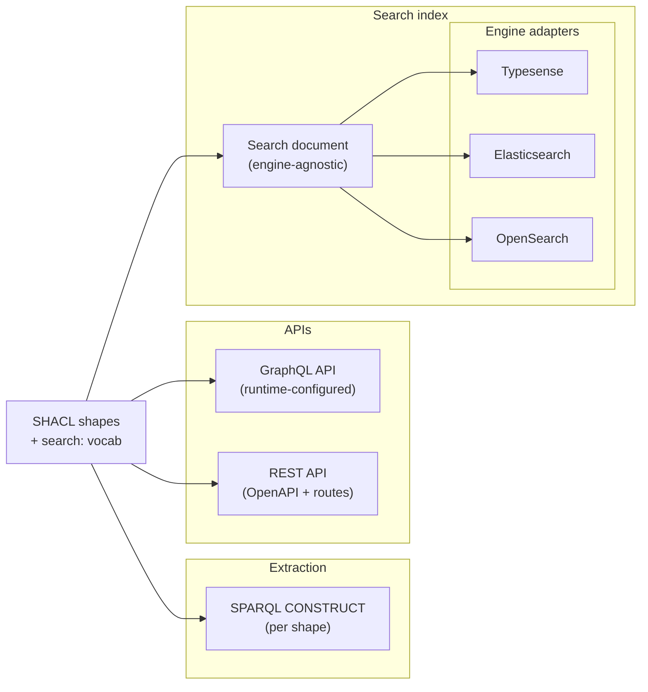

# Service Platform side

:::warning Draft – under review
Part of the Stack documentation ([overview](../index.md)). Not yet endorsed by NDE.
:::

Service Platforms consist of a [Data Layer](#data-layer) and [Presentation Layer](#presentation-layer).
The Data Layer assembles network data into derived products; the Presentation Layer renders them for users.

## Function mapping

[*Van data naar dienst*](https://zenodo.org/records/17541400) defines ten functions (eight in the Data Layer, two in the Presentation Layer). The table below maps each onto what exists today (in [`ldelements/lde`](https://github.com/ldelements/lde) and in [`netwerk-digitaal-erfgoed/*`](https://github.com/netwerk-digitaal-erfgoed)) and what is proposed but not yet built. Empty cells (—) are real gaps. A package can appear under multiple functions if it genuinely contributes to several. Source-side components are not in this table; they appear in the [Publication Layer](provider.md#publication-layer).

The Stack standardises on [`@lde/pipeline`](https://github.com/ldelements/lde/tree/main/packages/pipeline) as the [pipeline orchestrator](../pipeline.md); the rows below list pipeline-stage packages that plug into it. Specific Writers or Executors are called out per row where relevant.

| Step | Function                   | Existing LDE (`@lde/*`)                                                                                                                                                                                                                                                                                                                                                                                                                                                                                                                                                                                    | Existing NDE                                                                                                            | Proposed / TBD                                                                                                                                                                                                                                                                                                  |
|------|----------------------------|------------------------------------------------------------------------------------------------------------------------------------------------------------------------------------------------------------------------------------------------------------------------------------------------------------------------------------------------------------------------------------------------------------------------------------------------------------------------------------------------------------------------------------------------------------------------------------------------------------|-------------------------------------------------------------------------------------------------------------------------|-----------------------------------------------------------------------------------------------------------------------------------------------------------------------------------------------------------------------------------------------------------------------------------------------------------------|
| 1    | Access                     | [`dataset-registry-client`](https://github.com/ldelements/lde/tree/main/packages/dataset-registry-client), [`distribution-downloader`](https://github.com/ldelements/lde/tree/main/packages/distribution-downloader), [`distribution-probe`](https://github.com/ldelements/lde/tree/main/packages/distribution-probe), [`distribution-monitor`](https://github.com/ldelements/lde/tree/main/packages/distribution-monitor), [`sparql-importer`](https://github.com/ldelements/lde/tree/main/packages/sparql-importer), [`sparql-qlever`](https://github.com/ldelements/lde/tree/main/packages/sparql-qlever) | [NDE Datasetregister](../../services/dataset-register)                                                                  | Pipelines read distribution health from the [Register’s health graph](../../services/dataset-register/data-model.md#distribution-health) rather than re-probing; ad-hoc probes can call [`distribution-probe`](https://github.com/ldelements/lde/tree/main/packages/distribution-probe) directly. LDES Executor |
| 2    | Discovery                  | [`dataset-registry-client`](https://github.com/ldelements/lde/tree/main/packages/dataset-registry-client) (`SearchCriteria` filter), [`pipeline-void`](https://github.com/ldelements/lde/tree/main/packages/pipeline-void)                                                                                                                                                                                                                                                                                                                                                                                 | [NDE Dataset Knowledge Graph](../../services/dataset-knowledge-graph)                                                   | Mature “Knowledge Graph voor Datasets” network service; advisor service surfacing DKG analyses to dienstplatformen                                                                                                                                                                                              |
| 3    | Normalisation              | —                                                                                                                                                                                                                                                                                                                                                                                                                                                                                                                                                                                                          | —                                                                                                                       | Wrapper services for AI-tooling at network level (HTR / ATR / ASR / NER)                                                                                                                                                                                                                                        |
| 4a   | Transformation (technical) | [`distribution-downloader`](https://github.com/ldelements/lde/tree/main/packages/distribution-downloader), [`sparql-importer`](https://github.com/ldelements/lde/tree/main/packages/sparql-importer), [`sparql-qlever`](https://github.com/ldelements/lde/tree/main/packages/sparql-qlever)                                                                                                                                                                                                                                                                                                                | —                                                                                                                       | SHACL-driven transformation generator – the realisation of [`ldelements/lde#325`](https://github.com/ldelements/lde/issues/325)                                                                                                                                                                                 |
| 4b   | Transformation (semantic)  | —                                                                                                                                                                                                                                                                                                                                                                                                                                                                                                                                                                                                          | [SCHEMA-AP-NDE-first](../patterns.md#schema-ap-nde-first) | domain-profile adapters (Linked Art / CIDOC-CRM, RiC-O, RDA, EDM)                                                                                                                                                                                                             |
| 5    | Enrich                     | —                                                                                                                                                                                                                                                                                                                                                                                                                                                                                                                                                                                                          | [NDE Network of Terms](../../services/network-of-terms)                                                                 | `@ndes/pipeline-tn-enrich` (calls NoT); NDE “Knowledge Graph voor Termen” network service (term ↔ term, [report function 5](#function-mapping), substrate C); **Term Backlink Graph** (term ↔ record, derived from substrate B)                                                                                                          |
| 6    | Build knowledge graph      | [`sparql-qlever`](https://github.com/ldelements/lde/tree/main/packages/sparql-qlever), [`sparql-server`](https://github.com/ldelements/lde/tree/main/packages/sparql-server), [`local-sparql-endpoint`](https://github.com/ldelements/lde/tree/main/packages/local-sparql-endpoint), [`pipeline`](https://github.com/ldelements/lde/tree/main/packages/pipeline)                                                                                                                      | —                                                                                                                       | `@ndes/pipeline-terms-kg-project`; `netwerk-digitaal-erfgoed/term-kg` (Term Backlink Graph deployment repo); `netwerk-digitaal-erfgoed/stack` (Nx monorepo for `@ndes/*` packages)                                                                                                                                          |
| 7    | Build search index         | [`pipeline-shacl-validator`](https://github.com/ldelements/lde/tree/main/packages/pipeline-shacl-validator), [`pipeline-shacl-sampler`](https://github.com/ldelements/lde/tree/main/packages/pipeline-shacl-sampler), [`pipeline-void`](https://github.com/ldelements/lde/tree/main/packages/pipeline-void)                                                                                                                                                                                                                                                                                                | —                                                                                                                       | `@lde/pipeline-construct-extract`, `@lde/pipeline-frame-reshape`, `@lde/pipeline-typesense-writer` (load + finalize as one transaction-aware `Writer`); `@ndes/schema-profile-search-config` (object search), `@ndes/dcat-ap-nl-search-config` (catalog search over dataset descriptions); Search pipeline                                                                                                                   |
| 8    | Expose Data Layer          | [`fastify-rdf`](https://github.com/ldelements/lde/tree/main/packages/fastify-rdf)                                                                                                                                                                                                                                                                                                                                                                                                                                   | —                                                                                                                       | `@lde/search-api-graphql`, `@lde/search-api-rest` (generated surfaces over the `@lde/search` core + `@lde/search-typesense` adapter; see [ADRs](https://github.com/ldelements/lde/tree/main/docs/decisions)); `@lde/ldes-static-writer`                                                                                                                                                                                                                                |
| 9    | Retrieve metadata          |                                                                                                                                                                                                                                                                                                                                                                                                                                                                                                   | —                                                                                                                       | Per-deployment presentation-layer adapters fetching the Data Layer’s GraphQL – directly from the browser ([Projection mode](#two-consumption-modes)’s single round-trip), or via a server-side rendering layer for SEO or multi-backend fan-in                                                                                                                                                                                                                          |
| 10   | Present metadata           | (out of scope)                                                                                                                                                                                                                                                                                                                                                                                                                                                                                                                                                                                             | —                                                                                                                       | `@ndes/heritage-ui-components`                                                                                                                                                                                                                                                                                  |
> 
How to read this table:

- **A package in the Existing LDE column** is generic, data-model-agnostic, network-agnostic – usable by anyone, not just NDE deployments.
- **A package in the Existing NDE column** carries NDE-network specifics (calls NDE-operated services, uses NDE conventions, references SCHEMA-AP-NDE).
- **A proposal prefixed `@lde/*`** belongs in `ldelements/lde` because it is reusable beyond NDE; `@ndes/*` belongs in `netwerk-digitaal-erfgoed/stack` because it depends on NDE-network specifics. Pieces can move between orgs as their reusability becomes clear.
- **Gaps (—) are not all equal.** [Function 3](#function-mapping) is empty because normalisation is positioned in the report as a Data Provider concern, not a Service Platform engine concern. [Function 10](#function-mapping) is empty because presentation components live in the application layer the Stack supports rather than constituting it.
- **[Functions 8](#function-mapping) and [9](#function-mapping) are two sides of one contract.** Function 8 (Expose Data Layer) is the provider end: the Data Layer serves its GraphQL/REST API. Function 9 (Retrieve metadata) is the consumer end: the Presentation Layer reads from that same API – directly from the browser, or through a server-side rendering layer where one is needed. They sit in separate functions only because the Data Layer ↔ Presentation Layer boundary – usually an ownership boundary too – runs between provider and consumer; the API schema is their single coupling point.

## Data Layer

Service Platform internals: discovering sources, ingesting their data, harmonising, enriching, building knowledge graphs and search indexes, exposing the result via APIs ([functions 1–8](#function-mapping)). This is where the Stack does most of its work, and where most of the current content lives.

The [Substrates](../index.md#substrates) section in the overview names three crawl substrates (A: dataset descriptions, B: dataset contents, C: terminology sources); the components and patterns below refer back to them by letter.

### Components

#### Search Pipeline

Implements
: [Report function 7](#function-mapping) (Build search index), with slices of 1, 2, 5

Instantiates
: [Configurable Pipeline](../patterns.md#configurable-pipeline)

Uses
: [Discovery via DCAT-AP Registry](../patterns.md#discovery-via-dcat-ap-registry), [Augmented Dataset Selection](../patterns.md#augmented-dataset-selection), [Change-driven Rebuild](../patterns.md#change-driven-rebuild), [Last-known-good Per-source Caching](../patterns.md#last-known-good-per-source-caching), [Blue/green Rebuild](../patterns.md#bluegreen-rebuild)

Provides
: [Search APIs](#search-apis) (downstream)

The **Search Pipeline takes a filtered set of records from selected datasets and generates typed GraphQL and REST APIs that consumers can query** *(proposed, under design)*. The search index that backs the APIs is generated too, but it is an internal artifact – consumers see only the APIs. It is AP-aware: SHACL + `search:` annotations + JSON-LD Framing drive both the APIs (GraphQL SDL + resolvers, OpenAPI + routes) and the projection from RDF into an engine-agnostic framed document; an engine adapter materialises that into Typesense (Elasticsearch/OpenSearch may follow). The first deployment is the [Dataset Register](../../services/dataset-register/) browser-search, from two sources: provided descriptions ([DCAT-AP-NL](https://docs.geostandaarden.nl/dcat/dcat-ap-nl30/)) and DKG summaries expressed in [VoID](https://www.w3.org/TR/void/) (Vocabulary of Interlinked Datasets) and [DQV](https://www.w3.org/TR/vocab-dqv/) (Data Quality Vocabulary).

A search *record* takes one of two grains, and the substrate follows from it. The norm is **object search** over [substrate B](../index.md#substrates): a Service Platform’s Search Pipeline reads the register (substrate A) only to *enumerate* which datasets to crawl, then ingests the *objects* inside their distributions (`CreativeWork`, `Person`, `Place`, …) – the dataset descriptions themselves are never indexed. The lone exception is **catalog search** over [substrate A](../index.md#substrates): the Dataset Register’s own browser is the catalog, so it indexes the dataset descriptions directly (title, publisher, creator), enriched with DKG facets. Same pipeline and stages drive both; only the substrate and record grain differ.

The Stack’s Data Layer pipelines ([Search](#search-pipeline) and [Knowledge Graph](#knowledge-graph-pipeline)) are **configured by linked-data standards** – SHACL shapes for projection, SPARQL CONSTRUCT for extraction, JSON-LD Framing for output shaping – not by bespoke Python scripts. Custom code lives only at port/adapter boundaries (a writer, a filter compiler). Each is a configuration of [`@lde/pipeline`](https://github.com/ldelements/lde/tree/main/packages/pipeline) over the [shared pipeline stages](../pipeline.md#stages) (Discover → Select → Read → Project → Validate → Materialise → Serve): they share the upstream (Discover, Select, Read) and diverge from **Project** onward, where the target shape determines validation, sink, and API.

The rest of this section describes the Search specialisation in detail; [Knowledge Graph Pipeline](#knowledge-graph-pipeline) below specifies only where it differs.

##### Architecture: two-stage split

SHACL together with a `search:` annotation vocabulary is the single source of truth. This SHACL describes *the index*: every NodeShape, every PropertyShape, every cardinality, every datatype constraint is what the framed document will contain. The shape graph is normally the upstream AP’s published SHACL; what diverges the index is the `search:` annotation overlay, not the shapes. `search:indexed false` drops a property from the projection, and nested-shape strategies (`labelOnly`, `idOnly`, `inline`) reshape what a referenced node looks like in the index – both without touching the `sh:` constraints. Only an explicit `sh:` override (e.g. tightening `sh:maxCount`) actually deltas the shape graph itself, and that is the exception. The projection SHACL is what the CONSTRUCT extracts, what the validator validates, and what the GraphQL SDL and REST OpenAPI types are derived from.

The pipeline splits in two so the search engine is a swappable adapter:



- **Engine-agnostic projection** consumes SHACL + `search:` annotations and produces, with zero search-engine specifics: the SPARQL CONSTRUCT (one per NodeShape with `sh:targetClass`), the engine-agnostic **field model** that configures the GraphQL and REST surfaces at runtime (no SDL or resolver artifacts – see [Search APIs](#search-apis)), and a generic, engine-agnostic **framed document** (one framed JSON-LD document per resource). GraphQL and REST are co-configured from the one field model, not maintained separately.
- **Engine adapter** consumes that format and the framed documents and produces engine-specific collection schemas, documents, and the filter compiler that translates typed GraphQL filter inputs into the engine’s query language. Typesense is the v1 adapter; Elasticsearch and OpenSearch follow the same shape.

The framed document is the seam where the [Ports & Adapters](../patterns.md#adapters) pattern lands for search: it plays the role of an *intermediate representation* (in the compiler sense) – the one neutral form where the projection and the engine adapters meet, so a single projection serves N engines instead of forking per engine. A Service Platform typically deploys with one search engine; a different Service Platform on the network may deploy with a different one. Adapters make that a per-deployment choice, not a per-pipeline fork – the upstream projection stays the same regardless of which engine a deployment picks.

##### Example: a SCHEMA-AP-NDE document, framed for indexing

The framed document is **RDF** – specifically *framed JSON-LD*, one of RDF’s standard serialisations. The clever property: it reads cleanly as plain JSON for tools that don’t know RDF (search engines, vector databases, UI components), while remaining valid RDF for tools that do. The framing applies a JSON-LD Frame generated from SHACL + `search:` annotations to flatten the underlying graph into the desired tree shape.

It is **almost entirely SCHEMA-AP-NDE**. Same vocabulary (`schema:name`, `schema:creator`, `schema:dateCreated`, `schema:material`, `schema:about`, …), same types (`CreativeWork`, `Person`, `DefinedTerm`), same URI conventions. What changes is the **JSON-LD framing**: a specific tree shape derived from the SHACL shapes + `search:` annotations, plus a context that encodes search-friendly conventions (per-language envelope, embedded term labels, etc.).

A typical framed document, combining several SCHEMA-AP-NDE properties (`CreativeWork-name`, `CreativeWork-creator`, `CreativeWork-dateCreated`, `CreativeWork-material`, `CreativeWork-about`) for an example record:

```json title="Framed document example: Vincent van Gogh, The Starry Night (framed JSON-LD 1.1)"
{
  "@context": {
    "@vocab": "https://schema.org/",
    "search": "https://ldelements.org/ns/search#",
    "name":     { "@id": "schema:name",     "@container": "@language" },
    "creator":  { "@id": "schema:creator",  "@type": "@id" },
    "material": { "@id": "schema:material", "@type": "@id" },
    "about":    { "@id": "schema:about",    "@type": "@id" }
  },
  "@id": "https://example.com/dataset1/the-starry-night",
  "@type": "CreativeWork",
  "name": {
    "nl": "De Sterrennacht",
    "en": "The Starry Night"
  },
  "creator": [
    {
      "@type": "Person",
      "name": { "nl": "Vincent van Gogh" },
      "sameAs": "https://data.rkd.nl/artists/32439"
    }
  ],
  "dateCreated": "1889-06",
  "material": [
    {
      "@id": "http://vocab.getty.edu/aat/300015050",
      "name": { "nl": "olieverf" }
    }
  ],
  "about": [
    { "name": { "en": "night sky" } }
  ],
  "image": "https://example.com/starry-night.jpg"
}
```

Semantics worth noting:

- **Multilingual envelope** (`@container: @language`): `name` collapses to `{ "nl": …, "en": … }`. Engines that support nested objects (Typesense `enable_nested_fields`, Elasticsearch `nested`) preserve per-language stemming and IDF; a flat `string[]` would lose them. See the [Multilingual envelope](#multilingual-envelope) section for the rationale.
- **`search:labelOnly` default for nested objects**: `creator`, `material`, and `about` carry only `@id`, `@type`, and `name` – not the full graph of the referenced entity. The inline labels drive detail-page rendering and BM25 within this dataset’s curatorial vocabulary; cross-dataset canonical labels come from the separate `terms` collection (see [Term labels](#term-labels-two-sources-two-purposes)).
- **Term URIs preserved as `@id` or `sameAs`** (Getty AAT for *olieverf*; RKD for Van Gogh): URIs remain queryable as URIs while labels feed text search. The context entry `"creator": { "@id": "schema:creator", "@type": "@id" }` declares the property’s range as IRI – it does not automatically promote `sameAs` to `@id`; that is a SHACL+annotations modelling choice (canonicalise to one identifier vs. preserve both).
- **Engine-blind**: the framed document contains no SHACL, no `search:` annotations, no Typesense/Elasticsearch specifics. Adapters consume only this format + a corresponding generated schema.
- **Standards-grounded**: every triple in the document is still valid SCHEMA-AP-NDE RDF. Round-tripping back to the source vocabulary is a JSON-LD framing-inverse step.

So a framed document is a SCHEMA-AP-NDE record reshaped for indexing – not a new vocabulary, just a frame.

##### Other framed-document targets

The framed document is engine-agnostic, but more importantly it is *sink-agnostic*. Anything that can consume a stream of typed, framed JSON-LD documents per resource can plug in as another engine adapter. Realistic targets, current and proposed:

- **Search engines** (current): Typesense / Elasticsearch / OpenSearch. The keyword-search path.
- **Embedding indexes** *(proposed)*: Weaviate, Qdrant, pgvector, Typesense vectors. An embedding adapter selects which framed-document fields to embed (typically `name[*]`, `about[*].name`, descriptive text), runs them through a model (sentence-transformers, OpenAI embeddings, etc.), and writes URI + vector pairs to the vector store. Pairs with the search engine adapter to enable **hybrid search** (BM25 + semantic).
- **LDES republishing** *(proposed)*: each framed document becomes an LDES member; downstream consumers subscribe instead of re-deriving. See the [Change Stream Producer](#change-stream-producer) component.
- **Heritage UI / presentation rendering** *(future)*: Heritage UI Components consume framed documents directly to render pre-built pages, without going through the search engine. Maps to [report function 10](#function-mapping) (Presentatie).
- **Dashboards, recommendations, document stores**: any consumer that wants the typed per-resource document stream.

**EDM export is not one of these.** Europeana aggregation is produced by a *separate* pipeline ([loda-pipeline, PR #14](https://github.com/netwerk-digitaal-erfgoed/loda-pipeline/pull/14)) that maps each dataset’s **SCHEMA-AP-NDE** into EDM via SPARQL CONSTRUCT in QLever. It is a downstream consumer of [SCHEMA-AP-NDE-first](../patterns.md#schema-ap-nde-first) – reading the full pivot representation, not the search-pruned framed document – and a sibling of the Search and Knowledge Graph pipelines; see [Example: EDM export](../pipeline.md#example-edm-export-loda-pipeline).

:::note Report alignment

The report *Van data naar dienst* names AI tooling for **upstream content extraction** ([stap 3 Ontwikkeling](#function-mapping) – HTR, ATR, ASR, NER) and *graph-semantic* enrichment of search ([stap 7](#function-mapping) – *“geavanceerde zoekmachines maken slim gebruik van de semantiek die in de linked data is vastgelegd”*). It does **not** explicitly call for vector-embedding semantic search, hybrid retrieval (BM25 + dense), or LLM-based discovery. The embedding-adapter direction above is therefore a Stack-direction extension beyond what the report prescribes

:::

##### Pipeline phases

Stages 1–3 of the [pipeline spine](../pipeline.md#stages) (Discover, Select, Read) run first; the search pipeline then expands stages 4–7 (Project, Validate, Materialise, Serve) into seven phases with explicit input/output contracts:

| Phase | Input | Output | Driven by |
| --- | --- | --- | --- |
| 1. Enumerate | Source RDF | Stream of resource URIs per `sh:targetClass` | SHACL `sh:targetClass`; optional `sh:filterShape` / named-graph scope |
| 2. Extract | A resource URI | Subgraph sufficient to populate the document | Generated parameterised CONSTRUCT per target class |
| 3. Reshape | Subgraph + JSON-LD Frame | Framed JSON tree matching the engine-agnostic schema | Frame generated from SHACL + `search:` annotations |
| 4. Validate | Framed document | Validated document + violation report | Projection SHACL (the [SHACL-honest](#non-conformant-source-data) policy) |
| 5. Adapt | engine-agnostic schema + framed document | Engine-specific schema + document JSON | Engine adapter |
| 6. Index | Engine schema + documents | Live alias-swapped collection | Bulk import + alias swap |
| 7. Resolve *(query-time)* | GraphQL/REST query | Typed result | Runtime-configured surface + adapter’s filter compiler |

Phases 1–4 are the **engine-agnostic projection**; phases 5–6 the **engine adapter**; phase 7 is split (the surface is configured at runtime from the field model; the neutral query is compiled to the engine query by the adapter).

Phase 6 (Index) is a single **transaction-aware `Writer`** (the pipeline’s sink), not two stages: load and finalize – bulk import + alias swap for [Blue/green Rebuild](../patterns.md#bluegreen-rebuild), or per-source upsert + sweep for [In-place Rebuild](../patterns.md#in-place-rebuild) – are one atomic step with one owner. They cannot be split cleanly (QLever’s bulk-load *is* its directory swap), and a single owner is what prevents illegal states (a Blue/green `Writer` always swaps; an In-place `Writer` never does) and coordinates a multi-collection commit. The `Writer` (`openRun` / `write` / `commit` / `abort`) is the pipeline’s sink in `source → transform → sink` terms.

Phase 2 uses a generated parameterised CONSTRUCT per target class – not CBD or `DESCRIBE`. CBD can’t express predicate filtering or configurable depth, and `DESCRIBE`’s exact shape is implementation-defined across triplestores. Phase 3 uses W3C JSON-LD Framing: `@container: @language` for multilingual properties, `@embed: @always` with restricted property lists for `labelOnly`, `@embed: @never` for `idOnly`.

##### From SHACL to engine and API

The base SHACL-to-engine-and-API mapping is mechanical:

| SHACL | Search engine (Typesense example) | GraphQL |
| --- | --- | --- |
| `sh:targetClass` | What to iterate in CONSTRUCT | Object type |
| `sh:path` | Property path in WHERE | Field |
| `sh:datatype xsd:integer` etc. | `type: int64` / `float` / `string` | `Int` / `Float` / `String` |
| `sh:maxCount 1` | Scalar; else `string[]` / `int64[]` | Nullable scalar vs list |
| `sh:minCount ≥ 1` | Required | Non-null |
| `sh:languageIn ("nl" "en")` | `title_nl`, `title_en` (nested-object form) | `[LanguageString!]!` |
| `sh:in (…)` | Facet candidate | String facet values + `in` filter |
| `sh:node` / `sh:class` | Nested object OR engine `reference` join | Named per-shape type (`labelOnly` by default) |

What SHACL alone doesn’t express – facetability, sortability, full-text inclusion, embedding, per-language field explosion, nested-shape strategy, collection naming – lives in a separate annotation graph at `https://ldelements.org/ns/search#` (prefix `search:`). The vocabulary is engine-agnostic by design (`search:facetable`, not `typesense:facet`); engine-specific tuning lives in separate vocabularies (`tsx:` for Typesense, `esx:` for Elasticsearch) loaded as additional graphs.

The expectation is that annotating SCHEMA-AP-NDE is the rare exception, not the rule. SCHEMA-AP-NDE ships with sane `search:` defaults via the proposed `@ndes/schema-profile-search-config`; a deployment’s own annotations file is a thin delta layer that only declares overrides.

##### Two consumption modes

The same SHACL-driven pipeline powers two architecturally different consumer setups; the choice depends on whether the consuming frontend is RDF-native.

- **Projection mode.** Engine documents carry the full denormalised search-relevant payload; the GraphQL API resolves typed fields from the search engine directly. Single round-trip per page; works for non-RDF frontends. Default for new consumer-facing applications.
- **URI-filter mode.** Engine indexes only the fields needed for search / facet / sort / pagination and returns URIs only (plus facet counts, total, and page/perPage). The RDF-native frontend hits SPARQL with `VALUES ?s { … }` for the actual graph. Preserves graph semantics end-to-end; suitable for retrofitting search onto a site that already speaks RDF.

URI-filter mode is Projection mode with `search:nestedStrategy search:idOnly` everywhere and a thinner GraphQL surface. Same generator, same configuration shape.

##### Multilingual envelope

Multilingual properties (`rdf:langString` / `sh:languageIn`) project as a nested object: `name: { nl: "...", en: "..." }`, with `enable_nested_fields: true` on every collection. In GraphQL this surfaces as a best-first `[LanguageString!]!` list ordered by `Accept-Language` preference – `[0]` is the value to display and its `language` is the one actually served (a per-field `Content-Language`), where `LanguageString { language, value }` matches the [Network of Terms](../../services/network-of-terms/)’ existing GraphQL API.

This preserves per-language stemming, IDF and query-time boosting (the engine binds `locale` to a field path, not to an array element). A single multi-valued `string[]` field would lose those.

##### Normalization is engine-dependent

Diacritic folding and stemming are not free on every engine. Lucene-based engines (Elasticsearch, OpenSearch) fold and stem natively in their analysis chain – `asciifolding` plus a language analyzer – so the projection can hand them raw text. Typesense cannot: it auto-folds only *decomposing* diacritics for the default locale, and it cannot transliterate *non-decomposing* letters (ø, æ, ß) while also stemming Dutch. The flagship case is the register’s [diacritic-insensitive search](https://github.com/netwerk-digitaal-erfgoed/dataset-register/issues/1661) – “Møhlmann” must be found by “Mohlmann”.

Where the engine cannot do it, the **application** must, under one iron rule: **fold identically at index time and query time.** Any divergence is a silent miss – a document folded one way and a query folded another never match. The Dataset Register search uses a shared, zero-dependency fold utility (proposed `@lde/text-normalization`) imported by both the indexer (index time) and the browser (query time), so the two cannot drift. Pre-folding also sidesteps Typesense’s stemming-versus-diacritics locale conflict: fold first, then let the engine stem the already-folded tokens.

This is a [Ports & Adapters](../patterns.md#adapters) consequence – an engine adapter can push an obligation back up onto the projection. The fold utility is engine-driven (Lucene engines would not need it), so it belongs at the adapter boundary rather than in the engine-agnostic projection; the catch is that the same utility must also run on the query side, outside the indexing pipeline entirely.

##### Term labels: two sources, two purposes

Term labels enter the index from two distinct sources, serving two distinct UI concerns:

- **Inline labels in the parent document** (the default `search:labelOnly` nested strategy) come from the *source dataset*. They drive detail-page rendering and BM25 within that dataset’s curatorial vocabulary.
- **A separate `terms` collection** populated from the [Network of Terms](../../services/network-of-terms/)’ GraphQL Lookup endpoint. It drives cross-dataset faceted search with canonical labels across all configured sources, regardless of how each underlying record labelled the term (or whether it labelled it at all).

A dedicated pipeline phase populates the `terms` collection; it does not rewrite labels in parent documents. Source-faithful and canonical labels coexist.

##### Document is the materialised view

In Projection mode the engine document is the materialised view of the resource per the SHACL projection – not just a search-result row. Detail-page rendering reads from the same document: search and detail pages are both queries against the same materialised view, snapshot-consistent through the alias swap. There is no separate SPARQL store on the detail-page read path.

Watch-items, not blockers: Typesense’s 1 MB document limit can be hit by long-form text × multiple languages × inlined labels (mitigation: `index: false` for display-only fields, truncation, external storage for overflow). The ∼1000-field soft limit per collection is comfortably above typical AP shapes.

##### Source-RDF topology

A search-subsystem instance ingests from one or more NDE-conformant source datasets, processed independently into a shared rebuild collection. No aggregation step, no staging triplestore. Identity across datasets is URI equality; per-resource projection needs only the resource’s own dataset plus term labels from the Network of Terms.

Per-dataset processing is naturally change-data-capture (CDC)-friendly (each source has its own freshness cadence) and gives failure isolation (one source’s outage doesn’t halt the others). Cross-dataset graph analytics (“merge two source descriptions of the same Place into one richer record”) are out of scope; that is a separate aggregation layer’s concern.

##### Multiple data models across sources

Sources publishing different APs don’t force a unioned, permissive SHACL. The projection contract is one AP at a time:

- **One AP per projection.** A pipeline run reads one SHACL shape graph plus one `search:` annotation graph and produces one collection. A dataset that publishes both SCHEMA-AP-NDE and Linked Art is read against whichever AP the projection is configured for; the other representation is ignored at index time. See [Parallel data models](../patterns.md#parallel-data-models) for the publication-side commitment that makes this safe.
- **Multi-AP search = parallel projections, not a wider SHACL.** A deployment that wants Linked-Art-driven search alongside SCHEMA-AP-NDE-driven search runs a second projection with a different annotation package (e.g. `@ndes/linked-art-search-config`) against the same sources, producing a separate collection with its own GraphQL root type. Same pipeline, same generator – different shapes, different annotations.
- **Sources publishing only a non-NDE AP** (no SCHEMA-AP-NDE shape at all) sit outside the SCHEMA-AP-NDE projection. They can either be picked up by a parallel projection for their AP, harmonised upstream into SCHEMA-AP-NDE (function 4 / [`ldelements/lde#325`](https://github.com/ldelements/lde/issues/325)), or skipped.
- **Extensions** ride on AP-defined extension points (`additionalType`, `subjectOf`, etc.) or on a per-deployment annotation delta layered on top of the base AP’s `search:` defaults. They never relax the base shape.

The architectural consequence: “what if my crawled datasets speak different APs?” turns into “how many collections does this deployment produce?” – a configuration question, not a shape-design one. Each collection has a strict, single-AP SHACL.

##### Update modes

| Mode | Trigger | State per document | Atomicity |
| --- | --- | --- | --- |
| 1. Full alias-swap rebuild (default) | All sources at once | None | Atomic |
| 2. Per-source upsert + sweep | One source changes | `source`, `last_seen` | Source-scoped |
| 3. Per-resource incremental | Per-resource CDC | Snapshot diff or LDES | Resource-scoped |

Default is Mode 1: atomic, no state, simple to reason about. Mode 2 is designed in (every document carries `source` and `last_seen` from day one) but not activated until source cadences diverge enough to make Mode 1 wasteful. Mode 3 stays out of scope until upstream LDES feeds appear.

A Mode 1 full rebuild is not scheduled; it fires automatically when the [schema fingerprint](../patterns.md#rebuild-trigger-schema-fingerprint) changes – a deploy that retypes a field or bumps the fold-map – while routine runs take the incremental path. Query-time tuning (weights, synonyms, typo tolerance) is excluded from the fingerprint and synced live, so changing it never forces a rebuild.

This is the engine-native variant of the [Blue/green Rebuild](../patterns.md#bluegreen-rebuild) pattern, specialised to the search engine’s collection-alias API. When more than one source writes the collection – today the register projection plus the DKG enrichment – the `source` and `last_seen` fields are scoped per source, per [Multi-source Composition](../patterns.md#multi-source-composition).

##### Non-conformant source data

Real heritage datasets carry violations against the projection SHACL. The indexing policy is SHACL-honest – because the projection SHACL is exactly what the index should contain (see [Architecture](#architecture-two-stage-split) above), the validator’s rules and the indexer’s decisions are the same rules:

| Violation on… | Pipeline policy |
| --- | --- |
| A property with `sh:minCount 0` in the projection SHACL (optional in the index) | Drop the offending value from the indexed document. Log. Index the resource without that field. |
| Anything else – a missing `sh:minCount ≥ 1` property, a `sh:targetClass` constraint, a `sh:datatype` / `sh:pattern` / `sh:in` violation on a required property | Reject the resource. Log. |

The rule reduces to: if the projection SHACL says the field is required, the indexer treats it as required; if optional, a bad value gets dropped but the resource still makes it into the index. A deployment that wants stricter or laxer behaviour for a specific property tightens or relaxes the cardinality in its annotation delta – not by adding pipeline configuration, but by editing the shape that *is* the index’s contract.

Validation uses `@lde/pipeline-shacl-validator` (the same engine the [Dataset Knowledge Graph](../../services/dataset-knowledge-graph/) uses for its conformance step); scope is per-resource, not sampled. A CI threshold fails the rebuild if the rejection rate jumps by more than a configurable percentage versus the previous run – catches a sudden source regression before it nukes the index.

#### Search APIs

The Search APIs are **search-engine-agnostic**: a [Ports & Adapters](../patterns.md#adapters) boundary keeps the GraphQL and REST contracts independent of the engine behind the index (Typesense today; Elasticsearch or OpenSearch later). This matters for heritage in particular – projects are often transient and finite, but the data and the applications built on it must outlive them. The [Stable API Contract](../patterns.md#stable-api-contract) is what lets the Data Layer move to a better-suited search engine years on without the Presentation Layer noticing.

Implements
: [Function 8](#function-mapping) (Expose) for search: the presentation-layer-facing API. The KG slice of Expose lives in [Knowledge Graph APIs](#knowledge-graph-apis) below

Uses
: [Stable API Contract](../patterns.md#stable-api-contract)

Provides
: Typed GraphQL and REST surface for Presentation Layers

The Search APIs face the Presentation Layer and expose the search index produced by the [Search Pipeline](#search-pipeline). Neither the GraphQL nor the REST surface is hand-written, and neither is emitted as a build artifact: both are **configured at runtime** from the same engine-agnostic **field model** that drives the pipeline – the runtime form of the SHACL + `search:` source – with generic, in-package resolvers, and the live API serves its own schema via introspection. Hand-writing – or hand-maintaining a generated – spec is the bug, not the feature.

The packages split into a backend tier – `@lde/search` (the field model, the neutral query IR, filter semantics, and the engine-adapter port) and `@lde/search-typesense` (the engine adapter: collection schema and query/filter compiler) – and a surface tier, `@lde/search-api-graphql` (and later `@lde/search-api-rest`). The adapter returns a logical, typed document, so nothing engine-specific or RDF-specific leaks past it. See the Dataset Register ADRs [0003](https://github.com/ldelements/lde/blob/main/docs/decisions/0003-search-api-core-query-model.md) and [0004](https://github.com/ldelements/lde/blob/main/docs/decisions/0004-search-api-graphql-surface.md) for the full design.

##### GraphQL API: shaped for web developers, not RDF specialists

The Data Layer’s GraphQL API is the contract to the Presentation Layer. Its primary audience is web developers building consumer-facing applications, most of whom won’t know SHACL, SPARQL, URIs as a first-class concept, or language-tagged literals as a distinct datatype. The API surface is shaped accordingly:

- Web-friendly `where` / `orderBy` inputs, deliberately minimal – per-field filters (`in` membership for keyword and reference, inclusive `{ min, max }` ranges for numbers and dates, a boolean flag) and a single `orderBy` the client picks (the server appends its own tie-breaks). The input-object _shape_ is GraphQL-idiomatic, but the grammar is a small subset by design – not the full Prisma-style `eq` / `gt` / `lt` operator set, and one sort rather than an `orderBy` list – chosen to be self-documenting and additively extensible (per the DR ADRs).
- **Facets as a keyed object** – one field per facetable field, not a generic facet array, so the facet set and each bucket shape are typed statically in the schema. A value facet returns `ValueBucket { value, count, label }`; a numeric **range facet** returns `RangeBucket { min, max, count }` (histogram bins). Only the facets a query selects are computed, each counted with its own filter removed (skip-own-filter), so a multi-select facet still lists its other options.
- Numbered pagination (`page` / `perPage`, with `total`) – it matches the page-numbered catalog UI and the search engine native paging.
- References surface as **named per-shape types** (e.g. `Organization`, `Term`), `labelOnly` by default (`id` + a `name`), so growing one to `inline` only adds fields.
- URIs surface as `String`, not a custom `IRI` scalar. Numbers, strings and booleans are GraphQL primitives.
- Localised strings as a best-first `[LanguageString!]!` list ordered by `Accept-Language`: `[0]` is the value to display and `[0].language` is the language actually served (a per-field `Content-Language`, so a client can detect a fallback); `language` is nullable for untagged values. `Accept-Language` is the sole language mechanism – no GraphQL argument.
- Plain SDL served via introspection, standard `POST /graphql`, standard error shape – idiomatic tooling (codegen, IDE autocomplete, persisted queries, fragment composition) works out of the box.

##### REST API

The same search index is also exposed as a plain HTTP/JSON REST API, for consumers that don’t want a GraphQL client, such as simple server-to-server integrations, scripts, and CDN-cached reads. Its OpenAPI spec and Fastify route handlers come from the same SHACL + `search:` source as the GraphQL surface, so the two never drift.

- A **fixed query-parameter grammar for filters and facets**, generated from the same SHACL + `search:` annotations as the GraphQL filter inputs. REST has no native convention for this, so the Stack defines one – every deployment exposes the same filter and facet syntax rather than inventing its own. Pagination uses the same numbered `page` / `perPage` model as GraphQL.
- An OpenAPI 3 description drives client codegen and IDE tooling; `GET` requests carry HTTP caching (`ETag` / `Cache-Control`) – an edge the single `POST /graphql` endpoint does not get for free.
- URIs surface as `string`; localised strings use the same `LanguageString` shape, with language selection via `Accept-Language` rather than a query parameter – identical to GraphQL.
- Served by the same Fastify runtime as the GraphQL API (Mercurius), so both share one process, one auth layer, and one deployment.

This is the data-layer side of the [Stable API Contract](../patterns.md#stable-api-contract) pattern: the consumer never sees the underlying SHACL-driven RDF projection. That insulation is what lets the Data Layer re-shape its SHACL, re-model the RDF, or swap the search engine without breaking consumers; lets web developers build without RDF, SPARQL or SHACL expertise; and lets a Presentation Layer consume any Data Layer on the network – or several at once – through one typed contract instead of per-platform mapping.

#### Knowledge Graph Pipeline

Implements
: [Report function 6](#function-mapping) (Build knowledge graph)

Instantiates
: [Configurable Pipeline](../patterns.md#configurable-pipeline)

Uses
: [Discovery via DCAT-AP Registry](../patterns.md#discovery-via-dcat-ap-registry), [Augmented Dataset Selection](../patterns.md#augmented-dataset-selection), [Change-driven Rebuild](../patterns.md#change-driven-rebuild), [Last-known-good Per-source Caching](../patterns.md#last-known-good-per-source-caching), [Blue/green Rebuild](../patterns.md#bluegreen-rebuild)

Provides
: [Knowledge Graph APIs](#knowledge-graph-apis) (downstream)

The KG pipeline shares the [Search Pipeline](#search-pipeline)’s upstream (Discovery → Selection → Source reading → Change detection → Last-known-good caching) and its standards-backed framing. It differs at projection, sink, and API:

| | Search pipeline | KG pipeline |
| --- | --- | --- |
| Projection | SHACL + `search:` annotations + JSON-LD Framing → framed documents | SHACL + SPARQL CONSTRUCT → RDF (n-quads) |
| Sink | Search engine (Typesense alias swap; Elasticsearch / OpenSearch follow) | Triplestore (QLever, directory-level blue/green) |
| Deploy options | [Blue/green](../patterns.md#bluegreen-rebuild) or [In-place](../patterns.md#in-place-rebuild) | [Blue/green](../patterns.md#bluegreen-rebuild) only – QLever is read-only after load |
| API surface | [Search APIs](#search-apis) (GraphQL + REST) derived from the same SHACL | SPARQL endpoint over the loaded triples (per [Knowledge Graph APIs](#knowledge-graph-apis)) |

**KG-specific specialisation details:**

- **Backend: QLever.** Read-only-after-load model fits the per-rebuild lifecycle of Stack KGs; bulk-loads `.nq` dumps fast. Alternatives (Oxigraph, GraphDB, Jena Fuseki) only when a feature-specific reason applies.
- **Per-source writer: [`@lde/pipeline`](https://github.com/ldelements/lde/tree/main/packages/pipeline)’s `FileWriter`** with `format: 'n-quads'`, one file per `Dataset` (filename derived from `dataset.iri`).
- **Configuration shape:** what differs between KG instances is the *projection logic* over the chosen substrate – AP-aware vs data-model-agnostic vs custom – and which annotations/SHACL drive it. The engine, writer, rebuild mechanics, and discovery are reusable.

**The Stack provides building blocks for any Service Platform to build any KG it needs – not a fixed catalog of KGs.** A regional aggregator wanting a thematic KG over its members’ collections uses the same building blocks; a research project building a domain-specific KG over a curated subset does too. The Stack is the *capability layer*; instances – [Knowledge Graph APIs](#knowledge-graph-apis) – are deployments.

#### Knowledge Graph APIs

Implements
: [Report function 8](#function-mapping) (Expose) for knowledge graphs: the presentation-layer-facing API. Parallel to [Search APIs](#search-apis) on the search side

Uses
: [Stable API Contract](../patterns.md#stable-api-contract)

Provides
: SPARQL endpoint and content-negotiated RDF (Turtle, N-Quads, JSON-LD)

APIs over the knowledge graphs built by the [Knowledge Graph Pipeline](#knowledge-graph-pipeline). Each knowledge graph exposes a **SPARQL endpoint** over its loaded triples (QLever); content negotiation returns RDF in standard serialisations via [`@lde/fastify-rdf`](https://github.com/ldelements/lde/tree/main/packages/fastify-rdf). Change-feed access is the same cross-cutting concern as on the search side, not a separate KG API: a KG can be republished as an LDES feed through the [Change Stream Producer](#change-stream-producer) (planned, via `@lde/ldes-static-writer`).

**Network-operated instances** (run by NDE, addressable network-wide):

- **[Dataset Knowledge Graph (DKG)](../../services/dataset-knowledge-graph/)**
- **Term Backlink Graph** *(proposed)*: maintains backlinks from term URIs to records (and datasets) citing them. Inverse of the Network of Terms (URI → label vs URI → records). SPARQL endpoint in v1; LDES feed when `@lde/ldes-static-writer` lands. **data-model-agnostic by design:** walks any RDF dataset looking for references to URIs from recognised terminology sources, regardless of whether the dataset conforms to SCHEMA-AP-NDE, a domain-specific data model (Linked Art, CIDOC-CRM, RiC-O, RDA, etc.) or no AP at all. The vocab list driving the walk comes from the Network of Terms, not from any AP shape. Producer pipeline: `@ndes/pipeline-terms-kg-project`. Shares substrate B with the search pipeline but with orthogonal projection logic – the search pipeline is AP-aware; the Term Backlink Graph is data-model-agnostic. Same crawl feeds both. Corresponds to the cross-collection term-object KG sketched as a “bijzondere toepassing” in [function 6](#function-mapping).
- **Knowledge Graph voor Termen** *(proposed, term ↔ term, substrate C)* – planned network service per [report function 5](#function-mapping). Aggregates relations between equivalent / related terms across terminology sources.

**Self-operated instances** (run by a Service Platform, a regional aggregator, a research project, etc.):

A deployment builds its own KG by configuring its substrate(s) and projection logic against the [Knowledge Graph Pipeline](#knowledge-graph-pipeline) building blocks. No new Stack components needed – the same QLever + blue/green rebuild + FileWriter + discovery + caching Stack runs any KG. Per-deployment configuration lives in the deployment’s own repo, separate from `netwerk-digitaal-erfgoed/stack`.

#### Change Stream Producer

Instantiates
: [Configurable Pipeline](../patterns.md#configurable-pipeline) (with LDES as the sink)

Uses
: [Discovery via DCAT-AP Registry](../patterns.md#discovery-via-dcat-ap-registry), [Augmented Dataset Selection](../patterns.md#augmented-dataset-selection), [Change-driven Rebuild](../patterns.md#change-driven-rebuild) (Detect mode applies these mechanisms inside the Producer), [Last-known-good Per-source Caching](../patterns.md#last-known-good-per-source-caching)

Provides
: LDES feed for downstream consumers

Tracks
: [`ldelements/lde#254`](https://github.com/ldelements/lde/issues/254)

The **Change Stream Producer** *(proposed)* turns a Service Platform’s change detection into a uniform **LDES** output that downstream pipelines and consumers can subscribe to. It is **opt-in**: pipelines work with or without it.

Typical operation is **Detect-only**: the Producer crawls its configured sources (dumps or SPARQL endpoints), computes deltas using the mechanisms in [Change-driven Rebuild](../patterns.md#change-driven-rebuild), and emits LDES members from the inferred change events. In effect the Producer is the Service Platform’s own Change-driven Rebuild output, with an LDES Writer at the end – the same detection logic the platform already needs, exposed for downstream consumers.

An optional **Push ([LDP](https://www.w3.org/TR/ldp/), Linked Data Platform)** input – sources `POST` / `PUT` / `DELETE` RDF resources directly into the Producer – if sources support it: a source that prefers push to publication, or a Service Platform writing its own derived data into the Producer for republication. Most Service Platform Producers don’t need this and run Detect-only.

Whichever input mode is used, the output is the same LDES feed. Downstream consumers ([Search Pipeline](#search-pipeline), [Knowledge Graph Pipeline](#knowledge-graph-pipeline), other Service Platforms) pull it via the existing *LDES from upstream* mechanism in [Change-driven Rebuild](../patterns.md#change-driven-rebuild).

**Why this matters:**

- **Centralises snapshot-CDC complexity** in one place for sources that don’t publish LDES directly. Pipelines that subscribe to a Producer avoid implementing per-source change detection themselves.
- **Uniform input contract** for any pipeline that opts in: LDES, regardless of how the source publishes. Sources that already publish LDES bypass the Producer entirely.
- **Orthogonal to pipelines.** No coupling: pipelines that don’t opt in keep their own per-source change detection. Adoption is per-deployment and per-source, not all-or-nothing.

**Tradeoffs:**

- An additional moving part for deployments that adopt it.
- LDES becomes load-bearing as the Producer’s output contract; consumers that opt in commit to it.
- Dump-only sources still require snapshot-diffing inside the Producer to synthesise LDES – more costly, and more approximate for deletions, than a source that publishes native LDES.

**Scoping and federation.** A Producer is operated *per Service Platform* and scoped to that platform’s own data; this bounds retention and storage to a manageable size. There is no single all-network Producer – a network-wide event history doesn’t scale. Downstream consumers wanting a cross-source view subscribe to the relevant Producers in parallel; the union of those LDES feeds is the network-level change stream. NDE may operate Producers for specific bounded sources (e.g., for the [Dataset Register](../../services/dataset-register/) or [Network of Terms](../../services/network-of-terms/) change feeds) where the scope is naturally small, but those are source-scoped utilities, not omniscient services.

#### Network Services

Foundational services that the Stack consumes – patterns like [Discovery via DCAT-AP Registry](../patterns.md#discovery-via-dcat-ap-registry), [Enrichments-as-Datasets](../patterns.md#enrichments-as-datasets), and [SCHEMA-AP-NDE-first](../patterns.md#schema-ap-nde-first) are load-bearing on these. Each is **a category of service**, not a hard-coded singleton: the canonical NDE-operated instance is the public one most deployments use, but the Stack architecture supports **self-operated instances** where a deployment has scope-specific needs (private datasets, sector-specific vocabularies, data too specific or too sensitive for network-wide registration).

This mirrors the framing the Stack uses for KGs (capability + canonical instances + self-operated instances). A consumer wanting an autonomous Stack runs its own registry / terminology aggregator / KG; one targeting the public network consumes the NDE-operated instances.

**Dataset registry** (DCAT-AP catalog of `dcat:Dataset` descriptions)

- **Canonical NDE-operated instance:** [NDE Dataset Register](../../services/dataset-register/) – the network-wide public catalog.
- **Self-operated scenarios:** private datasets that cannot be exposed publicly (rights, embargo, sensitive material); scoped catalogs too specific for the country-wide register (a research project’s curated subset, a regional aggregator’s member-only catalog, a sector-specific feed); experimental / staging catalogs during development.
- **Stack patterns depending on it:** [Discovery via DCAT-AP Registry](../patterns.md#discovery-via-dcat-ap-registry) (the [`@lde/dataset-registry-client`](https://github.com/ldelements/lde/tree/main/packages/dataset-registry-client) package works against any DCAT-AP 3.0 catalog, not specifically the NDE one); [last-known-good caching](../patterns.md#last-known-good-per-source-caching) (registry membership is the cache-retention signal); [Enrichments-as-Datasets](../patterns.md#enrichments-as-datasets) (the registry is the publication target).

**Terminology aggregator** (URI → label, term ↔ term)

- **Canonical NDE-operated instance:** [NDE Network of Terms](../../services/network-of-terms/) – aggregates recognised terminology sources (AAT, GTAA, RKDartists, …), resolves term URIs to multilingual labels.
- **Self-operated scenarios:** sector-specific vocabularies not yet in the network-wide Network of Terms; private terminology sources with restricted access; experimental vocabularies during development.
- **Stack patterns depending on it:** the Term Backlink Graph’s vocab list (which URIs count as term URIs); `@ndes/pipeline-tn-enrich` for label denormalisation at projection time; future Knowledge Graph voor Termen.

**Dataset Knowledge Graph (DKG)** *(cross-listed; see [Knowledge Graph APIs](#knowledge-graph-apis) above)*

- **Canonical NDE-operated instance:** DKG – analyses dataset descriptions across substrate A.
- **Currently exceptional among network services:** the [planned migration to QLever + blue/green](https://github.com/netwerk-digitaal-erfgoed/dataset-knowledge-graph/issues/298) would make it the first network service whose internals are built on Stack components.
- **Self-operated scenarios:** a regional aggregator wanting dataset-level analytics over its own member registry; a research project profiling a curated subset; sector-specific catalogue quality dashboards.

### Patterns applied at this layer

The Data Layer is the primary home for most operational patterns defined in the [Patterns chapter](../patterns.md):

- [Discovery via DCAT-AP Registry](../patterns.md#discovery-via-dcat-ap-registry) – the [Dataset Register](../../services/dataset-register/) is the authoritative “which datasets should exist?” signal; every rebuild starts here.
- [Augmented Dataset Selection](../patterns.md#augmented-dataset-selection) – combine publisher-declared DCAT-AP with pipeline-derived analysis to drive selection.
- [Blue/green Rebuild](../patterns.md#bluegreen-rebuild) – atomic dual-instance rebuild (engine-native / directory-level / proxy-level variants).
- [Last-known-good Per-source Caching](../patterns.md#last-known-good-per-source-caching) – survive transient source outages by persisting each source’s last-good projection.
- [Multi-source Composition](../patterns.md#multi-source-composition) – several sources (the register projection plus DKG enrichment) compose into one collection, scoped by `source`; different record kinds get separate collections.

Cross-cutting patterns that also apply at this layer:

- [SCHEMA-AP-NDE-first](../patterns.md#schema-ap-nde-first) – Data Layer reads SCHEMA-AP-NDE without per-source mapping.
- [Parallel Data Models](../patterns.md#parallel-data-models) – projections may consume publisher data in any of several models.
- [Enrichments-as-Datasets](../patterns.md#enrichments-as-datasets) – Data Layer produces enrichments and publishes them back into the Dataset Register.
- [Stable API Contract](../patterns.md#stable-api-contract) – Data Layer’s outward face; the unit of stability across rebuilds.

## Presentation Layer

User-facing presentation: querying the Data Layer’s API and rendering for human consumption. [Functions 9–10](#function-mapping) of [*Van data naar dienst*](https://zenodo.org/records/17541400). The Stack’s presentation-layer content is currently thin – mostly a contract description plus future work on reusable components.

### Patterns applied at this layer

- [Stable API Contract](../patterns.md#stable-api-contract) – the Data Layer exposes a typed, versioned API; Presentation Layers consume it without source-specific mapping. Cross-data-layer interoperability flows from this combined with SCHEMA-AP-NDE-first.
- [SCHEMA-AP-NDE-first](../patterns.md#schema-ap-nde-first) – the data shape the Presentation Layer reads through the API.

### Future work

The Presentation Layer is also where the report’s development agenda is most ambitious: it asks the NDE programme to develop reusable presentation components against the gedragsprofielen (behavioural profiles). The Stack does not yet have content here. Sketched directions:

- **`@ndes/heritage-ui-components`** *(future)* – a library of standardised weergavetype (display-type) components (beeldweergave, multimedia, tijdlijn, kaart, verhaal) driven by gedragsprofielen, packaged so Service Platforms and consumer applications can embed them. Initial exploration in MakeMyFlix and Erfgoedflix. NLMaps (Kadaster) is a similar inspiration for the map weergavetype.
- **Gedragsprofielen-driven UIs** – ongoing NDE work on gedragsprofielen yields explicit data and presentation requirements per profile (Gericht informatie zoeken, Browsen en ontdekken, Intens beleven, …). Future Stack guidance will name conventions for matching components to profiles.
- **[Function 10](#function-mapping) (Present metadata)** is empty in the function-mapping table for the same reason: presentation components are not Stack-internal yet. When they land they fill that row.
