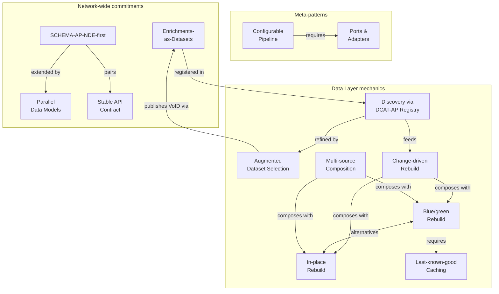

# Patterns

:::warning Draft – under review
Part of the Stack documentation ([overview](./index.md)). Not yet endorsed by NDE.
:::

This chapter consolidates the **operational patterns** the [Stack](index.md) uses.
Each pattern carries an **Applies to** line indicating which of the four [layers](layers/) it touches.
Several patterns are cross-cutting so listing them per layer would duplicate; they are listed here once and referenced from the layer pages.

The patterns roughly group into three:

- **Network-wide commitments** that hold across multiple layers: [SCHEMA-AP-NDE-first](#schema-ap-nde-first), [Parallel Data Models](#parallel-data-models), [Stable API Contract](#stable-api-contract), [Enrichments-as-Datasets](#enrichments-as-datasets).
- **Data-layer operational mechanics** for rebuilding, refreshing, and surviving source-side flakiness: [Discovery via DCAT-AP Registry](#discovery-via-dcat-ap-registry), [Augmented Dataset Selection](#augmented-dataset-selection), [Change-driven Rebuild](#change-driven-rebuild), [Blue/green Rebuild](#bluegreen-rebuild), [In-place Rebuild](#in-place-rebuild), [Last-known-good Per-source Caching](#last-known-good-per-source-caching), [Multi-source Composition](#multi-source-composition).
- **Architectural meta-patterns** underlying the Stack as a whole: [Configurable Pipeline](#configurable-pipeline), [Ports & Adapters](#adapters).

## Pattern relationships

Patterns rarely stand alone; their relationships are part of what makes them load-bearing. The map below shows the main ones – which patterns pair, which compose, which require which, and which are alternatives.

The architectural meta-patterns *(Configurable Pipeline, Ports & Adapters)* are shown at the top because they underpin every operational pattern below them rather than composing with any single *operational* one. The two are not independent, though: the Configurable Pipeline is **built on** Ports & Adapters – a pipeline *contains* its ports (the Writer, engine, registry-client and reverse-proxy boundaries) and a deployment is configured by choosing which adapter fills each (QLever at the triplestore port; `SparqlUpdateWriter` or `FileWriter` at the sink; Typesense or Elasticsearch at the search engine). That structural dependency is the `requires` edge above. Configurable Pipeline is instantiated by every pipeline; Ports & Adapters underpins every adapter-backed substitution (engines, writers, registries, reverse proxies, the IIIF contract on the Stable API Contract surface).

Relationship vocabulary used in the diagram:

- **pairs**: peer composition – both patterns are needed together to deliver the architectural property (SCHEMA-AP-NDE-first defines the data; Stable API Contract defines the surface).
- **extended by**: one pattern is the network minimum; the other allows richer alternatives alongside it.
- **refined by**: one pattern adds analytical signal on top of another. Augmented Dataset Selection, for instance, adds [VoID](https://www.w3.org/TR/void/) (Vocabulary of Interlinked Datasets) analyses on top of Discovery.
- **feeds**: one pattern's output becomes another's input.
- **composes with**: optional combination – either pattern works on its own, both together unlock a configuration.
- **requires**: hard dependency – the upstream pattern cannot deliver its property without the downstream.
- **alternatives**: choose one or the other for the same axis (Blue/green vs In-place at the Deploy axis).
- **publishes back via** / **registered in**: closes a loop – an output of one pattern becomes a published input the other discovers.

## SCHEMA-AP-NDE-first

*Applies to: [Publication Layer](layers/provider.md#publication-layer), [Data Layer](layers/platform.md#data-layer).*

The [NDE Schema.org Application Profile](https://docs.nde.nl/schema-profile/) is the data contract between what Data Providers produce and what Service Platforms consume:

- every Data Provider publishes at least SCHEMA-AP-NDE ([Publication Layer](layers/provider.md#publication-layer) commitment)
- every Service Platform can read SCHEMA-AP-NDE without per-source mapping work ([Data Layer](layers/platform.md#data-layer) expectation),

Pairs with [Stable API Contract](#stable-api-contract). SCHEMA-AP-NDE-first defines *what* the data looks like across layers; Stable API contract defines *how* the Data Layer exposes it through a stable API. The two compose: SCHEMA-AP-NDE-first is the data contract; Stable API contract is the API engineering on top.

#### Mechanics

- Data Providers publish SCHEMA-AP-NDE-conformant [linked data](../glossary.md#linked-data) (RDF dump, SPARQL, and/or LDES). Validation against the  [netwerk-digitaal-erfgoed/schema-profile](https://github.com/netwerk-digitaal-erfgoed/schema-profile) SHACL is the conformance check.
  The [Dataset Knowledge Graph](../services/dataset-knowledge-graph) automatically reports conformance.
- The `@lde/*` core stays data-model-agnostic – generic linked-data plumbing. The `@ndes/*` configuration layer carries SCHEMA-AP-NDE-specific shapes and annotations (e.g., `@ndes/schema-profile-search-config`), making SCHEMA-AP-NDE the network default. A deployment configures a different data model by swapping in a different `@ndes/<other-model>-…-config` package.
- The [Dataset Register](../services/dataset-register/) carries `dcterms:conformsTo` pointing at SCHEMA-AP-NDE for every NDE-compatible dataset.

#### Why this matters

SCHEMA-AP-NDE acts as a **pivot**: a shared intermediate shape every party maps to and from, like a pivot language in translation.

- **The pivot collapses an O(n×m) integration problem to O(n+m).** Without it, every Service Platform needs a per-source mapping. With it, *n* Data Providers × *m* Service Platforms all interoperate through one shape.
- **Network-wide search becomes possible.** Cross-collection search works because every record arrives in the same shape. The pivot is what makes a network rather than a federation of bilateral integrations.

#### Tradeoffs

- **The profile is a minimum, not the full picture.** SCHEMA-AP-NDE is intentionally narrow and will not cover the full expressive range of GLAM data. Sources with rich domain semantics still need a parallel domain model: see [Parallel Data Models](#parallel-data-models).
- **Versioning the pivot affects the whole network.** A breaking change in SCHEMA-AP-NDE ripples to every Data Provider, Service Platform, and Presentation Layer.

## Parallel Data Models

*Applies to: [Publication Layer](layers/provider.md#publication-layer), [Data Layer](layers/platform.md#data-layer). The flexibility layer above the [SCHEMA-AP-NDE-first](#schema-ap-nde-first) pivot: same data, multiple model expressions, served alongside each other.*

> Voor linked data-systemen is het gebruikelijk dezelfde informatie in meerdere datamodellen aan te bieden, zodat deze eenvoudig gecombineerd of afzonderlijk kan worden opgevraagd. ([_Van data naar dienst_](https://zenodo.org/records/17541400) p. 25)

Same data, multiple orthogonal model expressions, served alongside each other and consumable separately or combined. 
[SCHEMA-AP-NDE](#schema-ap-nde-first) is the network minimum; [domain-specific models](../glossary.md#data-model) coexist where relevant.

#### Mechanics

- Each data model is **its own SHACL shape graph**, not unioned with others. A dataset advertises multiple `dcterms:conformsTo` values.
- Downstream tooling reads whichever shape suits: the Search pipeline’s AP-aware projection gets one `search:` annotations package per data model (`@ndes/schema-profile-search-config`, future `@ndes/linked-art-search-config`, etc.) – not merged.
- A single dataset can be served in multiple representations either [combined or separated](https://docs.nde.nl/schema-profile/#publication-method).
- Consumers pick which model they want via [profile-based content negotiation](https://docs.nde.nl/schema-profile/#profiles), query parameter, or simply by hitting the right endpoint.

#### Why this matters

- Different consumers want different vocabularies. A web developer building a discovery UI wants `schema:CreativeWork`; a museum specialist wants `crm:E22_Human-Made_Object`. Forcing one onto the other loses precision in one direction and accessibility in the other.
- Reach beats parsimony at the network level. The cost of multiple representations is paid back in audience – including European delivery via EDM, which is otherwise a separate transformation step.

#### Tradeoffs

- **Storage and maintenance cost** scales with the number of models.
- **Update discipline:** the same source change must propagate to all model expressions or they drift. Easier when generated from a shared internal representation than maintained in parallel.

## Stable API Contract

*Applies to: [Data Layer](layers/platform.md#data-layer), [Presentation Layer](layers/platform.md#presentation-layer). The contract surface the Data Layer exposes to Presentation Layers; the unit of stability across rebuilds, deployments, and consumer rollouts.*

> Een volgende ontwikkelstap is om de presentatielaag volledig los te zien van het dienstplatform. ([_Van data naar dienst_](https://zenodo.org/records/17541400) p. 17)

Every Data Layer commits to **at least** the shared API contracts the Stack standardises (GraphQL for typed search, REST for versioned resource access, SPARQL for graph queries, [IIIF](https://iiif.io/) for image-based heritage – the latter externally maintained by the IIIF community, see below), each typed and backward-compatible. Because these contracts are identical across Data Layers, a Presentation Layer can pull from its own Data Layer, from another, or compose from several at once.

A Data Layer may additionally expose specialised or optimised APIs alongside the shared contracts – they live in the Data Layer because they need direct data access. These specialised APIs are deployment-specific and need not interoperate across Data Layers. What the shared contracts keep out is presentation-specific fields on the shared types (see the *No presentation-specific fields* mechanic and the *Discipline cost* tradeoff below).

The Data Layer is ignorant of specific presentations at the shared-contract level. The shared contracts are what stay stable when the data is rebuilt, the Data Layer is redeployed, or new consumers attach.

Pairs with [SCHEMA-AP-NDE-first](#schema-ap-nde-first). Stable API contract is about the *API engineering*: typed evolution, multi-consumer affordances, versioning discipline. SCHEMA-AP-NDE-first is about the *data model* the API exposes. Both are needed: SCHEMA-AP-NDE-first without API discipline gives a consistent vocabulary served through an unstable interface; API discipline without SCHEMA-AP-NDE-first gives a versioned interface to per-source vocabularies that don't compose.

Not every stable contract is Stack-defined. The [IIIF Presentation API](https://iiif.io/api/presentation/) and [Image API](https://iiif.io/api/image/) are externally specified, versioned, and committed to backward compatibility by the IIIF community; when the Stack serves IIIF, it adopts an externally-determined stable contract rather than designing its own. The pattern applies the same way – typed surface, additive evolution, multi-consumer affordances – just maintained by IIIF rather than by NDE.

#### Mechanics

- **Typed, additive evolution.** GraphQL schema with non-breaking extensions only (new fields, new optional arguments, new enum values; never removed or retyped). REST with versioned routes. SPARQL as an RDF-native escape hatch.
- **Search and filter are part of the contract.** GraphQL exposes a typed `search(query, filter, sort, …)` field returning AP-typed results; REST exposes versioned `/search?…` plus resource collections with declared filter parameters. The set of filterable fields, the filter operators, and the result shape are all part of the schema.
- **Multi-consumer affordances built in from day one**, even when v1 has one consumer: per-consumer rate limits, CORS allow-list per origin, API keys issuable, telemetry tagged with `presentation_layer=<id>`.
- **Standard HTTP conventions:** status codes, `Accept-Language` for multilingual content negotiation, `Cache-Control`, ETags.
- **Auth and abuse mitigation at the gateway**, not in the schema. The contract stays clean.
- **No presentation-specific fields in the contract.** Types follow the AP / data model (`Dataset`, `CreativeWork`, `Place`, …), not any particular consumer’s UI needs. The contract gives you the data; the Presentation Layer shapes it for its own views – composed display titles, sized thumbnail URLs, type-keyed badges all live there, not in the shared schema.

#### Why this matters

- **Cross-data-layer interoperability** (the property the intro names) enables the four configurations the report sketches in ch. 3 – classic, multi-source presentation, fully-separate presentation, data-layer-only Service Platform – without per-configuration Data Layer changes. The pivot stabilises the shape; the API contract stabilises the surface.
- Decouples the data-layer rebuild cycle from presentation rollout. The Search pipeline can rebuild hourly; the presentation can deploy weekly.
- New Presentation Layers (an alternative UI for education, a researcher portal, a public widget) land as configuration on the Data Layer’s gateway, not as code.
- Forces the “shaped for web devs, not RDF specialists” discipline. The contract is the audience boundary.

#### Tradeoffs

- **Discipline cost.** Tempting to leak presentation concerns into projections. Resist – use server-side composition instead.
- **Versioning discipline is harder than ad-hoc evolution.** Every change needs the non-breaking lens applied.
- **Multi-consumer affordances cost something** even when only one consumer exists. Pay it anyway – retrofit is expensive.

## Discovery via DCAT-AP Registry

*Applies to: [Data Layer](layers/platform.md#data-layer).*

> Datasetregister gebruiken voor het opvragen van de bronnen ([_Van data naar dienst_](https://zenodo.org/records/17541400) p. 19)

A DCAT-AP registry (in the NDE network: the [Dataset Register](../services/dataset-register/)) is the **authoritative “which datasets exist?” signal**.
It contains dataset descriptions provided by Data Providers.
Stack components never hardcode a source list; every [pipeline](#configurable-pipeline) starts by discovering datasets from the registry.

#### Mechanics

- [`@lde/dataset-registry-client`](https://github.com/ldelements/lde/tree/main/packages/dataset-registry-client) queries the registry, returning a stream of `dcat:Dataset` descriptions with their distributions. Generic over DCAT-AP 3.0 registries; not tied to the NDE Dataset Register specifically.
- **Filtered queries narrow the candidate list at discovery time.** Pipelines can ask the registry for datasets matching criteria – keyword, publisher, subject, `dcterms:conformsTo`, validity – rather than fetching the full list and filtering downstream. The NDE [Dataset Register](../services/dataset-register/) exposes this via its [SPARQL endpoint](../services/dataset-register/sparql.md) (arbitrary filter expressions) and a [website search](https://datasetregister.netwerkdigitaalerfgoed.nl/en/datasets) for human use.

#### Why this matters

- All Stack [pipelines](pipeline.md) use the same discovery step; no per-component source-list configuration.
- It is the basis for [Last-known-good Caching](#last-known-good-per-source-caching) (the cache lifecycle is keyed on registry membership, not on previous index state).
- A source removed from the registry drops out everywhere downstream on the next rebuild, automatically. A source added shows up everywhere. Operationally clean.

## Augmented Dataset Selection

*Applies to: [Data Layer](layers/platform.md#data-layer). Refines [Discovery via DCAT-AP Registry](#discovery-via-dcat-ap-registry) with derived analyses (VoID statistics) on top of publisher-declared metadata.*

> Op basis van beschrijvingen in het Datasetregister en de beschikbare linked data bij de bron kunnen
inhoudelijke analyses worden gemaakt van de informatie. ([_Van data naar dienst_](https://zenodo.org/records/17541400) p. 22)

Selection decisions improve when two *kinds* of metadata are combined: what the publisher **declares** about a dataset (DCAT-AP description in the registry) and what an automated pipeline **derives** by analysing the data itself (VoID statistics: triple counts, class partitions, property partitions, language partitions). Each is partial; together they let a consumer decide whether a dataset is worth ingesting, in full or sampled, and against which projection logic.

#### Mechanics

- **Declared metadata:** DCAT-AP description fetched via [`@lde/dataset-registry-client`](https://github.com/ldelements/lde/tree/main/packages/dataset-registry-client) (per [Discovery](#discovery-via-dcat-ap-registry) above).
- **Derived metadata:** [`@lde/pipeline-void`](https://github.com/ldelements/lde/tree/main/packages/pipeline-void) analyses the dataset’s SPARQL endpoint or dump and produces a VoID description. Output is RDF; can be cached per-dataset, diffed across runs, and published.
- **Selection logic reads both sides:**
  - Skip datasets whose declared `dcterms:conformsTo` doesn’t include a relevant AP or data model.
  - Skip datasets whose VoID class partitions don’t contain target classes.
  - Sample stratified by class size when VoID indicates the dataset is too large for full ingestion.
  - Skip re-processing when the VoID hash is unchanged since last run.
- **Network artifact.** Derived VoID is generated once and published so other consumers can read it instead of re-analysing – as the [Dataset Knowledge Graph](../services/dataset-knowledge-graph) does today. This closes the same loop as [Enrichments-as-Datasets](#enrichments-as-datasets), but for analytical metadata rather than content enrichment.

#### Why this matters

- **Declared metadata alone is incomplete.** Data Providers publish what they think matters; rich DCAT-AP descriptions still can’t tell you “this dataset has 12 instances of `crm:E22` but 50 000 of `crm:E21`.”
- **Derived metadata alone is too expensive to compute per consumer.** Every Service Platform analysing every dataset wastes compute; centralising the analysis amortises the cost.
- **Combination gives selection logic real signal.** A pipeline can refuse to ingest a dataset that *says* it conforms to SCHEMA-AP-NDE but whose VoID shows zero `schema:` predicates – an inconsistency the declared side alone wouldn’t catch.

#### Tradeoffs

- **Derivation cost.** Computing VoID requires walking the dataset. Centralising it in DKG amortises the cost; per-platform analysis multiplies it.
- **Freshness mismatch.** Declared metadata and derived analysis can drift apart. Treat the two as one combined snapshot; re-derive when either side moves.
- **Partition granularity is fixed by the VoID vocabulary.** Finer-grained selection needs custom extensions.

## Enrichments-as-Datasets

*Applies to: [Publication Layer](layers/provider.md#publication-layer), [Data Layer](layers/platform.md#data-layer). Service Platforms publish their enrichments as separate datasets, feeding them back into the network as new published sources.*

Enrichments produced inside a [Service Platform](../glossary.md#service-platform) (term links, georeferences, transcriptions, user annotations) are not consumed only locally. They are published as standalone datasets in the [Dataset Register](../services/dataset-register/) and become network-level inputs that other Service Platforms can discover and consume. The Service Platform’s outputs close the loop back into the network.

#### Mechanics

- **Standard models:** [Web Annotation Data Model](https://www.w3.org/TR/annotation-model/) for the enrichment content, [PROV-O](https://www.w3.org/TR/prov-o/) for provenance.
- **Provenance triples:** each enrichment carries `dcterms:source` (the enriched dataset’s URI) and `prov:wasDerivedFrom` (the source records / activities).
- **Published as a separate `dcat:Dataset`**, with its own distribution(s) – SPARQL endpoint, dump, or LDES feed (`@lde/ldes-static-writer` once available).
- **Registered in the [Dataset Register](../services/dataset-register/)** so the [Discovery pattern](#discovery-via-dcat-ap-registry) picks it up automatically network-wide.

#### Why this matters

- A term link produced by one platform becomes term knowledge for the whole network – feeds the Term Backlink Graph, feeds other Service Platforms, feeds vocab curators.
- Source data + Service Platform enrichments together can be re-aggregated by anyone; the enrichments are no longer trapped behind a single UI.
- Provenance is preserved; downstream consumers see *who* enriched *what*, *when*, *derived from what*.

#### Tradeoffs

- Storage and serving cost for an additional dataset.
- Versioning discipline: a re-enrichment after a vocab update is a new version, not a silent overwrite.
- Discoverability depends on consumers actually subscribing to the enrichment LDES.
- Some enrichments derive mechanically from term URIs and do not need to be published separately.

## Change-driven Rebuild

*Applies to: [Data Layer](layers/platform.md#data-layer). Filters the candidate dataset list to only sources whose data has changed since the last run.*

> Wijzigingen bij de bron leidend maken voor het bijwerken van de opgenomen informatie ([_Van data naar dienst_](https://zenodo.org/records/17541400) p. 19)

A rebuild that re-processes every source on every run wastes work and floods upstream endpoints. Change-driven rebuild runs downstream stages *only* for sources whose data has actually changed since the last run. [Discovery](#discovery-via-dcat-ap-registry) produces the candidate list; this pattern filters it.

Composes with both deploy strategies. With [Blue/green Rebuild](#bluegreen-rebuild), unchanged sources land in the new build via [Last-known-good Per-source Caching](#last-known-good-per-source-caching) – the same cache that Blue/green already needs for source-outage resilience. With [In-place Rebuild](#in-place-rebuild), unchanged sources stay where they are because the rebuild only touches changed ones; no cache needed.

The granularity of "what changed" varies. LDES gives record-level deltas including deletions — true incremental. Per-record timestamps (`schema:sdDatePublished`) let a consumer filter for records newer than its last-seen max, so additions and updates are record-level even without LDES — though pure deletions go undetected. Distribution-level signals (`Last-Modified`, declared metadata, fingerprint) only say "the dataset changed somehow"; without per-record timestamps to layer on top, the response is a full per-dataset re-crawl (which does catch deletions).

#### Mechanics

Change-detection mechanisms, in order of precision:

- **Sub-dataset change feeds.** LDES streams individual record-level changes. Most precise; no whole-dataset re-processing.
- **Per-distribution conditional probes.** [`@lde/distribution-probe`](https://github.com/ldelements/lde/tree/main/packages/distribution-probe) HEADs each HTTP distribution and reads `Last-Modified` / `ETag`. Cheap and well-supported for dumps; SPARQL endpoints rarely expose comparable change signals.
- **Per-record timestamps.** For SCHEMA-AP-NDE-conformant sources, a `SELECT (MAX(?sd) AS ?max) WHERE { ?cw schema:sdDatePublished ?sd }` aggregate returns the dataset’s most recent [record-publication time](https://docs.nde.nl/schema-profile/#CreativeWork-sdDatePublished). Cheap on most stores (aggregate only, no result-set walk); works on SPARQL endpoints and dumps alike. Catches additions and updates; misses pure deletions.
- **Distribution timestamp.** The distribution’s last-modified date as declared by the publisher.
- **Content fingerprint.** Hash a downloaded source dump and compare against the previous run’s fingerprint. Cheap for dumps; impractical for SPARQL endpoints, where walking the data costs as much as re-processing.

A rebuild runs downstream stages only for sources whose change signal has advanced since the last run; unchanged sources reuse their previous projection from [Last-known-good Caching](#last-known-good-per-source-caching).

Pipelines pick the mechanism based on what each source supports: LDES where the publisher offers it; `Last-Modified` for HTTP dumps; `MAX(?sdDatePublished)` for SCHEMA-AP-NDE-conformant SPARQL endpoints; content-fingerprint for dumps without `Last-Modified`; declared metadata or scheduled full re-processing for non-conformant SPARQL endpoints.

#### Why this matters

- **Compute, bandwidth, and source-side load all drop** with each more-precise mechanism. LDES on a busy dataset can mean processing thousands of small deltas instead of a terabyte-scale full crawl.
- **Composes with the other Data-layer patterns.** [Discovery](#discovery-via-dcat-ap-registry) produces the dataset list; this pattern filters it by change signal; [Augmented Dataset Selection](#augmented-dataset-selection) filters it by AP-conformance and VoID partitions; [Blue/green Rebuild](#bluegreen-rebuild) ships the result; [Last-known-good Caching](#last-known-good-per-source-caching) carries unchanged sources.

#### Tradeoffs

- **Depends on Data Providers publishing accurate change signals.** LDES adoption is sparser still.
- **Fingerprinting is a fallback, not a default.** Computing a fingerprint requires walking the source – cheaper than re-processing but not free. Use it only when upstream signals are unreliable.
- **Coarser signals miss intra-dataset changes.** A dataset’s last-modified date may advance without revealing which records changed; downstream sinks then re-process the whole dataset even if only one record actually moved.
- **SPARQL-only sources without AP-conformance are the hard case.** Without LDES, accurate registry metadata, or AP-mandated per-record timestamps (`schema:sdDatePublished`), no reliable automated change detection. Fallback: scheduled full re-processing at whatever cadence the consumer can afford.

A pipeline can optionally consume LDES from a [Change Stream Producer](layers/platform.md#change-stream-producer) instead of running these mechanisms per-source itself. The Producer centralises the same mechanisms once for its own scope and exposes a uniform LDES feed; consumers that opt in get a single input contract regardless of how the underlying sources publish. Use of a Producer is per-deployment and per-source, not all-or-nothing.

## Blue/green Rebuild

*Applies to: [Data Layer](layers/platform.md#data-layer). Atomic dual-instance rebuild for derived stores. **Requires [Last-known-good Per-source Caching](#last-known-good-per-source-caching)** for source-outage resilience: without it, any source unreachable during the rebuild disappears from the new build. Alternative to [In-place Rebuild](#in-place-rebuild); composes with [Change-driven Rebuild](#change-driven-rebuild) on top.*

Atomic dual-instance rebuild without infrastructure-level access (no kubectl, no Kubernetes service swap). The rebuild pipeline does the flip itself.

Blue/green fans the rebuild out per source, then ships the result via the swap. Two complications fall out of that fan-out, both solved by the same cache:

- **Source-outage resilience.** Any source can be temporarily unreachable during a run. Without per-source state, that source vanishes from the new build at swap time. [Last-known-good Per-source Caching](#last-known-good-per-source-caching) keeps the previous projection on disk; the rebuild reads the union of fresh + cached projections, and the swap ships a complete build.
- **Composition with Change-driven Rebuild.** If [Change-driven Rebuild](#change-driven-rebuild) skips unchanged sources, those sources still need to land in the new build – they come from the same Last-known-good cache.

Both complications resolve through one mechanism, so Last-known-good is the operational sibling of Blue/green, with or without Change-driven on top.

#### Mechanics

Three variants, distinguished by *what gets flipped* (engine alias, filesystem symlink, reverse-proxy upstream):

**Engine-native** – the engine has a built-in collection/index alias API.

- Typesense: `collections/alias` swap; used by the Search pipeline.
- The pipeline rebuilds into a fresh collection, calls the engine’s alias API, drops the old. Zero downtime, no proxy.

**Directory-level** – the engine has no alias API but loads from a directory; restart is fast.

- QLever: `qlever index` builds into `index-new/` while the live server keeps serving from `current/`. Atomic symlink swap (`current/` → `index-new/`) followed by `qlever restart`. Downtime = restart window (seconds).
- Default for QLever-backed components (e.g. the planned Term Backlink Graph; dump-source ingestion in the Search pipeline).

**Proxy-level** – two engine instances on different ports, a reverse proxy in front holds the “live” upstream pointer.

- Pipeline loads into the inactive instance; once healthy, the proxy atomically swaps which upstream is live (nginx reload, HAProxy runtime API, Caddy admin API, etc.).
- Zero downtime, *and* institutional self-containment: when the reverse proxy is bundled inside the application’s own deployment, the entire swap mechanism lives within the app’s control. No dependency on foundational infra the heritage institution may not have permission to change.
- Default proxy is nginx; any reverse proxy supporting atomic upstream switching works.

Pick the cheapest variant the consumer’s latency requirements *and* the deployment environment’s permissions allow. Heritage-institution deployments may prefer proxy-level even when directory-level would suffice on latency grounds, because it removes infra-cooperation requirements.

#### Rebuild trigger: schema fingerprint

A full blue/green rebuild is expensive enough that firing it on a fixed schedule wastes work whenever the index shape has not changed. Fire it instead only when the **index-affecting configuration** changes, detected by a **fingerprint**: a hash over everything that determines the index’s shape and analysis – the field registry (which fields, their types, facet/sort flags), the fold-map version (folded values are *stored*, so changing the map invalidates them), and the projection / CONSTRUCT logic.

Query-time parameters are deliberately **excluded** from the fingerprint: relevance weights, synonyms, typo tolerance, and default sort are applied per query against the live collection, so changing them needs no reindex – they sync live on every run instead.

The fingerprint is stored as metadata on the live collection (or alias). Every run compares the code’s fingerprint against the live one:

- **mismatch** → blue/green full rebuild, then done;
- **match** → the incremental path ([In-place Rebuild](#in-place-rebuild) upsert + sweep, or a no-op).

Rebuilds become **deploy-driven and automatic**: a commit that retypes a field or bumps the fold-map triggers a self-rebuild on the next scheduled run, with no cron entry and no manual flag. This is distinct from the source-change trigger ([Change-driven Rebuild](#change-driven-rebuild), which decides *which sources* a run processes); the fingerprint decides *whether the whole index must be rebuilt from scratch*.

#### Why this matters

- **Zero-downtime atomic switch.** Reads against the live store continue while the new build is materialised; the swap is a single atomic operation. No half-rebuilt window.
- **Structurally right for snapshot-source deletions.** A pipeline reading periodic dumps has to ingest the whole dump to detect deletions: there is no way to learn “record X is gone” without confirming X isn’t in the new dump. A full rebuild via alias-swap pays no extra cost relative to incremental approaches – the dump-read cost is paid in both. The “skip unchanged resources” win that incremental processing seems to offer only saves the projection step, not the read. For snapshot sources without LDES, blue/green is one structurally right answer to the delete problem.
- **Composes with [Change-driven Rebuild](#change-driven-rebuild).** Full alias-swap where unchanged sources reuse cached projections via [Last-known-good Caching](#last-known-good-per-source-caching). Alternatively replace with [In-place Rebuild](#in-place-rebuild) – accepting source-scoped atomicity in exchange for skipping the rebuild cost on stable sources. Pick by deployment shape and source-cadence divergence.

#### Tradeoffs

- **Full rebuild every run.** Even when only one source changed, the alias-swap variant rebuilds the whole derived store. For divergent source cadences, [In-place Rebuild](#in-place-rebuild) is the cheaper alternative.
- **Variant choice constrained by sink.** Engine-native is cheapest but needs an alias API. Directory-level needs a fast restart. Proxy-level needs operational permission to run a reverse proxy. The variant table above is the matching exercise.
- **Brief restart window in Directory-level.** QLever-style symlink + restart variants are not zero-downtime; the restart window is the cost.

## In-place Rebuild

*Applies to: [Data Layer](layers/platform.md#data-layer). Alternative to [Blue/green Rebuild](#bluegreen-rebuild) for sinks where re-projecting all sources every run is wasteful and source cadences diverge.*

Modify the live sink in place: upsert per-source documents with `source` and `last_seen` fields (set to `run_start` on every upsert), then sweep – delete any document whose `last_seen < run_start` for this source. No atomic swap; reads against the live sink see a mix of fresh and stale documents during the sweep window.

#### Mechanics

- Each document carries `source: <dataset-URI>` and `last_seen: <ISO timestamp>`.
- At the start of a run, capture `run_start`. For each source whose change signal has advanced (per [Change-driven Rebuild](#change-driven-rebuild)): bulk upsert all current records with `last_seen = run_start`, then `DELETE WHERE source = X AND last_seen < run_start`.
- Sources whose signal hasn’t advanced are skipped entirely.

#### Why this matters

- **Diverging source cadences.** When some sources change hourly and others yearly, a full rebuild on every run is mostly wasted I/O. In-place per-source updates let each source’s pipeline run on its own cadence.
- **No full-rebuild cost.** Skipped sources cost zero; touched sources cost only their own re-projection.
- **Last-known-good is implicit.** The live sink doubles as per-source state: any source whose change signal hasn’t advanced has its documents (and `source` + `last_seen` markers) preserved in place. No separate cache directory needed – the sink *is* the cache, and that's why [Last-known-good Per-source Caching](#last-known-good-per-source-caching) is not required alongside In-place (unlike [Blue/green Rebuild](#bluegreen-rebuild), where the fresh build starts empty).

#### Tradeoffs

- **Source-scoped atomicity only.** During a per-source rebuild there is a brief window where the sink has some upserted-fresh and some pre-sweep stale documents from the same source. Reads in that window are inconsistent. Acceptable for typical consumer use but a real semantics change from [Blue/green Rebuild](#bluegreen-rebuild)’s atomic swap.
- **Per-document state cost.** Every doc carries two extra fields (`source`, `last_seen`). Cheap, but a schema commitment.
- **Deletions via sweep, not events.** A deleted record disappears because it is not re-upserted; the sink cannot tell whether it was deleted or just temporarily missing. (LDES would distinguish.)
- **Requires upsert + delete-by-filter at the sink.** Most engines support this (Typesense, Elasticsearch, SPARQL stores) but not all – engines that load read-only after build, like QLever, cannot.

## Last-known-good Per-source Caching

*Applies to: [Data Layer](layers/platform.md#data-layer). Sibling to [Blue/green Rebuild](#bluegreen-rebuild). Resilience for transient source-side outages during a rebuild.*

A rebuild that fans out per source can fail for some sources without losing their previous data. Each source’s projection is materialised to its own file; if the source is unreachable this run, the existing file persists and is picked up by the rebuild’s downstream steps unchanged. The registry (see [Discovery](#discovery-via-dcat-ap-registry)) is the authority on whether the dataset should still exist; reachability is just whether *this run* refreshes it.

#### Mechanics

- Use [`@lde/pipeline`](https://github.com/ldelements/lde/tree/main/packages/pipeline)’s `FileWriter` with `format: 'n-quads'` or another framework-supported format. Each source writes to a deterministic path: `<cache-dir>/<filenamified-iri>.<ext>`.
- For each `dcat:Dataset` in the registry:
  - If endpoint reachable: re-run the projection stages, overwriting the cache file (atomically, via temp-write + rename).
  - If unreachable: leave the existing cache file in place. Log the staleness.
- Rebuild’s downstream step (`qlever index <cache-dir>/*.nq`, or Typesense bulk import, or whichever sink) reads the union of fresh + cached files. It can’t tell the difference – they are just files.
- A source removed from the registry: drop its cache file on the next rebuild.
- **Staleness threshold** (configurable per deployment): drop a source’s cache file after N consecutive failed probes or after M days of unreachability. Default: 30 days. Protects against permanently-broken endpoints silently lingering forever.

#### Why this matters

- **Survives transient source outages.** A single unreachable source doesn’t lose its data or stall the rebuild – the previous projection stays in place until the source comes back.
- **Decouples rebuild scope from per-source reachability.** Reachability becomes a per-run signal, not a registry-membership signal. The registry decides whether a dataset should exist; reachability only decides whether *this run* refreshes it.
- **Closes a gap the report describes only implicitly.** [Function 6](layers/platform.md#function-mapping)’s “afgeleide of cache”-framing taken literally would lose unreachable sources during a rebuild; this pattern keeps them.

#### Tradeoffs

- **Disk usage.** Full N copies of source projections persist; for substrate B at NDE-network scale this can be substantial.
- **Schema evolution.** Cached files from a previous run encode the schema in use *then*. After a SHACL or `search:` annotation change, cached files may be stale-shaped, not just stale-content. Default policy: invalidate the entire cache directory on annotation-graph change.
- **Trend analysis is still a separate concern.** Caching keeps the *current* state resilient; it does not preserve historical observations for trend analysis. That needs an explicit historical store or an LDES feed.

## Multi-source Composition

*Applies to: [Data Layer](layers/platform.md#data-layer). How several sources land in one derived sink: when they share a collection and when they get separate ones. Sits above the [update modes](layers/platform.md#update-modes) and the engine adapter; composes with [In-place Rebuild](#in-place-rebuild) and [Blue/green Rebuild](#bluegreen-rebuild).*

A derived sink is rarely fed by a single source. The Dataset Register search index, for instance, is written by two pipelines – the register projection and the DKG enrichment – and a future object-search index ingests many datasets at once. Two orthogonal questions decide the layout, and they have different answers.

#### Same kind, multiple sources → one collection

Records of the same kind (all dataset descriptions, or all `schema:Place` objects) share one collection, distinguished by a `source` field. This covers two sub-cases:

- **Enrichment (same id, one owner + enrichers).** One source owns a document’s existence; others only add fields to it. The register pipeline creates and deletes the dataset document (keyed on the dataset IRI); the DKG enrichment pipeline partial-updates facet fields on that same document and never creates or deletes. Exactly one source defines existence and owns the [sweep](#in-place-rebuild); the rest enrich in place. If an enricher’s data for a record disappears, its fields clear on the next enrichment run – the document survives.
- **Same-kind coexistence (disjoint ids, per-source ownership).** Several sources each contribute their own documents to one collection (two registers, say, or the many datasets in an object index). Each source owns its own ids; no source enriches another.

Both rely on the same three mechanisms, baked in from day one even when there is a single source:

1. every document carries a `source` field;
2. the [sweep](#in-place-rebuild) filters on `source`, so one source’s run can never delete another’s documents;
3. the self-describing high-water mark is **per source** (`max(<change-signal>) WHERE source = X`) – a global maximum would let one source’s freshness suppress another’s.

#### Different kinds → separate collections

Records of different kinds (datasets vs objects vs persons) do **not** share a collection. No union schema, no `type` discriminator carrying wildly different fields. Each kind is self-contained – its own schema, synonyms, weights, facets – and relations across kinds are expressed with the engine’s cross-collection features (for Typesense: reference fields + JOINs for query-time links, `multi_search` for federated per-collection results). The limit: no blended cross-collection relevance ranking – merge those application-side.

#### Kind and source are orthogonal

The two questions above are independent axes. Separation is by *kind*, never by *source*: choosing separate collections for different kinds does **not** mean one source per collection. Each per-kind collection still composes multiple sources internally, by the same `source`-scoped mechanism. A future `objects` collection is separate from a `persons` collection because they are different kinds – yet the `objects` collection still combines records from hundreds of dataset sources, and may be enriched by another source on top.

| | One source | Many sources |
| --- | --- | --- |
| **One kind** | single collection, single writer | single `source`-scoped collection – enrichment (register + DKG) and/or coexistence (many datasets) |
| **Many kinds** | one collection per kind, each single-source | one collection per kind, **each still combining many sources** |

The register today sits in the top-right cell: one `datasets` collection, two sources (the register projection plus DKG enrichment). Adding an `objects` collection later moves it to the bottom-right – separate collections per kind, each still source-composed.

#### Why this matters

- **One mechanism, every topology.** Enrichment and same-kind coexistence are the same `source`-scoped collection with different id ownership; the `source` field and source-scoped sweep cover both, and they compose (a coexistence index whose sources also enrich each other).
- **No premature union schema.** Forcing datasets, objects and persons into one collection couples their schemas and analysis config. Separate collections keep each kind’s relevance tuning independent and let new kinds land without reshaping the existing ones.
- **Forward-compatible at near-zero cost.** Carrying `source` and a per-source high-water mark while there is only one source is cheap at register scale and avoids a reindex when the second source arrives.

#### Tradeoffs

- **A per-document `source` field** is a schema commitment – cheap, but permanent.
- **Cross-collection relevance must be merged in the application.** The engine federates results per collection but does not blend their scores.
- **Per-source high-water marks** are more bookkeeping than a single global cursor; the payoff is that one source can never suppress another.

## Configurable Pipeline

*Applies to: cross-cutting (all layers). Engineering meta-pattern alongside [Ports & Adapters](#adapters). Fully described in the [Pipeline](pipeline.md) chapter; named here as a pattern so other patterns and components can reference it. Instantiated by every Data Layer pipeline: [Search Pipeline](layers/platform.md#search-pipeline), [Knowledge Graph Pipeline](layers/platform.md#knowledge-graph-pipeline), [Change Stream Producer](layers/platform.md#change-stream-producer).*

Data Layer pipelines are **configured, not coded**. Pipeline structure is explicit in configuration artifacts (SHACL shapes for projection, SPARQL CONSTRUCT for extraction, JSON-LD Frames for output shaping) not buried inside bespoke scripts.
Custom code lives only at [port/adapter](#adapters) boundaries (a writer, a filter compiler). The contrast is with implicit, coded pipelines whose stages, transformations, and assumptions are visible only to the people maintaining the code.

See [Pipeline](pipeline.md) for the configuration axes, composition rules, and worked examples.

## Ports & Adapters {#adapters}

*Applies to: cross-cutting (all layers). Engineering meta-pattern – the architectural commitment behind the [Foundational technologies](index.md#foundational-technologies) substitutes column and the Stack’s claim that defaults are exchangeable.*

Engineering meta-pattern that forms the commitment behind the [Foundational technologies](index.md#foundational-technologies) substitutes column and the Stack’s claim that defaults are exchangeable.

The Stack follows **ports-and-adapters**: core logic depends on **ports** (abstract interfaces), and concrete tools attach as **adapters** behind those ports. 
This is what makes the Stack’s “Realistic substitutes” claim real: substitution is a configuration concern, not a code rewrite.

#### Mechanics

- **Define a narrow port**: the minimum operational interface (the contract) and a clean argument type (the data flowing across it). For the Search Pipeline, the port is *“index the documents you are given and serve typed queries against them”*; its argument is the engine-agnostic framed document, not raw SHACL. This decouples adapters from SHACL: every adapter receives the framed document and only worries about engine specifics. For a KG, the port is *“load these triples and serve SPARQL”*; argument is `.nq`. For a registry, *“discover datasets matching a query”*; argument is a typed query.
- **Implement adapters per concrete backend.** Each adapter translates between port and backend specifics. Filter compilers (GraphQL → Typesense `filter_by` vs Elasticsearch query DSL) live in the adapter, not the port.
- **Default selection is configuration, not code.** A deployment names its adapter choice in a config file; the pipeline composes the rest.
- **Adapter graduation.** As more deployments use an alternative adapter, it can graduate from “realistic substitute” to “additionally supported default.”

Concrete instances in the Stack:

- **Search engine.** The [Search pipeline](layers/platform.md#data-layer) defines a generic engine-agnostic schema and a typed filter input language; the Typesense adapter is the v1 implementation. Elasticsearch and OpenSearch can plug into the same port with their own adapter, sharing the AP-aware projection logic upstream.
- **KG triplestore.** [Knowledge graphs](layers/platform.md#data-layer) build into any SPARQL-compliant store. QLever is the Stack default (its read-only-after-load lifecycle fits [blue/green rebuild](#bluegreen-rebuild)); Oxigraph, GraphDB, and Jena Fuseki are adapter alternatives.
- **Per-source writer.** [`@lde/pipeline`](https://github.com/ldelements/lde/tree/main/packages/pipeline) defines a `Writer` port with several adapters: `FileWriter` (n-quads / Turtle to disk – the default for blue/green rebuilds), `SparqlUpdateWriter` (the original DKG approach), more to come. Pipelines depend on `Writer`, not on a specific output sink.
- **Reverse proxy.** The proxy-level [blue/green rebuild](#bluegreen-rebuild) variant treats nginx, HAProxy, and Caddy as adapters behind the same “atomic upstream swap” port.
- **DCAT-AP registry.** [Discovery via DCAT-AP Registry](#discovery-via-dcat-ap-registry) – [`@lde/dataset-registry-client`](https://github.com/ldelements/lde/tree/main/packages/dataset-registry-client) is generic over any DCAT-AP 3.0 catalog; the NDE Dataset Register is one instance; a self-operated catalog is another.
- **Network services as categories.** Each network service entry on the [Data Layer page](layers/platform.md#data-layer) is structured as a category (the port) with a canonical NDE-operated instance and optional self-operated instances (adapters). Same shape, applied at the operated-service level.

#### Why this matters

- **Substitutability is real, not aspirational.** “Use Typesense by default but Elasticsearch if needed” only works when the dependence is on a port, not on Typesense specifically. Without ports-and-adapters, swap claims become rewrites.
- **Deployments choose their own dependencies.** Heritage institutions with operational constraints (no Node.js, no QLever, no nginx, no public NDE Dataset Register) can adapt without forking. A self-operated Stack deployment substitutes for institutional reasons; a research deployment substitutes for performance reasons; both use the same pattern.
- **Vendor lock-in is bounded.** No Stack component is married to a specific backend. The cost of moving off Typesense or QLever is one adapter, not a rewrite.

#### Tradeoffs

- **Indirection cost.** Ports add an abstraction layer; reading a code path requires understanding both port and adapter.
- **Abstraction discipline.** Ports must be narrow enough that alternative adapters are realistic to write. A port that leaks too much backend specifics (e.g., baking in Typesense’s filter syntax) defeats the pattern.
- **Adapters can push work back onto the core.** A narrow port hides backend specifics, but some backends lack a capability the others provide – Typesense has no `asciifolding`, so diacritic folding moves into an application-side utility that must be applied identically at index time and query time. The port stays clean; the obligation is real, and it reaches past the pipeline onto the query side. See [Normalization is engine-dependent](layers/platform.md#normalization-is-engine-dependent).
- **Adapter maintenance.** Each supported adapter is a maintenance cost. The Stack commits to defaults; alternatives are “supported on best-effort” unless promoted.
