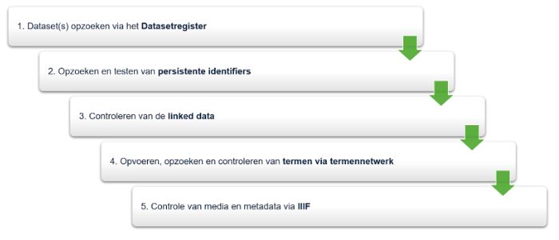
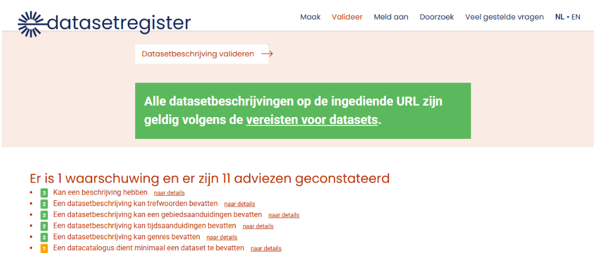
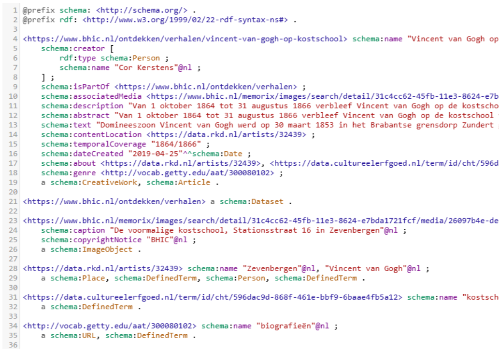
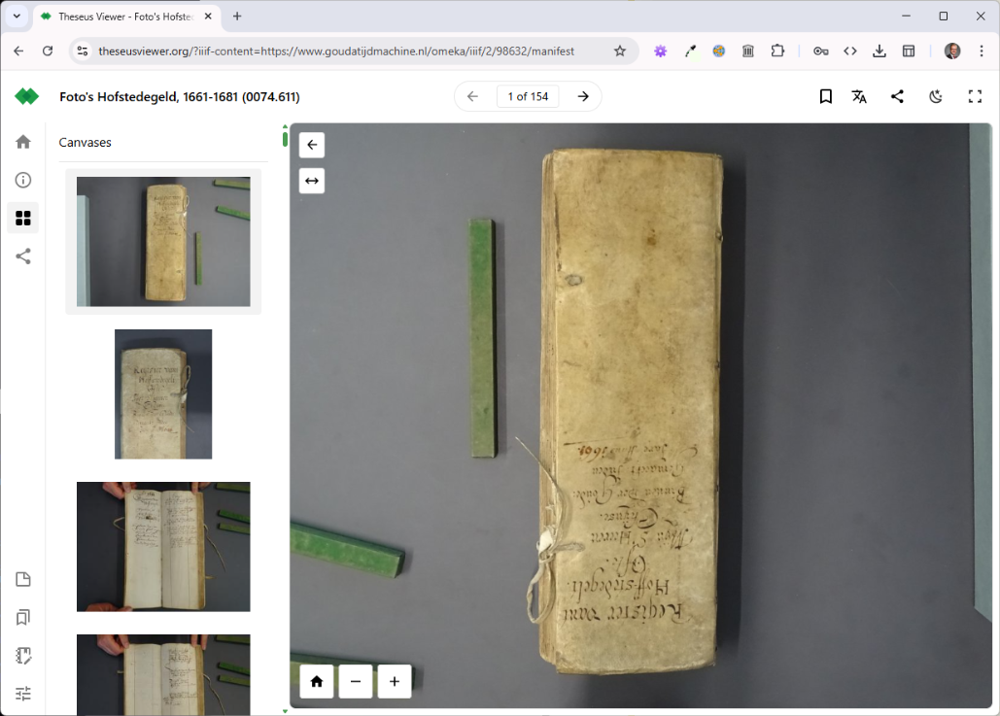
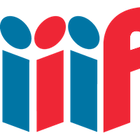

# Testen op NDE-compatibiliteit


## Inleiding

Wanneer een leverancier een collectiebeheersysteem (CBS) oplevert, is het aan de klant om te bepalen of het systeem voldoet aan de gestelde eisen en wensen. Vanuit het Netwerk Digitaal Erfgoed (NDE) zijn de volgende eisen van belang:

* [Requirements for Collection Management Systems](https://docs.nde.nl/requirements-collection-management-systems/) die specificeert hoe een aan welke eisen een collectiebeheersysteem (CBS) moet voldoen.
* [Requirements for Datasets](https://docs.nde.nl/requirements-datasets/) die specificeert het formaat van datasetbeschrijvingen;
* [Schema.org Application Profile](https://docs.nde.nl/schema-profile/) die specificeert het formaat van de te publiceren erfgoeddata;

Vanuit het NDE is er goed contact met leveranciers en wordt er gekeken naar één implementatie om de NDE compatibiliteit vast te stellen. Dit document geeft een handvat hoe je je, als erfgoedinstelling, leverancier, digitaal erfgoedcoach, datawerkplaats of zelfstandig erfgoed specialist - kunt bepalen of de specifieke implementatie van een CBS bij een erfgoedinstelling leidt tot een NDE-compatibel geheel. Datawerkplaatsen, digitaal erfgoedcoaches en zelfstandige erfgoed specialisten kunnen hierin een ondersteunende rol spelen. Het blijft echter de verantwoordelijkheid van de erfgoedinstelling om te bepalen dat hetgeen ze hebben aangeschaft voldoet aan de wensen en eisen.

## NDE compatibiliteit

De 5 eisen die worden gesteld in het kader van NDE compatibiliteit komen voort uit de doelstellingen van de Nationale Strategie Digitaal Erfgoed en zijn in lijn met de Digitale Erfgoed Referentie Architectuur ([DERA](https://dera.netwerkdigitaalerfgoed.nl/index.php/Hoofdpagina)):

✅ Datasets vindbaar via het Datasetregister 
✅ Gebruik van duurzame identifiers
✅ Publiceert linked open data
✅ Linkt naar URI's van gestandaardiseerde termen via het Termennetwerk
✅ Gebruik IIIF voor toegang tot beeldcollecties

## Acceptatietesten

Wanneer de leverancier heeft aangegeven dat de implementatie van het CBS is afgerond (wat hen betreft), is het moment aangebroken om deze implementatie goed te bekijken en te testen. Pas na een "acceptatietest" en eventuele opgeloste bevindingen, is er sprake van een afgeronde implementatie (wat veelal gepaard gaat met betaling van een laatste factuur deel). De testaanpak dient te kijken naar alle aspecten van het systeem, van functies naar datamodel, van helpteksten naar look-and-feel, van domeinnaam tot API. 

## Stappenplan

Dit document beschrijft alleen hoe de NDE compatibiliteit van het opgeleverde systeem getest kan worden. De tests worden op een zodanige wijze beschreven dat deze met een webbrowser uitgevoerd kunnen worden, zonder andere technische hulpmiddelen. Elke teststap start ter inleiding met informatie over het te testen onderwerp.



Over de volgorde van de teststappen is nagedacht. Als een teststap niet slaagt, dan kan het lastig zijn om met de vervolgstappen aan de slag te gaan.Meld het issue bij de leverancier, vermeld daarbij precies hoe en wat je hebt getest, bij voorkeur met URI van erfgoedobjecten of URL's van collectie pagina's. Als de leverancier een issue heeft opgelost of het toch geen issue blijkt te zijn, dan kan de teststap herhaald worden. Als een teststap niet slaagt, probeer toch de vervolgstappen van het testplan te zetten.

Om informatie bij te houden wordt er in de bijlage een sjabloon gegeven voor een werkdocument.

## 1. Dataset(s) opzoeken via het Datasetregister 

> ***Wat is een dataset?***
>
> *Een dataset (of gegevensverzameling) is een verzameling van gegevens (data of metadata). In de context van erfgoedinstellingen kun je hierbij denken aan de data van/over erfgoedobjecten, zoals een catalogus, een set museumobjecten of een collectie van archieven of nadere toegangen. Deze (meta)data wordt veelal in een archiefbeheer- of collectieregistratiesysteem beheerd en in de een of andere vorm via de eigen website toegankelijk gemaakt aan haar gebruikers. De data kan ook worden gedeeld voor hergebruik, door een dienstenportaal of aggregator. Het systeem van de erfgoedinstelling dient hiervoor de data via een datadump (export) of API beschikbaar te stellen.*
>
> **Bron**: [Veelgestelde vragen over het Datasetregister door dataset beheerders bij erfgoedinstellingen](https://datasetregister.netwerkdigitaalerfgoed.nl/faq-beheerders.php)

Het testen op NDE-compatabiliteit van het CBS begint bij het NDE Datasetregister. Het datasetregister geeft inzicht in de beschikbaarheid van datasets in het erfgoedveld en stimuleert daarmee het gebruik van deze datasets.

➡️ Open het [NDE Datasetregister](https://datasetregister.netwerkdigitaalerfgoed.nl/) in je browser. Ga naar de zoekpagina en zoek de dataset(s) van de erfgoedorganisatie op. 

Kan er geen enkele dataset van erfgoedorganisatie gevonden worden, dan geeft dat de eerste bevinding die bij de leverancier gemeld dient te worden.

Als er wel één of meerdere zoekresultaten zijn, dan betekent dit dat de datasetbeschrijvingen die door de erfgoedorganisatie online worden gepubliceerd (veelal via het CBS) bij het NDE Datasetregister zijn aangemeld en dat deze **valide** zijn. Oftewel, de datasetbeschrijving voldoet qua syntax geheel aan de eisen in [Requirements for Datasets](https://docs.nde.nl/requirements-datasets/).

Bij de zoekresultaten dient gelijk de vraag beantwoord te worden of de naam van de dataset en de naam van de organisatie correct en duidelijk is. Het zijn de "producten" die "in de etalage staan" en dus aantrekkelijk moeten zijn voor hergebruikers van de datasets. Wanneer de naam van de dataset of naam van de organisatie niet naar wens is, dient dit aangepast te worden. Dit kan veelal binnen je CBS of via een bericht aan de leverancier die het kan aanpassen.

➡️ Klik op elke zoekresultaat om de complete datasetbeschrijving te bekijken. Neem de URI van de dataset op in het werkdocument.

Net als een object uit de collectie dient de dataset goed beschreven te zijn voor de doelgroep. Het verhoogt de kans dat de dataset gevonden en hergebruikt wordt door dienstplatformen, waarmee jouw objecten nog beter vindbaar worden. Dus stel jezelf de vragen: is de beschrijving correct en compleet en aansprekend? Klopt de licentie? Is duidelijk om wat voor soort data het gaat, over welke periode, over welke gebieden, relevante steekwoorden, waarvan het is afgeleid, is er een link naar een pagina met nog meer uitleg over de dataset, enz. ?

➡️ Onder het kopje Metadata vind je de URL van de datasetbeschrijving met daarachter een Valideer link, klik daarop.

De datasetbeschrijving is valide (de verplichte velden zijn aanwezig), want deze is opgenomen in het Dataset Register. Maar de validatiefunctie geeft ook adviezen over toe te voegen waarden en waarschuwing omtrent waarden die in de toekomst verplicht worden!



Een dataset bevat één of meer zogenaamde distributies. Dit zijn de links naar een datadump of een API waarmee de dataset daadwerkelijk gedownload of op een machineleesbare wijze geraadpleegd kan worden. 

➡️ Klik bij elke datasetbeschrijving op de AccessURL van elke distributie in de datasetbeschrijving. Sla het bestand lokaal op en noteer URI en bestandsnaam in het werkdocument.

Controleer de inhoud van de datadump of van Application Programming Interface (API) met de in de datasetbeschrijving genoemde media type, die minimaal één van de Linked Data formaten moet zijn, zoals JSON-LD, N-triples (.nt) en Turtle (.ttl). Bijvoorbeeld: als bij media type "text/turtle" staat dan moet er in de datadump dus Turtle staan. Dit kunt je eenvoudig zien door het bestand in een editor zoals Notepad/kladblok te openen (of een [online variant](https://onlinenotepad.org/notepad)). 

**Tip**: Turtle is de meest leesbare vorm voor de mens van RDF / linked data, dus voor visuele inspectie erg fijn. Machines werken efficiënter met N-triples.

Als API zijn veel voorkomend SPARQL, GraphQL en OAI-PMH. Dat datasets via dergelijke API's beschikbaar worden gesteld is niet verplicht, andersom geldt wel dat als er datasets via dergelijke API's wordt beschikbaar gesteld deze genoemd moet worden in één of meerdere datasetbeschrijvingen.


**✅ Zijn de verwachte datasets van jouw organisatie gevonden in het NDE Datasetregister, is de beschrijving compleet en duidelijk en zijn de distributies downloadbaar of op te vragen, dan is deze test geslaagd.**


## 2. Opzoeken en testen van persistente identifiers

> ***Wat zijn Persistent Identifiers (PID's)?***
>
> *Een Persistent Identifier is een permanente en unieke identificatiecode van een digitaal object (scan, een audiovisueel bestand, een metadata record, een website, etc.). De Persistent Identifier staat los van de bewaarlocatie. Het is een unieke identificatiecode die op een afgesproken plaats wordt geregistreerd. De unieke identificatiecode zorgt ervoor dat het object altijd teruggevonden kan worden op het internet, ook als de naam van het object of de bewaarplaats verandert. Hiermee is een object altijd en overal eenduidig refereerbaar en vindbaar.*
>
> **Bron**: [Veelgestelde vragen Persistent Identifier Wijzer](https://www.pidwijzer.nl/veelgestelde-vragen)

Tijdens de implementatie van het CBS heeft de leverancier wellicht gevraagd naar het duurzaamheidsbeleid en het gewenste persistent identifier (PID) systeem. Veelal wordt er gekozen voor ARK (via [Arks.org](https://arks.org/)) of Handle (via [SURF](https://www.surf.nl/diensten/publiceren/persistent-identifiers)), maar gebruik van een generieke domeinnaam als [data.bibliotheek.nl](http://data.bibliotheek.nl) met per object een GUID, kan ook voldoen. In het algemeen geldt dat duurzame identifiers een **belofte** zijn van de erfgoedorganisatie: het object is ook in de toekomst op te vragen via een persistent webadres. Deze belofte is deels beleid & organisatie en deels techniek. In deze stap wordt alleen naar het techniek deel gekeken.

Een belangrijk aspect van linked data is dat alles een HTTP URI (internetadres) heeft. We willen het gebruik van termen en het aan elkaar verbinden van collecties duurzaam vormgeven. Dus de HTTP URI's van erfgoedobjecten (en termen) dienen ook persistent te zijn. Om deze reden spreken we in plaats van PID's (dat de vorm `ark:60537/b3xVzO` kan hebben) liever over persistente HTTP URI's (zoals bijv. [https://n2t.net/ark:/60537/b3xVzO](https://n2t.net/ark:/60537/b3xVzO)). In een persistente HTTP URI staat dus veelal een globale resolver als [n2t.net](https://n2t.net), [arks.org](https://arks.org) of [handle.net](https://handle.net) waarmee de PID een echt, duurzaam internetadres wordt.

In de voorgaande stap is er linked data gedownload. Het testen van een complete RDF datadump via online tooling is lastig: veelal zijn de datadumps te groot en alleen via offline tools in z'n geheel te testen. De testen in stap 2 tot en met 5 zullen we steekproefsgewijs aanpakken.

➡️ Open het de datadump uit de vorige stap in een programma als Kladblok/Notepad (of een [online variant](https://onlinenotepad.org/notepad)).



➡️ Voor de steekproef dien je een stuk of 5 persistente HTTP URI's te verzamelen van erfgoedobjecten, archieftoegangen of werken. Noteer de URI's in het werkdocument.

Als je een Turtle bestand hebt, zijn URI's te herkennen door de internetadressen tussen haakjes &lt;>. Selecteer willekeurige persistente HTTP URI's (uit heel de datadump) van de eigen organisaties en niet "externe" URI's van bijvoorbeeld termen (deze nemen we in stap 4 onder de loep). Noteer de 5 persistente HTTP URI's in een tabel in een werkdocument (dat je ook kunt gebruiken voor een eventuele acceptatietestrapport).

Indien de persistente HTTP URI's werken op basis van het ARK systeem kan de registratie van de gecontroleerd worden. Het nummer achter "ark:" is de zogenaamde NAAN (Name Assigning Authority Number), het nummer specifiek voor de eigen erfgoedorganisatie. Door de URL https://arks.org/ark:{NAAN} op te vragen (bijv. [https://arks.org/ark:60537](https://arks.org/ark:60537)) krijg je de metadata te zien die aan deze registratie is gekoppeld,

➡️ Vraag de pagina die de ARK registratie van je organisatie beschrijft op in de webbrowser en controleer dat het inderdaad de eigen organisatie is (en niet van een aggregatieplatform of CBS leverancier).

➡️ Plak elke persistente HTTP URI in de adresbalk van je browser en controleer de inhoud: kom je op een collectiepagina (in HTML) die het erfgoedobject beschrijft? Werk de resultaten bij in het werkdocument.

Idealiter staat de persistente HTTP URI ook genoemd op de publiekspagina, als "duurzaam adres" of "persistente link" of "permalink". Het is aan erfgoedorganisaties om haar gebruikers te wijzen op deze persistente HTTP URI's en uit te leggen dat deze webadressen blijven werken en altijd naar de informatie over het specifieke object zullen leiden, zodat ze niet het internetadres uit de adresbalk van de browser blijven overnemen in hun onderzoek, maar de permalink.

**✅ Wanneer er persistente HTTP URI's in de linked data voorkomen en deze URI's leiden naar het betreffende erfgoedobject dan is deze test geslaagd.**


## 3. Controleren van de linked data

> ***Wat is linked data?***
>
> *Linked data zijn gestructureerde gegevens (data) die gelinkt zijn aan andere gegevens en daardoor beter bruikbaar zijn in semantische queries. De methode is gebaseerd op de techniek van HTTP-URI's en RDF. Linked data kunnen worden gelezen door mensen via internetpagina's en geautomatiseerd door computers. Onderdeel van de visie van linked data is om het internet te laten uitgroeien tot een wereldwijde database en zo een grotere groep 'niet-ingewijde' gebruikers gebruik te kunnen laten maken van de data.*
>
> *Wanneer bij linked data gebruik wordt gemaakt van open data (dat wel als de voorloper van linked data wordt gezien) wordt gesproken van linked open data (LOD). Linked open data implementeert vrije kennis.*
> **Bron**: [Linked data (op Wikipedia)](https://nl.wikipedia.org/wiki/Linked_data)

> **DOEL Naar brede bruikbaarheid van erfgoedinformatie**
>
> *De inzet van algemene webstandaarden bevordert niet alleen de toegankelijkheid voor mensen, maar ook voor machines. Zo zorgt het gebruik van linked data, de standaard die het Netwerk Digitaal Erfgoed toepast bij het koppelen van data, ervoor dat computers die kunnen lezen en verbanden kunnen ontdekken in stukjes informatie uit verschillende bronnen. Op die manier kan erfgoedinformatie ook gebruikt worden door algoritmen, bijvoorbeeld in (veilige en verantwoorde) AI-toepassingen. En als gegevens weergegeven worden volgens de standaard schema.org, kunnen ook zoekmachines die verwerken. Zo kan erfgoed wereldwijd gedeeld worden, voor gebruik in heel veel verschillende contexten. 
>
> **Bron**: [Nationale Strategie Digitaal Erfgoed 2025-2028](https://zenodo.org/records/14237069)

Elke erfgoedobject URI moet "resolvable" zijn, oftewel elke erfgoedobject moet zijn op te vragen via het betreffende internetadres, waarbij de juiste inhoud in het juiste formaat wordt teruggegeven. 

Met opvragen van URI's via de browser in stap 2 zijn verzoek gedaan om inhoud te leveren in HTML formaat (onder water geeft de browser de request header `Accept: text/html` mee). Dit vragen om inhoud in een bepaald formaat heet *content-negotiation*. Laten we kijken of de URI's ook voor machine leesbare linked data leveren.

➡️ Controleer elke persistente HTTP URI via [reqbin.com](https://reqbin.com) en sla het resultaat op in een bestand. Noteer de URI en bestandsnamen in het werkdocument.

[Reqbin.com](https://reqbin.com) is een gratis service, inloggen is niet nodig, maar geeft wel extra functionaliteiten. Met deze online service kun je via de browser HTTP requests doen en de HTTP response bekijken. Om een HTTP request te doen, vul je naast de URI ook een *Accept header* in met de waarde `text/turtle`*` (zie onderstaande screenshots). Na het klikken op de Send knop zie je onder het HTTP request (de vraag) de HTTP response (het antwoord). Als het goed is het de informatie over het object in Turtle formaat! Alternatieve te testen formaten: `application/ld+json`, `application/n-triples` (de linked data van de erfgoedorganisatie dient in minimaal één RDF representatie beschikbaar te zijn).


Of de ontvangen linked data geldig is qua syntax kun je controleren met de RDF converter van Zazuko.

➡️ Ga naar [RDF converter van Zazuko](https://converter.zazuko.com) en plak de inhoud van de in bestanden opgeslagen linked data in het Input vlak. Kies in het linker paneel het juiste input formaat (waarschijnlijk `text/turtle`). Als de syntax ok is verschijnt er in het Output vlak de omgezette linked data naar JSON-LD, TriG, … Als de syntax niet ok is, dan verschijnt naast Input de rode tekst Parsing failed (zet de muis op de eerste regel in het input vlak dat rood is onderstreept en je ziet informatie over de fout). Noteer de resultaten van de controles in het werkdocument.


Het is een vereist dat de linked data (de RDF) gebruik maakt van het [schema.org](https://schema.org/) vocabulaire. Dit kun je eenvoudig zien in de datadump: worden er classes en properties gebruikt die beginnen met https://schema.org. Bij voorkeur wordt hierbij het Schema.org NDE applicatie profiel ([SCHEMA-AP-NDE](https://docs.nde.nl/schema-profile/)) gebruikt, waarin keuzes zijn gemaakt voor eenduidig gebruik en betere vindbaarheid. In de toekomst wordt gebruik van [SCHEMA-AP-NDE](https://docs.nde.nl/schema-profile/) een requirement. Daarnaast kan er de linked data in een domeinspecifiek model worden gepubliceerd, zoals Records-in-Context ([RIC-O](https://www.ica.org/resource/records-in-contexts-ontology/)), [Linked.Art](https://linked.art/) en Resource Description and Access ([RDA](https://www.rdaregistry.info/)).

Een vervolgtest controleert of de linked data voldoet aan het applicatie profiel Schema.org AP NDE zoals beschreven op [https://docs.nde.nl/schema-profile/](https://docs.nde.nl/schema-profile/). Voor deze test maken we gebruik van SHACL Play! van het Franse Sparna.

➡️ Ga naar [SHACL Play!](https://shacl-play.sparna.fr/play/validate) en plak de RDF (uit een opgeslagen bestand) als Input Data bij het veld 'Copy/paste RDF content'. Selecteer bij de Shapes sectie 'Schema.org Application Profile for NDE' uit de Shapes catalog. Click op de 'Validate' knop om een validatierapport te krijgen. Herhaal dit voor alle opgeslagen linked data bestanden, pas het werkdocument aan met resultaten.


De NDE requirements vereisen voor het publiceren van linked data dat URI's zijn te resolven (nivo 1) en dat er een datadump is (nivo 2). Nivo 3 - een SPARQL endpoint - is niet verplicht en dus ook geen voorwaarde voor een NDE-compatible systeem. Als je stap 1 in de datasetbeschrijving een SPARQL-endpoint bent tegengekomen, dan moet deze wel goed werken (anders slaagt de test niet). We kunnen dit testen met behulp van Yasgui.

➡️ Ga naar [Yasgui](https://yasgui.org/) en vul de URL van het SPARQL-endpoint in (gevolgd door Enter). Voer de volgende SPARQL query in en klik op de 'Play' knop:  
```
SELECT ?class (COUNT(?s) AS ?count) WHERE { 
    ?s a ?class . 
}
GROUP BY ?class 
ORDER BY DESC(?count)
```

Als het goed is zie je onder het query vlak resultaten verschijnen. Deze specifieke query vraagt naar de gebruikte classes. Naast het controleren van de technische werking van het SPARQL-endpoint kun je ook inhoudelijk controleren of je de verwachte classes (van schema.org!) terug ziet.


**Tip**: via het Deel ikoontje kun je een verkorte URL krijgen van de SPARQL-query op het geselecteerde  SPARQL-endpoint, die je eenvoudig kunt delen met collega's en leverancier. Via [http://yasgui.org/short/Bnnq2X1w2F](http://yasgui.org/short/Bnnq2X1w2F) kom je op de hierboven getoonde SPARQL pagina.

**✅ Als de linked data in z'n geheel is te downloaden en objecten los zijn op te vragen met inachtneming van het gewenste linked data format, dit valide RDF is en minimaal voldoet aan het [Schema.org](https://docs.nde.nl/schema-profile/) AP NDE dan is deze test geslaagd.**


## 4. Opvoeren, opzoeken en controleren van termen via termennetwerk

> ***Wat zijn termen?***
>
> *Termen beschrijven waar erfgoed over gaat. Termen zijn bijvoorbeeld onderwerpen, personen of plaatsen. Neem De Nachtwacht: het is een 'schilderij', vervaardigd door 'Rembrandt' in 'Amsterdam'.*
>
> *Toch is een term meer dan een woord. Elke term heeft namelijk een identifier, een zogeheten URI. Een URI is een uniek adres waardoor ondubbelzinnig duidelijk is welke term bedoeld wordt. Bijvoorbeeld de term 'noodweer': wordt hier het juridische concept bedoeld of een bepaalde weersgesteldheid? De betekenis wordt duidelijk als je de URI van de term gebruikt, zoals http://www.wikidata.org/entity/Q741507.*
>
> *Daarnaast kan een term extra informatie bevatten, zoals een definitie of een alternatieve benaming. Bijvoorbeeld de term 'schilderij' met de URI http://vocab.getty.edu/aat/300177435. De extra informatie over deze term maakt duidelijk dat het een synoniem heeft, 'schilderstuk'.*
>
> **Bron**: [https://termennetwerk.netwerkdigitaalerfgoed.nl/nl/faq1](https://termennetwerk.netwerkdigitaalerfgoed.nl/nl/faq1) *

Deze test hangt af van de eigen data in je CBS, is deze al gekoppeld aan termen? Heb je dit als organisatie nog niet gedaan, vraag dan aan de leverancier om een uitleg hoe de eigen data aan termen is te koppelen. De leverancier zal vragen welke velden aan welke terminologiebronnen gekoppeld moeten worden. Bij een goede implementatie van het NDE Termennetwerk staan de terminologiebronnen ter beschikking zoals deze in de [lijst van terminologiebronnen](https://termennetwerk.netwerkdigitaalerfgoed.nl/nl/sources) opgesomd staan. Het is aan te raden om voor de afronding van de implementatie van het CBS enkele objecten voorzien te hebben van (URI's van) termen. Deze URI's moeten namelijk ook door het CBS gepubliceerd worden in de linked data, waarmee de hierboven beschreven test uitgevoerd kan worden.

➡️ Zoek in de RDF URI's op van termen. Veelal zie je URI's van de [AAT](https://www.getty.edu/research/tools/vocabularies/aat/), de [CHT](https://kennis.cultureelerfgoed.nl/index.php/Thesauri_bij_de_RCE_-_Cultuurhistorische_Thesaurus), [WO2 thesaurus](https://www.niod.nl/collections/ww2-thesaurus), [Geonames](https://www.geonames.org/), enz. bij velden als onderwerp, steekwoord, plaats, auteur,... Plak de gevonden URI's van termen in de browser: krijg je meer informatie over de term of een "pagina niet gevonden"? Noteer de URI's en resultaten in het werkdocument.

➡️ Vraag de steekproef objecten op in de browser en controleer of de termen ook op de publiekspagina worden getoond. Minimaal moet het label van de term getoond worden, idealiter wordt er ook een beschrijving gegeven van de term, bijvoorbeeld in een tooltip. Noteer de URL's van de publiekspagina's en de resultaten in het werkdocument.

**✅ Wanneer er in het CBS - via het NDE Termennetwerk - velden voorzien zijn en kunnen worden met termen en deze ook in de gepubliceerde linked data voorkomen is deze test geslaagd.**


## 5. Controle van de media en metadata via IIIF

> ***Wat is IIIF?***
>
> *IIIF staat voor International Image Interoperability Framework. Het is een set open standaarden die het makkelijker maakt om gedigitaliseerde schilderijen, kaarten, aktes, middeleeuwse handschriften, foto's en andere afbeeldingen, samen met de bijbehorende informatie, online toegankelijk te maken. IIIF is ontwikkeld door en voor de internationale erfgoedwereld. Het wordt ondersteund door een community van bibliotheken, archieven, musea, universiteiten, softwarebedrijven en ontwikkelaars die samen de standaarden schrijven, ontwikkelen, testen en promoten. De communitysite [iiif.io](https://iiif.io) biedt veel achtergrondinformatie, gidsen en trainingen om je op weg te helpen met IIIF.*
>
> **Bron**: [https://netwerkdigitaalerfgoed.nl/activiteiten/iiif/](https://netwerkdigitaalerfgoed.nl/activiteiten/iiif/)

Als er media (afbeeldingen, scans, 3D-modellen, video's) worden gepubliceerd dan moeten de afbeeldingen beschikbaar zijn via de [IIIF Image API](https://iiif.io/api/image/3.0/) en de metadata van de media moet beschikbaar zijn via de [IIIF Presentation API](https://iiif.io/api/presentation/3.0/), ook wel manifest genoemd.

De IIIF Image API beschrijft de wijze waarop een afbeelding kan worden opgehaald en welke bewerkingen moeten plaatsvinden. De opbouw van een URL van een afbeelding via IIIF is `{scheme}://{server}{/prefix}/{identifier}/{region}/{size}/{rotation}/{quality}.{format}`, een voorbeeld: [https://www.goudatijdmachine.nl/omeka/iiif/2/51787/full/max/0/default.jpg](https://www.goudatijdmachine.nl/omeka/iiif/2/51787/full/max/0/default.jpg). Ook is er een info.json bestand die technische informatie geeft over de afbeeldingen als afmetingen, bijvoorbeeld [https://www.goudatijdmachine.nl/omeka/iiif/2/51787/info.json](https://www.goudatijdmachine.nl/omeka/iiif/2/51787/info.json) Een validator specifiek voor de IIIF Image API wordt door de IIIF community beschikbaar gesteld via [https://iiif.io/api/image/validator/](https://iiif.io/api/image/validator/).

De IIIF Presentatie API beschrijft meer de structuur van een werk, wat één foto kan zijn, maar ook meerdere scans van een boek of register. Het manifest biedt een IIIF viewer alle informatie om het werk te tonen. Een vaste structuur voor de URI van een manifest is er niet, maar veelal herken je IIIF (versie 2 of 3) en het woord manifest, zoals [https://www.goudatijdmachine.nl/omeka/iiif/2/98632/manifest](https://www.goudatijdmachine.nl/omeka/iiif/2/98632/manifest)  Een validator specifiek voor de IIIF Presentation API wordt door de IIIF community beschikbaar gesteld via [https://presentation-validator.iiif.io/](https://presentation-validator.iiif.io/) (let op dat je de juiste API versie instelt, 2 of 3). 

Wanneer je een IIIF Manifest bekijkt in een IIIF Viewer zoals de [Theseus Viewer](https://theseusviewer.org/), [Mirador](https://projectmirador.org/) of [Universal Viewer](https://universalviewer.io/), valideer je daarmee de IIIF bestanden!

➡️ Zoek in de steekproef linked data bestanden IIIF URI's. Ga naar [Theseus Viewer](https://theseusviewer.org/) en plak daar elke IIIF URI in om het resultaat te bekijken (zie je de afbeeldingen, is de metadata goed > klik hiervoor op (i) in de linker balk). Neem in het werkdocument de IIIF URI's en resultaten op.




Idealiter wordt het IIIF manifest ook beschikbaar gesteld op de collectiewebsite. Het is gebruikelijk om hiervoor het IIIF logo op te nemen en te linken naar het manifest.



**✅ Als de afbeeldingen en de hieraan gekoppelde informatie zichtbaar is in een IIIF viewer, dan is deze test geslaagd.**

Als je op dit punt gekomen bent heb je de 5 stappen om NDE-compatabiliteit te testen voltooid!

## Bijlage: werkdocument

Het is aan te raden om tijdens de test op NDE compatabiliteit informatie vast te leggen in een werkdocument. Handig voor jezelf, collega's en leverancier en kan gebruikt worden in een acceptatietestrapport. Deze bijlage biedt een sjabloon voor zo'n werkdocument.


#### 1. Dataset(s) opzoeken via het Datasetregister 

Lijst van URI's van de geteste datasets en het validatie resultaat, inclusief waarschuwingen en adviezen.


<table class="table">
  <tr>
   <td><strong>Dataset URI</strong></td>
   <td><strong>Validatie resultaat </strong></td>
  </tr>
  <tr>
   <td></td>
   <td></td>
  </tr>
  <tr>
   <td></td>
   <td></td>
  </tr>
  <tr>
   <td></td>
   <td></td>
  </tr>
</table>

Lijst van URI's van de gedownloade datadumps en bestandsnaam op je computer (wat aangeeft dat distributie URI werk).

<table class="table">
  <tr>
   <td><strong>Distributie URI (AccessURL van datadump)</strong></td>
   <td><strong>Lokaal bestand</strong></td>
  </tr>
  <tr>
   <td></td>
   <td></td>
  </tr>
  <tr>
   <td></td>
   <td></td>
  </tr>
  <tr>
   <td></td>
   <td></td>
  </tr>
</table>


URI van het SPARQL-endpoint (alleen als opgenomen als distributie):

-

Gevonden / opgeloste issues:

-
-
-

#### 2. Opzoeken en testen van persistente identifiers

Gebruikt PID-systeem:

-

Lijst van persistente HTTP URI's van erfgoed objecten (en of je "beeld" krijgt als je deze URI's in de browser opvraagt).

<table class="table">
  <tr>
   <td><strong>Persistente HTTP URI</strong></td>
   <td><strong>Beeld in browser</strong></td>
  </tr>
  <tr>
   <td></td>
   <td></td>
  </tr>
  <tr>
   <td></td>
   <td></td>
  </tr>
  <tr>
   <td></td>
   <td></td>
  </tr>
  <tr>
   <td></td>
   <td></td>
  </tr>
  <tr>
   <td></td>
   <td></td>
  </tr>
</table>

Gevonden / opgeloste issues:

-

#### 3. Controleren van de linked data

Lijst van persistente HTTP URI's van erfgoed objecten, de bestandsnaam op je computer (van de linked data die via [reqbin.com](https://reqbin.com) is opgehaald), of ze valide zijn en voldoen aan schema.org AP NDE.

<table class="table">
  <tr>
   <td><strong>Persistente HTTP URI</strong></td>
   <td><strong>Valide syntax</strong></td>
   <td><strong>Schema.org AP NDE</strong></td>
  </tr>
  <tr>
   <td></td>
   <td></td>
   <td></td>
  </tr>
  <tr>
   <td></td>
   <td></td>
   <td></td>
  </tr>
  <tr>
   <td></td>
   <td></td>
   <td></td>
  </tr>
  <tr>
   <td></td>
   <td></td>
   <td></td>
  </tr>
  <tr>
   <td></td>
   <td></td>
   <td></td>
  </tr>
</table>


Verkorte URL van SPARQL-pagina (als er een SPARQL-endpoint is):

-

Gevonden / opgeloste issues:

-
-
-


#### 4. Opvoeren, opzoeken en controleren van termen via termennetwerk

Lijst van URI's van termen en of je "beeld" krijgt als je deze URI's in de browser opvraagt.

<table class="table">
  <tr>
   <td><strong>URI term</strong></td>
   <td><strong>Term</strong></td>
   <td><strong>Beeld in browser</strong></td>
  </tr>
  <tr>
   <td></td>
   <td></td>
   <td></td>
  </tr>
  <tr>
   <td></td>
   <td></td>
   <td></td>
  </tr>
  <tr>
   <td></td>
   <td></td>
   <td></td>
  </tr>
  <tr>
   <td></td>
   <td></td>
   <td></td>
  </tr>
  <tr>
   <td></td>
   <td></td>
   <td></td>
  </tr>
</table>

Lijst van URL's van collectiepagina's en of je hier termen worden getoond.

<table class="table">
  <tr>
   <td><strong>URL collectiepagina</strong></td>
   <td><strong>Term</strong></td>
   <td><strong>Getoond op collectiepagina</strong></td>
  </tr>
  <tr>
   <td></td>
   <td></td>
   <td></td>
  </tr>
  <tr>
   <td></td>
   <td></td>
   <td></td>
  </tr>
  <tr>
   <td></td>
   <td></td>
   <td></td>
  </tr>
  <tr>
   <td></td>
   <td></td>
   <td></td>
  </tr>
  <tr>
   <td></td>
   <td></td>
   <td></td>
  </tr>
</table>

Gevonden / opgeloste issues:

- 
-  
-

#### 5. Controle van de media en metadata via IIIF

Lijstje van IIIF URI's en of ze goed worden getoond in Theseus.

<table class="table">
  <tr>
   <td><strong>IIIF URI</strong></td>
   <td><strong>Beeld in Theseus</strong></td>
  </tr>
  <tr>
   <td></td>
   <td></td>
  </tr>
  <tr>
   <td></td>
   <td></td>
  </tr>
  <tr>
   <td></td>
   <td></td>
  </tr>
  <tr>
   <td></td>
   <td></td>
  </tr>
  <tr>
   <td></td>
   <td></td>
  </tr>
</table>

Gevonden / opgeloste issues:

-
-
-

#### **Eindconclusie NDE compatabiliteit**

<table class="table">
  <tr>
   <td><strong>Aspect</strong></td>
   <td><strong>Voldoet wel / niet</strong></td>
  </tr>
  <tr>
   <td>✅ Datasets vindbaar via het Datasetregister</td>
   <td>👍👎</td>
  </tr>
  <tr>
   <td>✅ Gebruik van duurzame identifiers</td>
   <td>👍👎</td>
  </tr>
  <tr>
   <td>✅ Publiceert linked open data</td>
   <td>👍👎</td>
  </tr>
  <tr>
   <td>✅ Linkt naar URI's van gestandaardiseerde termen via het Termennetwerk</td>
   <td>👍👎</td>
  </tr>
  <tr>
   <td>✅ Gebruik IIIF voor toegang tot beeldcollecties</td>
   <td>👍👎</td>
  </tr>
</table>
