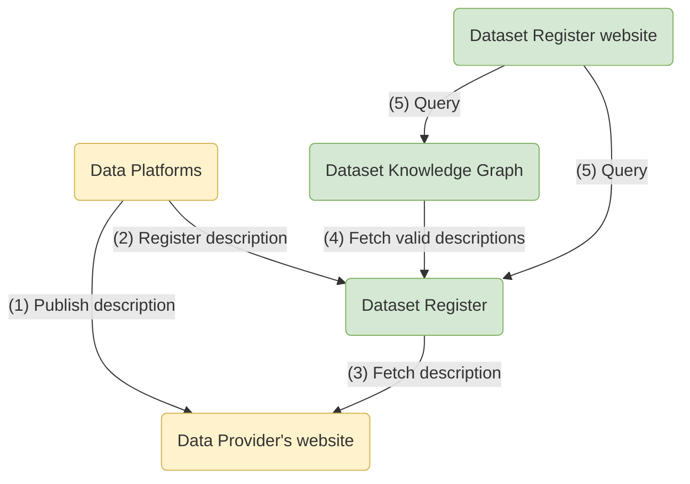
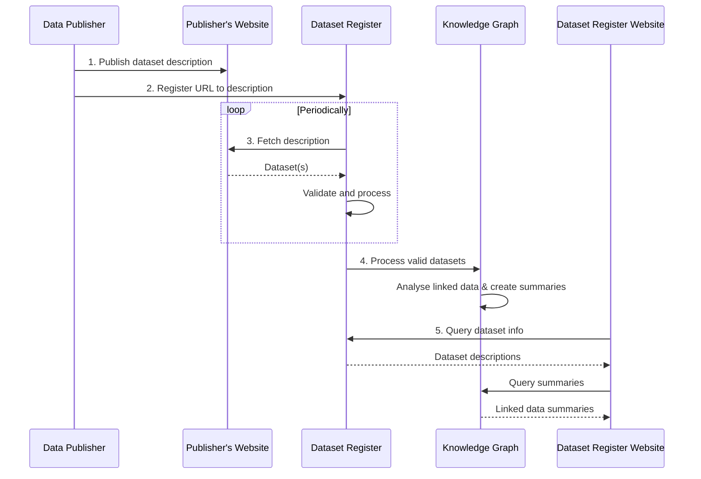

# Datasetregister

Het Datasetregister is de lijst van datasets in het Nederlandse erfgoednetwerk.
Voor elke dataset biedt het een [machineleesbare](../../glossary.md#machine-readable) [beschrijving](../../glossary.md#dataset-description)
die het volgende bevat:

* de naam van de dataset en de uitgever
* informatie over hoe de inhoud van de dataset te benaderen is, bijvoorbeeld datadumps en SPARQL-endpoints

## Onderdelen

* Gebruikers kunnen de [Datasetregister-website](https://datasetregister.netwerkdigitaalerfgoed.nl/datasets)
  doorzoeken op datasets.
* Softwareontwikkelaars die datasets willen vinden, kunnen het [Datasetregister SPARQL-endpoint](sparql.md) gebruiken.
* Softwareontwikkelaars die datasetbeschrijvingen willen registreren, moeten de [Datasetregister REST API](api.md) gebruiken.

## Registratiestroom

Om een datasetbeschrijving zichtbaar te maken op de Datasetregister-website,
volgen [dataplatforms](../../glossary.md#data-platform) deze stappen
(zie ook de [Requirements voor datasets](https://docs.nde.nl/requirements-datasets/)):

1. Een [collectiebeheerder](../../glossary.md#collection-manager) maakt een [datasetbeschrijving](../../glossary.md#dataset-description)
   en publiceert deze op het web (bijv. op een website of in een SPARQL-endpoint).
2. De URL naar de datasetbeschrijving wordt geregistreerd bij het Datasetregister.
3. Het Datasetregister haalt periodiek alle datasetbeschrijvingen op, valideert ze en slaat ze op voor latere raadpleging.
4. De [Dataset Knowledge Graph](../dataset-knowledge-graph/index.md) haalt periodiek geldige beschrijvingen op uit het Datasetregister,
   analyseert gekoppelde datasets en slaat samenvattingen op.
5. Wanneer gebruikers de Datasetregister-website raadplegen, wordt informatie uit het Datasetregister en de Knowledge Graph gecombineerd.

### Stroomdiagram

### Sequentiediagram

