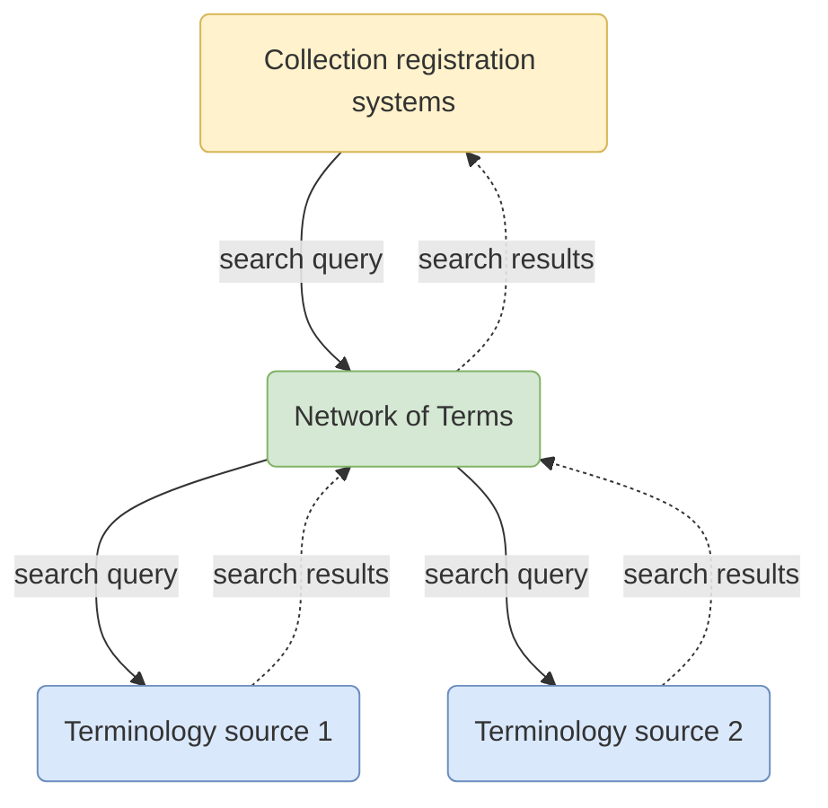

# Termennetwerk

Het Termennetwerk is een **zoekmachine voor het vinden van [termen](/glossary.md#term)** in terminologiebronnen (zoals thesauri, classificatiesystemen en referentielijsten).

Op basis van een tekstuele zoekopdracht doorzoekt het Termennetwerk één of meer [terminologiebronnen](../../glossary.md#terminology-source) in
**real-time** en geeft overeenkomende termen terug, inclusief labels en URI's. Het Termennetwerk biedt een **eenvoudige zoekinterface**,
**vangt fouten op** wanneer een bron niet goed reageert en **harmoniseert de resultaten** naar het SKOS-datamodel.

Het Termennetwerk is bedoeld voor [collectiebeheerders](../../glossary.md#collection-manager) die de vindbaarheid van hun
informatie willen verbeteren door termen toe te kennen uit terminologiebronnen die worden gebruikt door de instellingen in
het [Netwerk Digitaal Erfgoed](https://netwerkdigitaalerfgoed.nl). Informatiebeheerders gebruiken het Termennetwerk
in hun [collectie-informatiesysteem](../../glossary.md#collection-management-system).

Schematisch stuurt het collectie-informatiesysteem één zoekopdracht naar het Termennetwerk, die wordt vertaald naar een set
queries die passend is voor elke terminologiebron. De termen die overeenkomen met de zoekopdracht worden geharmoniseerd naar SKOS en
teruggegeven aan het collectie-informatiesysteem, waar informatiebeheerders de resultaten kunnen beoordelen en hun
data aan de termen kunnen koppelen:

## Termen zoeken

Als je het Termennetwerk eenvoudig via een webinterface wilt doorzoeken, bekijk dan onze
[demonstrator](https://termennetwerk.netwerkdigitaalerfgoed.nl), een webinterface bovenop de
[GraphQL API](graphql.md).

## API's

* [GraphQL](graphql.md)
* [Reconciliation](reconciliation.md)

## Broncode

Het Termennetwerk is open source software, beschikbaar [op GitHub](https://github.com/netwerk-digitaal-erfgoed/network-of-terms).
